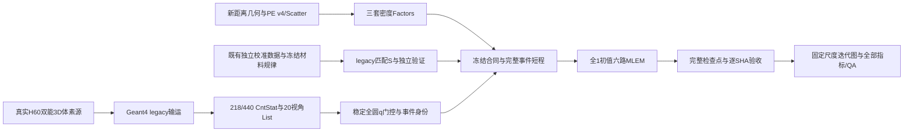

# 218/440双能JSCC基准：2026-10-07

本基准固定目前已经实际验收的从Geant4输入、三套响应与匹配灵敏度，到六路MLEM、检查点、取回和图像分析的流程。主参考案例是 **NEMA H60、既有5e9 legacy事件、连续材料能量核v5、作业1669255、10000/save50**。后续代码变更必须与这个基准比较，不能用新的结果覆盖旧证明。

“基准成立”指实现、输入身份、数值回归和执行验收成立。独立校准在充分统计区域通过，但446个联合类别仍未判定；长迭代噪声和小球恢复尚未解决。它不是整个视野或真实设备性能认证。详细的正面、负面与未定结论见[研究回顾](DUAL_ENERGY_RESEARCH_REVIEW.md)。

## 固定身份与入口

| 项目 | 基准值 |
|---|---|
| 主案例 | experiments/ELLIPSE500x300_H120 / NEMA_Body_H60 |
| 实际输运 | 5,000,000,000初级gamma；20视角；200worker×25,000,000；种子30100101–30100300 |
| 实际218/440/其他能量分类 | 1,469,053,733 / 3,530,946,267 / 0 |
| 事件策略 | legacy；不能与ideal首散射1e9作为纯剂量对照 |
| 事件筛选 | 原484936；全132040点圆网格stable_float64、q≤3；共同保留483743，删除1193 |
| 成像支持域 | 78920个完整柱坐标活动单元；旧82040分数边界入口只作兼容与历史对照 |
| 初值与算法 | 每阶段全1；原MLEM核心；无Huber/TV、绑定、平滑或重新抽样 |
| 正式参考 | 1669255；六路各200帧，三个阶段共600个完整检查点 |
| 2000次参考 | 1667869的B连续核；正式两路第2000帧逐值和SHA一致，L2=0 |
| 短程参考 | 1669189六路全事件10次；1667841两核全事件10次 |
| 发布 / 合同 | e0f01aea47f0f0fa / a75b13190cab84573f8c0a995b164572dcb7746761c5685e98a1cefc2691cbe8 |
| 实际authority | dcfdbb9d688aa2d4e8e7b432b0d74d8e5cff1753ec005842181865e050cea682 |
| 材料规律 | 9b752ae4a8568646c2225b53736662410f5acceb4dbcb4d542a2167fe0ac784d |
| legacy连续核S | 2140ec2be695a5bb1f18246db6e90872cd9bc9846b4146197f8fb1acec2cb56c |
| 原MLEM核心 | fc237206d9c5940484ef84dd36f60d6e0085bd4c23f0ac19149f390b5f375d70 |
| 真值 | truth_3mm.npz，SHA 2612f0ed6839f9460722711e1017a10102e83adf77cf715d5c2553cfaec948af |

[机器清单](baselines/dual_energy_20261007/manifest.json)逐文件固定源代码、小证明、23个原输入与27个完整Factors身份；[代码目录](baselines/dual_energy_20261007/source_inventory.json)区分基准、测试、兼容代码与历史诊断。[清理记录](baselines/dual_energy_20261007/cleanup_manifest.json)保存已删除旧脚本的SHA和恢复方法。

## 从模拟到图像的代码路线

以下路径相对仓库根。它们是阶段职责索引，不是要求重新执行已完成阶段。当前冻结发布仍在原目录，文件不搬迁，避免破坏导入与合同SHA。

| 阶段 | 当前代码 | 输入、输出及门控 |
|---|---|---|
| Geant4输运 | Geant4Sim/Geant4Code/{gamma01.cc,src,include} | GAGG/W探测器、逐晶体能量展宽、双能源、CntStat/List；legacy默认策略与ideal分开 |
| 真实三维源 | E/make_nema_body_h60.py、prepare_nema_simulation.py | 保存3mm双能球体真值；按浓度×体积×发射份额生成加权cuboid宏，不能用二维NEMA替代 |
| 模拟部署与收集 | E/deploy_nema_simulation.py、submit_nema_transport.py、maty_nema_array.sh、maty_nema_collect.sh、validate_nema_simulation.py、package_imaging.py | worker/种子/初级数/视角闭合后封装23个原输入；数组成功或文件存在不能代替核验 |
| 几何与原始矩阵 | E/geometry.py、矩阵工程FileGenerater_3D_Unified/run_gen_ellipse500x300_h120_params.m、E/run_matrices.py、run_scatter_slabs.py；矩阵工程PEGen_V4_Production.cu、ScatterGen/scatter.cu | 新距离PE v4与detector-local Scatter；85×85×40大网格Scatter必须四个10层slab，保留世界z并逐SHA拼接，避免int32索引溢出 |
| 三套密度Factors | E/convert_factors.py、validate_factors.py、calibrate.py | A218、A440、C440→218；B=A diag(ΔV)，非等权点活度；各响应分别做绝对层校准 |
| Compton规律及匹配S | E/process_list_global_audit_v4.py、compton_energy_probability_v5.py、calibrate_energy_5e9_v5.py、energy_5e9_v5_calibration_workflow.py | 冻结规律；使用既有独立legacy训练/验证产生匹配S；不能以ideal S替代或按接受率随意重缩放 |
| 事件/Factors身份 | E/prepare_energy_5e9_v5.py、verify_energy_5e9_factors.py、energy_5e9_v5_contract.py | 全网格稳定q筛选及逐视角索引、三套完整矩阵/Detector/坐标/旋转/体积SHA；非有限或零响应HOLD原行号 |
| 六路完整重建 | E/energy_full10000_v5_workflow.py、run_energy_full10000_v5.py、energy_full10000_v5_contract.py、single_checkpoint_mlem.py、reconstruct_energy_full10000_v5.sh | 独立入口仅validation10/save10或formal10000/save50；原torch_active_operator.py、冻结helpers不变 |
| 严格验收与取回 | E/verify_energy_full10000_v5.py、workflow fetch | 实际退出、资源、全部事件/rank身份、历史/末帧/组合和、600检查点和逐文件SHA；只读复验旧证明 |
| 分析与交付 | E/compare_energy_full10000_v5.py、plot_energy_four_iterations_v5.py、analyze_nema_result.py、mip_projection.py | 已验收真实正式结果门控；六路图、四路迭代图、全部200帧指标、科学/视觉QA和图像SHA |

E表示experiments/ELLIPSE500x300_H120。若新增实验需要再生成矩阵、模拟或校准，应使用独立输出目录并保存编译器、Geant4/CUDA/torch版本与二进制SHA；上述源码快照不等同于已有5e9输运二进制的重新验证。已有5e9输入及Factors是本案例的权威数值参考。当前Geant4的legacy兼容有既有1e9逐worker重放证据，**本次整理没有重新输运5e9**。



## 物理、单位和算法约定

成像FOV椭圆柱为(x/250)²+(y/150)²≤1、|z|≤60mm，长轴沿x，世界中心(0,−345,0)mm；准直器前面270mm。参考NEMA源是其中实际高60mm、|z|≤30mm的三维体素body与球体，不能把120mm计算FOV当作源高度。完整圆计算域半径255mm、40层、132040点；20视角、四层共10496个活动探测bin。当前模拟是探测器输运与真空源代理，没有人体组织衰减/散射模型。

单能点响应A按每个发射gamma定义；B=A diag(ΔV)作用于gamma密度，单位gamma/mm³。几何旋转、支持域和体积必须与响应/S共同使用；旧60mm、FOV120和新距离椭圆Factors不可混用。完整单元基准不再使用f<0.1指标；历史分数单元结论仍保留。

单光子MLEM更新为x←x·Bᵀ[y/(Bx+b)]/(Bᵀ1)。440取b=0；218的b由**本次最终440单光子图**经C440→218预测并固定。SC Compton采用事件响应和它的匹配S。440 JSCC在同一个x上合并单光子与Compton反投影、分母为两者灵敏度之和；它不是两个独立440图的事后相加。原1e−12前向下限保留，初始触发0已证明，10000次后期每轮触发数未认证。

| 输出名 | 含义 |
|---|---|
| 440_SinglePhoton | 440仅单光子 |
| 218_SinglePhoton_CrossTalkCorrected | 218仅单光子，固定串窗背景校正 |
| 440SinglePlus218Single | 同迭代440单光子+校正218的gamma密度和 |
| 440_ComptonOnly | 440 SC Compton |
| 440_SinglePlusCompton | 440 JSCC联合MLEM |
| 440SingleComptonPlus218Single | 同迭代440 JSCC+校正218的gamma密度和 |

两种218+440组合都不是Ac225母核活度。组合真值按实际背景gamma密度/发射数加权，当前218/440权重30.5633%/69.4367%；不能简单加两个单能归一真值后分别拟合。

## 安全、只读的基准检查

在仓库根执行（不连接远端，不模拟、提交或重建）：

```powershell
python -X utf8 tools/baseline/verify_dual_energy_baseline.py
# 本地大数据齐备时才进一步完整读取23输入及三套Factors：
python -X utf8 tools/baseline/verify_dual_energy_baseline.py --verify-data
# 检查本地冻结发布与全部已取回输出、600检查点：
python -X utf8 tools/baseline/verify_dual_energy_baseline.py --verify-payload --verify-results
```

默认检查代码/小证明、正式与短程身份、模型/事件/资源、已交付图集SHA和删除项。31个冻结执行源严格核对原字节；25个既有Geant4/CUDA文本源及1个旧真值ROI元数据manifest仅规范LF/CRLF平台行尾后核对SHA，原Windows字节SHA另存，不容许算法或元数据内容差异。其余执行证明保持原字节。缺文件或SHA不同会失败；跳过可选的大数据读取会明确列出，不能被解释为本次又做了一次完整物理或GPU验证。

已完成作业的只读状态入口为：

```powershell
python -X utf8 experiments/ELLIPSE500x300_H120/energy_full10000_v5_workflow.py status
```

新实验的历史执行顺序是freeze→deploy→submit --mode validation→实际成功退出→fetch→实际authority→submit --mode formal→退出→fetch→compare→QA。**本参考已经全部完成，不再重复此顺序。** 旧2k入口继续拒绝10000；新10000入口不改成任意迭代启动器。算法/事件/源策略/几何任一变化都要新合同和独立发布，不能覆盖参考目录或冒用旧authority。

## 后续改动的基准门槛

1. 固定同一输入、事件、S、几何、初值与算法时，先验证分块/rank正转置、数值一致性，再通过真实完整事件短程；单元测试不能替代这一阶段。218保存回调对原MLEM逐值一致，实际短程Compton/JSCC L2=0，作为实现回归参考。
2. 变更核或测度时重新生成匹配S，并用独立圆源、椭圆和点源检验；不能只靠全圆均值闭合。模型比较与同数据校准拟合必须分别报告。
3. 正式执行保留全部事件与空间采样。8节点×1GPU/bond0；主存分母来自scontrol AllocTRES，GPU预留、RSS、Slurm MaxRSS均≤80%；不显式指定mem，不取消其他项目，不重复同名作业。
4. 每50次原子发布/fsync完整active/full/manifest；有限非负、域外零、末帧/历史/组合和全部验证。先确认退出再修复失败阶段，不能悄悄删事件、放宽门槛或从不匹配的背景续算。
5. 保存全部迭代指标。峰值/峰背景下降≥50%是已有两核试验工作判据，CRC损失>5pp必须标代价；不能为了图像好看选择最有利迭代后隐去曲线。
6. 新增结论必须给出实际证据。代码回归通过、总积分接近1、Slurm COMPLETED、校准改善，分别不等价于物理完全正确、空间恢复正确、内容验收或图像尖峰改善。

## 图像与结果入口

[正式执行与科学验收](../experiments/ELLIPSE500x300_H120/reports/NEMA_Body_H60/compton_energy_probability_v5_5e9_full10000/ACCEPTANCE.md)、[六路图集和200帧曲线](../experiments/ELLIPSE500x300_H120/reports/NEMA_Body_H60/compton_energy_probability_v5_5e9_full10000/comparison_1669255/README.md)、[218单光子/440单光子/440 Compton/440 JSCC迭代图](../experiments/ELLIPSE500x300_H120/reports/NEMA_Body_H60/compton_energy_probability_v5_5e9_full10000/four_channel_iterations_1669255/README.md)。

固定展示100/500/1000/2000/5000/10000，轴/冠/矢位与中央72mm MIP；crop0、sigma0、同一尺度，原生120mm统计保留全部层。显示0–10饱和不影响原数组统计。218、440及组合按一个基准背景尺度传递，不逐图拟合。

compton-v5保持暂停；整理不触发新模拟、长迭代、正则化或精细响应任务。
