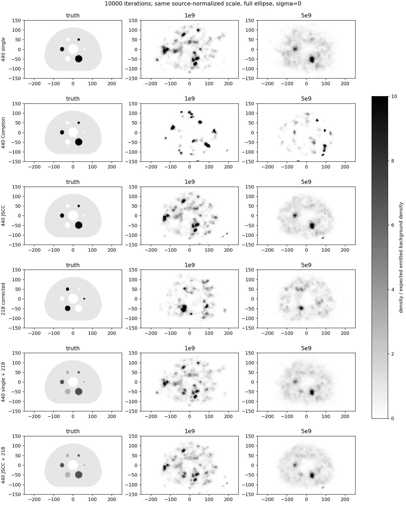
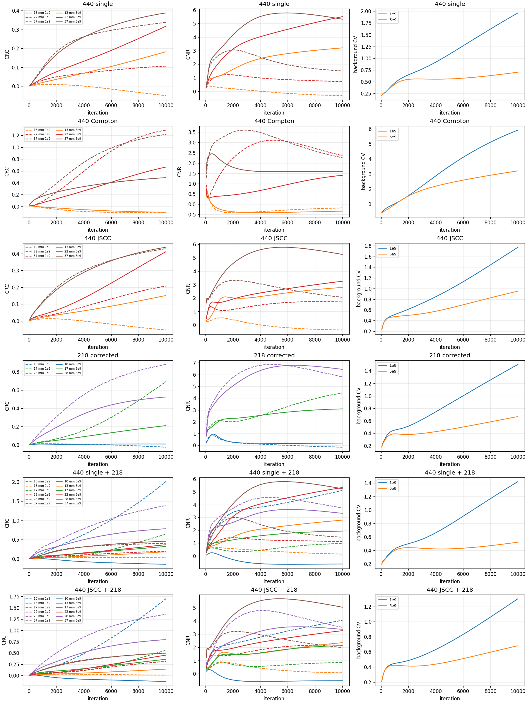
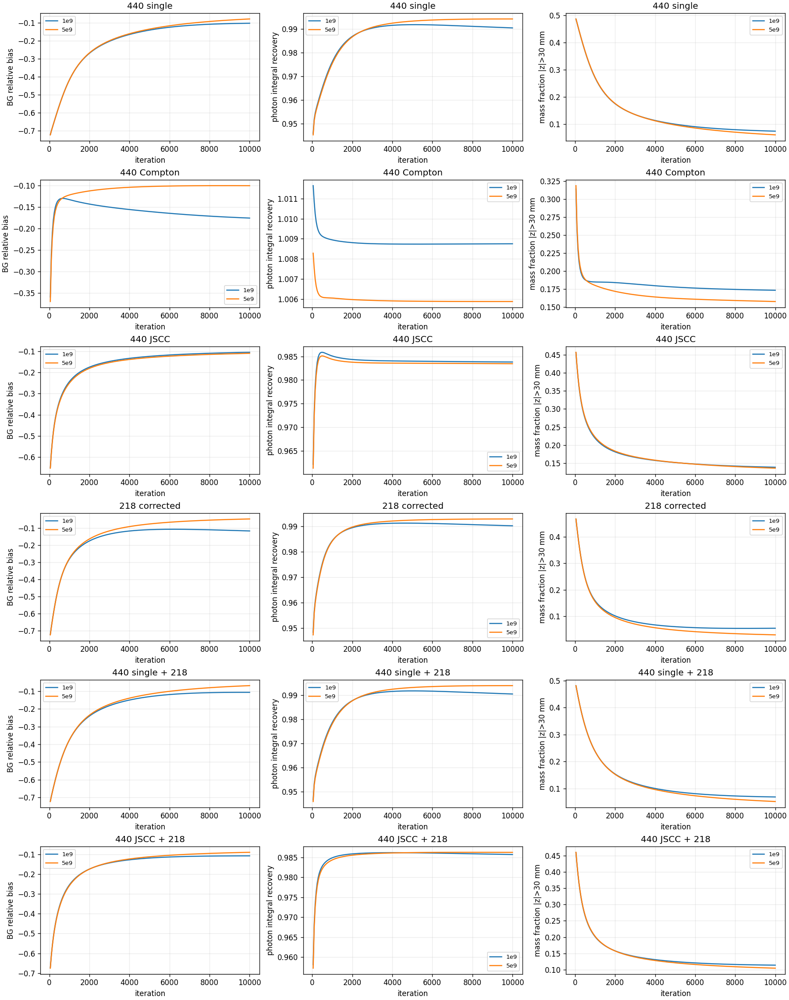

# NEMA H60：1e9与5e9匹配比较

[验收结论、全部路线汇总和局限](../ACCEPTANCE.md)。以下图像使用同一三维球体真值、相同ROI/保存迭代及500×300×120mm椭圆FOV；sigma0，无裁剪，gray_r白低黑高。每条曲线包含200个实际帧。固定源背景密度尺度保留绝对偏差；固定最终背景尺度展示对比度但不得用于绝对定量。所有图色标0..10，超出值只在显示时饱和。

## 每路逐迭代图

- 440 single：[固定源背景密度](440_SinglePhoton_expected_density.png)；[固定最终背景](440_SinglePhoton_fixed_final_background.png)
- 440 Compton：[固定源背景密度](440_ComptonOnly_expected_density.png)；[固定最终背景](440_ComptonOnly_fixed_final_background.png)
- 440 JSCC：[固定源背景密度](440_SinglePlusCompton_expected_density.png)；[固定最终背景](440_SinglePlusCompton_fixed_final_background.png)
- 218 corrected：[固定源背景密度](218_SinglePhoton_CrossTalkCorrected_expected_density.png)；[固定最终背景](218_SinglePhoton_CrossTalkCorrected_fixed_final_background.png)
- 440 single + 218：[固定源背景密度](440SinglePlus218Single_expected_density.png)；[固定最终背景](440SinglePlus218Single_fixed_final_background.png)
- 440 JSCC + 218：[固定源背景密度](440SingleComptonPlus218Single_expected_density.png)；[固定最终背景](440SingleComptonPlus218Single_fixed_final_background.png)

[球CRC/CNR](final_sphere_comparison.csv)、[六路汇总](final_channel_comparison.csv)、[200帧区域指标](regional_metrics.csv)、[哈希、尺度和追溯限制](comparison.json)。复现脚本见scripts/，运行入口为工程的compare_nema_counts.py；原始数组未修改。
