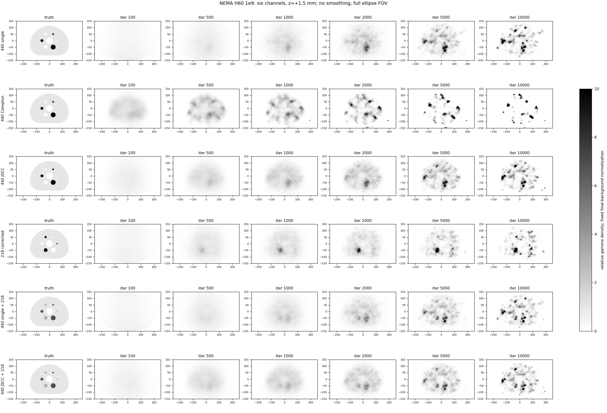
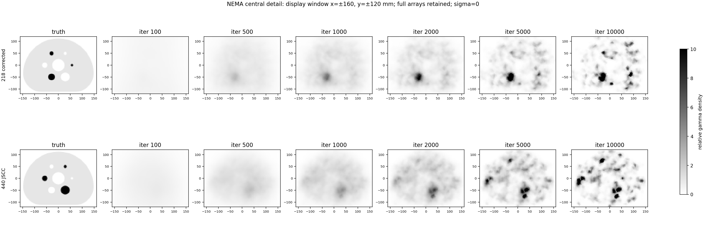
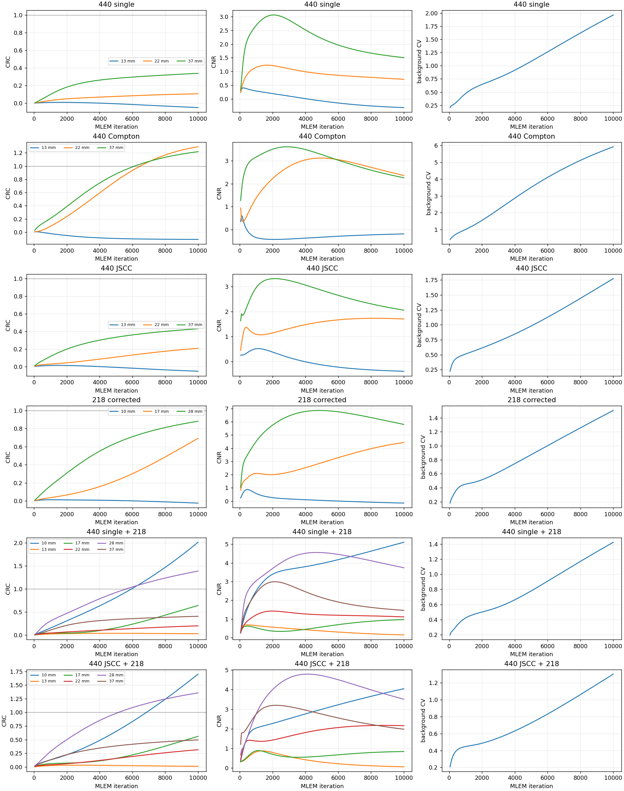

# NEMA H60: verified six-channel 1e9 result

See analysis.json and iteration_metrics.csv for reproducible methods and 200-frame metrics. All figures retain the ellipse FOV, use gray_r (white low, black high), sigma=0 and no edge crop. Color limits are fixed at 0..10. Background normalization is fixed per channel across iterations; values above 10 saturate visually but remain unchanged in metrics. Composite truth includes gamma yields, and is not parent 225Ac activity.

## 2026-10-02：MIP排除端层

默认显示上下各排除3层（各9mm），MIP保留z体积范围−51～+51mm。以下多平面图已链接新版；原始全z版本仍保存在本目录final_multiplanar.png。[逐迭代MIP与全z对照](mip_trim3/README.md)。iterations_z20.png为z=+1.5mm单层轴位图，不是MIP；原始重建和全部定量指标不变。
