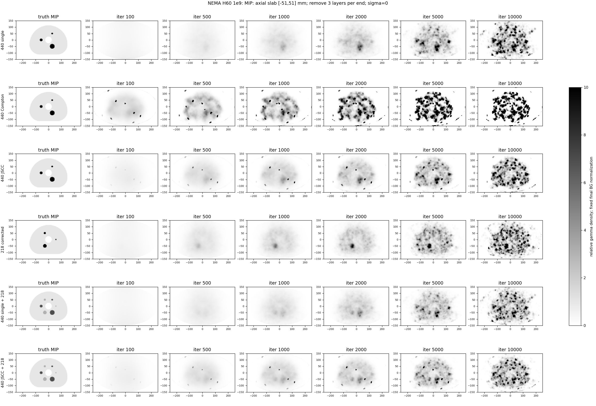
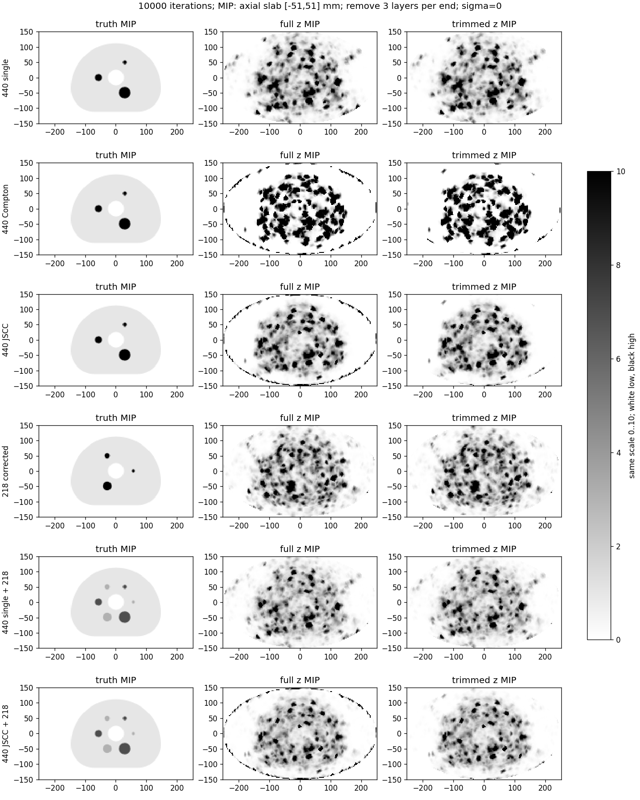
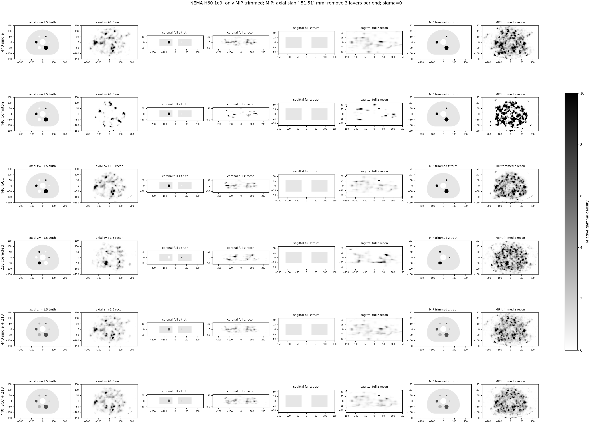

# NEMA H60：排除轴向端层的MIP

上下各排除3层（每端9mm），保留34层，中心范围[-49.5, 49.5]mm，对应投影体积z∈[-51,51]mm。只改变MIP显示，重建数组、轴冠矢位、CRC/CNR/CV与积分/泄漏指标不变。横向椭圆FOV完整，无平滑，白低黑高，固定色标0..10。附图iterations_z20.png是z=+1.5mm单层轴位图，不是MIP。

排除端层后仍可能存在内部噪声尖峰；改善显示不能作为边缘性能已修复的证据。原始全轴向MIP保留对照，输入/脚本哈希及实际选择见metadata.json。
