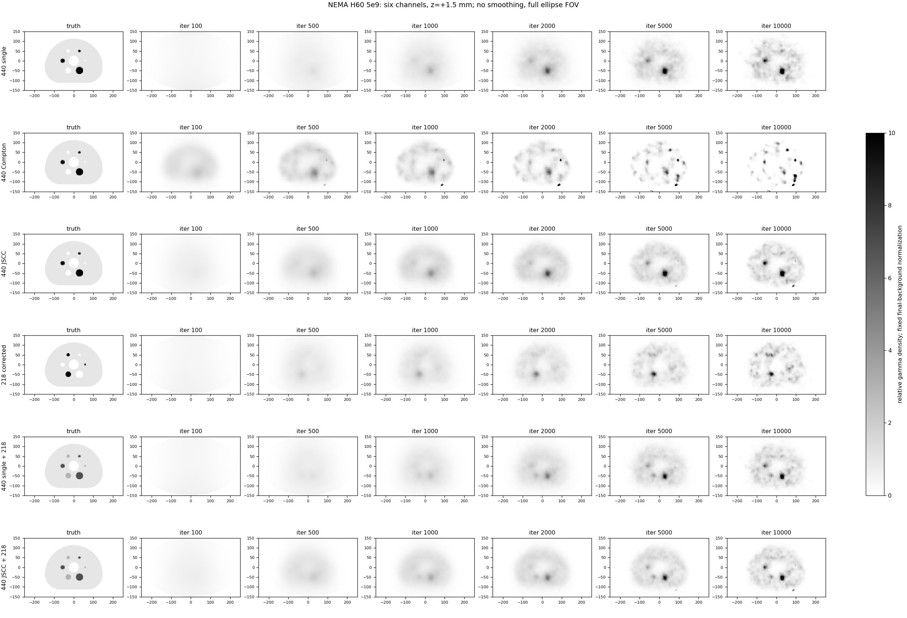
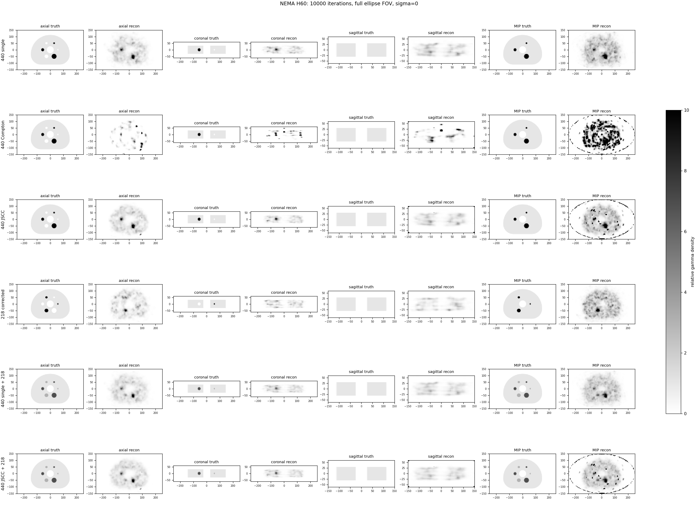
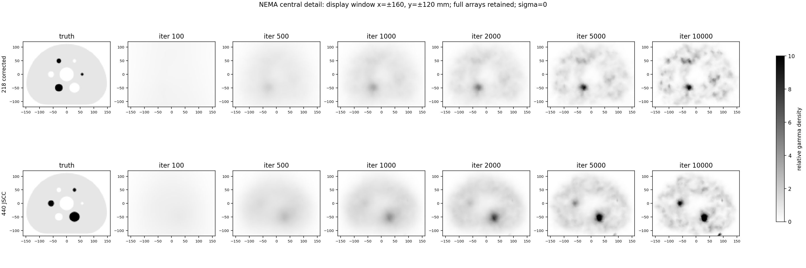
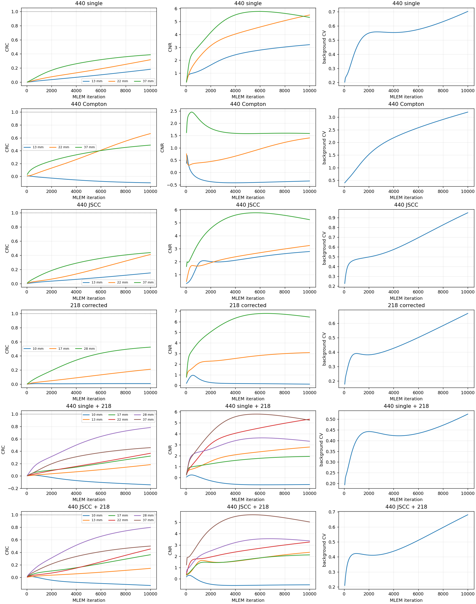

# NEMA H60: verified six-channel 5e9 result

See analysis.json and iteration_metrics.csv for reproducible methods and 200-frame metrics. All figures retain the ellipse FOV, use gray_r (white low, black high), sigma=0 and no edge crop. Color limits are fixed at 0..10. Background normalization is fixed per channel across iterations; values above 10 saturate visually but remain unchanged in metrics. Composite truth includes gamma yields, and is not parent 225Ac activity.

## 验收结论及比较

正式1644876完整性通过。详见[验收与科学报告](../5e9/ACCEPTANCE.md)，已包含小球欠恢复、噪声及轴向泄漏。

[1e9/5e9匹配比较](../5e9/comparison/README.md)。z20为+1.5mm中心近邻层，z10/z29为−28.5/+28.5mm源边界内侧，z00/z39为−58.5/+58.5mmFOV端层；这些图均保留全部500×300mm横向范围。

- [z层10六路迭代图](iterations_z10.png)
- [z层29六路迭代图](iterations_z29.png)
- [z层0六路迭代图](iterations_z00.png)
- [z层39六路迭代图](iterations_z39.png)

central_detail.png仅额外提供x±160/y±120mm显示窗；所有主图和指标保留全FOV。使用原始三维双能球真值，无Gaussian滤波。
