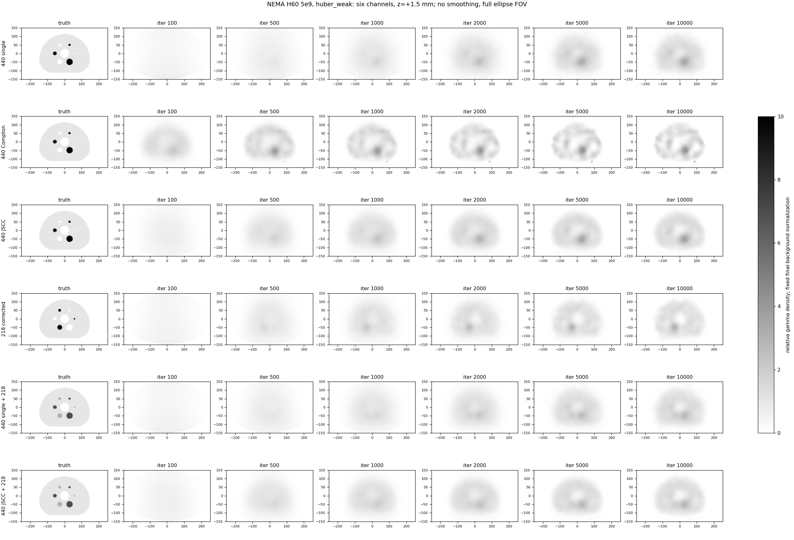
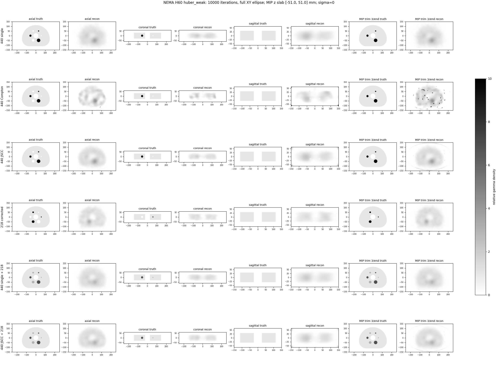
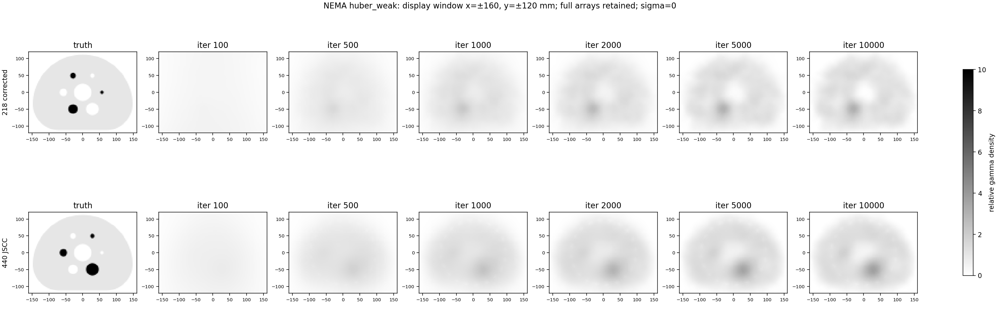
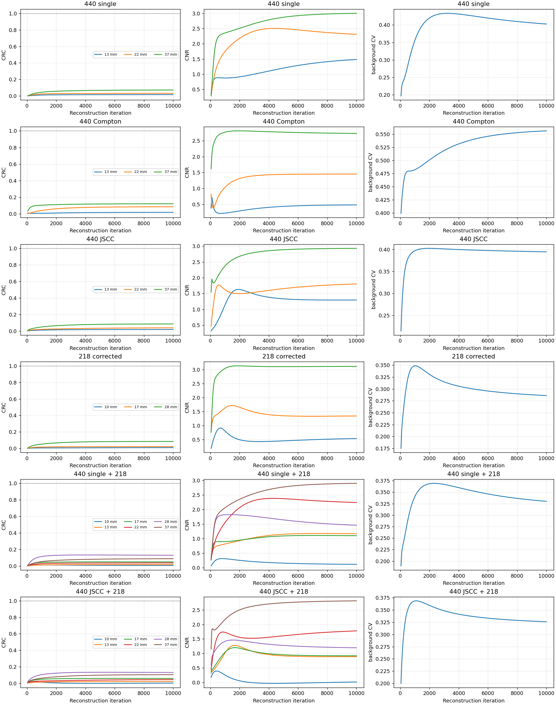

# NEMA H60: verified six-channel 5e9 huber_weak result

See analysis.json and iteration_metrics.csv for reproducible methods and 200-frame metrics. All figures retain the ellipse FOV, use gray_r (white low, black high), sigma=0 and no edge crop. Color limits are fixed at 0..10. Background normalization is fixed per channel across iterations; values above 10 saturate visually but remain unchanged in metrics. Composite truth includes gamma yields, and is not parent 225Ac activity.

Only MIP excludes 3 z layers per end; retained slab [-51.0, 51.0] mm. Quantitative metrics and other views use the complete reconstruction.

