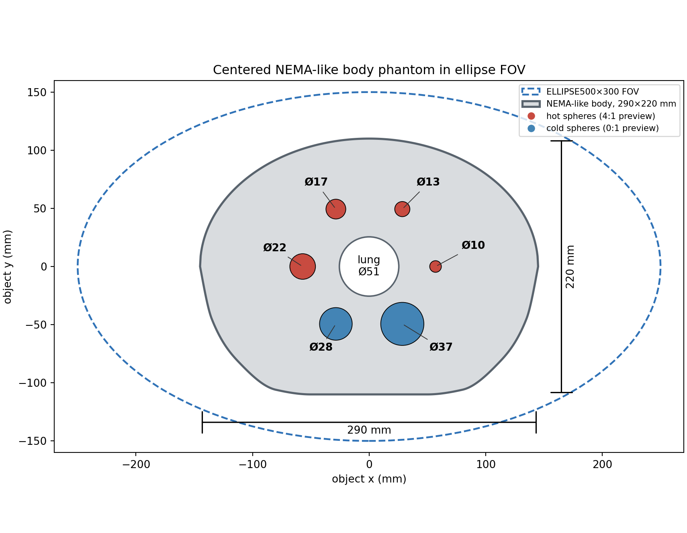
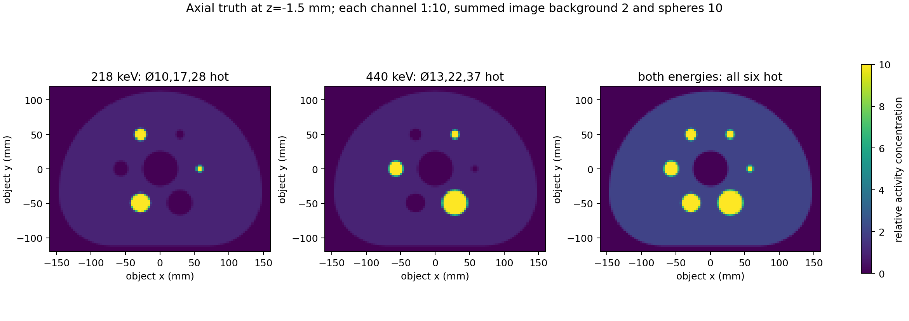
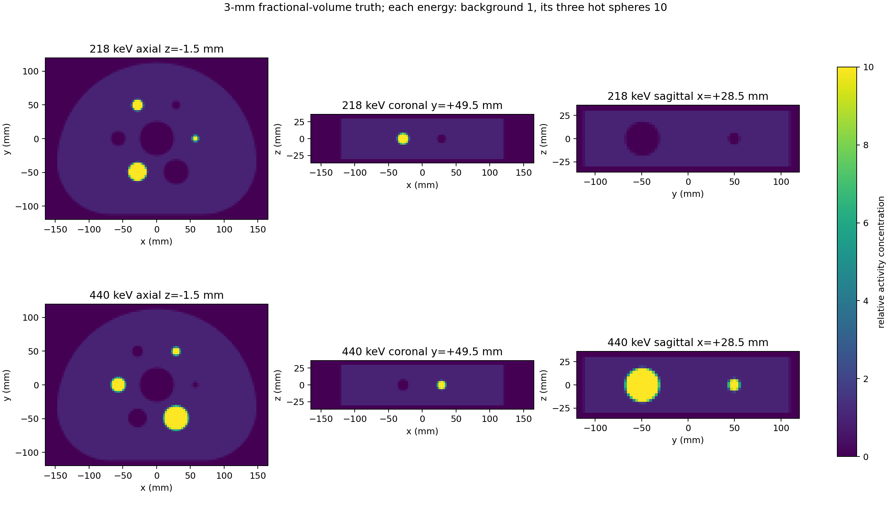
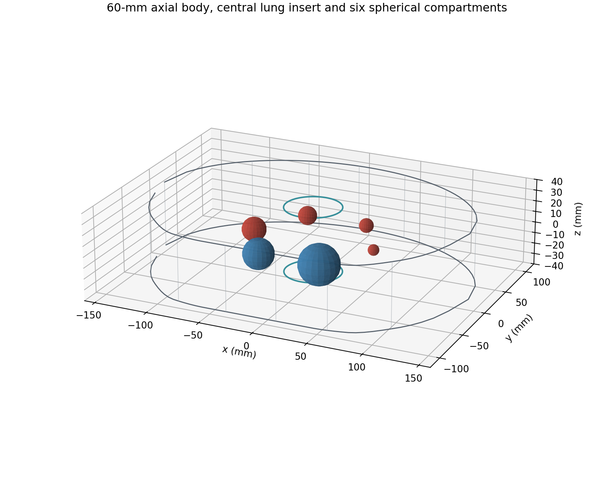

# NEMA Body Phantom：标准圆弧截面、60 mm 双能研究版

本页记录已验收的几何、双能活度浓度真值和预览。**1e9 初级 γ 的 Geant4 模拟已完成并核验；10000 次正式重建正在运行，尚无通过验收的 NEMA 图像。** 作业号、输入哈希及验证门槛见 [运行簿](PRODUCTION.md) 和 [输运核验](transport_1e9.json)。本体模位于 `ELLIPSE500x300_H120` 物理视野中心。源及重建始终限制在 `(x/250)^2+(y/150)^2≤1，|z|≤60 mm`，不得把长方形真值画布当成物理视野。

## 截面几何依据

上一版用示意图控制点和样条插值构造底缘，所得横截面不够符合 NEMA Body Phantom。现依据 [NEMA NU 2-2007 图 7-1（PDF 第 39 页、文档第 31 页）](https://psec.uchicago.edu/library/applications/PET/chien_min_NEMA_NU2_2007.pdf)直接构造相切圆弧：内腔上部为半径 **147 mm** 的半圆；下部为圆心横向 `x=±70 mm`、半径 **77 mm** 的两个四分之一圆；两个圆弧之间是 **140 mm** 的水平底边。外轮廓的对应半径为 **150/80 mm**，即约 **3 mm** 的侧壁。外包围尺寸为 **300×230 mm**，内腔从图纸解析为 **294×224 mm**。厂家当前 [Data Spectrum 资料表](https://intro.spect.com/pdf/NEMA-IEC-PET-Body-Phantom.pdf)给出约 **290×221 mm** 的内部尺寸与约 3.2 mm 壁厚；这是产品近似规格，与标准图的解析值略有差异。本模型明确选择标准图的圆弧尺寸，不再混用产品近似尺寸。

外轮廓的包围盒中心平移到 `(0,0)`，因此上、下边界为 `y=±115 mm`，左右边界为 `x=±150 mm`。外包围矩形也处于 500×300 mm 椭圆内。圆弧及直线的离散体积与解析值差异均小于 **0.05%**。墙体有独立的体素掩膜，但当前实验**不加入 PMMA 材料衰减**。

## 球体与双能填充

六球内径 **10、13、17、22、28、37 mm** 及中央插件外径 **51 mm**，依据厂家资料；球心的半径 **57 mm**、角度 **0°/60°/120°/180°/240°/300°** 和顺序来自用户提供的草图，未声称是厂家球架的 CAD 坐标。球心均在 `z=0`。高度为 **60 mm**，居于 120 mm 高视野中间，即主体 `|z|≤30 mm`。此轴向缩短以及下述双能填充是本项目适配，**不构成完整 NEMA 标准体模**。

| 位置 | 218 keV 相对活度浓度 | 440 keV 相对活度浓度 |
|---|---:|---:|
| 主体背景 | 1 | 1 |
| Ø10、Ø17、Ø28 mm 球 | 10 | 0 |
| Ø13、Ø22、Ø37 mm 球 | 0 | 10 |
| 中央插件、壁与体模外 | 0 | 0 |

因此两种能量**各自**的热球/背景浓度比均为 **10:1**；六球在双能合成图中均为热区。非目标能量在对应球内设为 0，避免把一个球误当成同时含有两种热源。简单相加的预览图中背景为 2、每个球为 10，即合成图是 **5:1**，不应把这个合成比例误报成单能 10:1。这里存的是相对**活度浓度**，尚未按 218/440 的光子产额 0.114/0.259 加权，也未抽样初级光子。边界体素由体积占比混合，故边缘可有 0–10 间的值。

## 复现与核查

在本实验目录执行 `python make_nema_body_h60.py`。输入为 `nema_body_h60_config.json`；输出 `generated/NEMA_Body_H60/truth_3mm.npz`（由 Git 忽略），内含 `[z,y,x]=[40,100,168]` 的坐标、内腔/壁/中央插件/六球的体积占比、`activity_218_zyx` 与 `activity_440_zyx`。间距 3 mm，主体占中心 20 层。球边界每轴使用 8 个子体素；六球数值体积的最大解析偏差约 **0.23%**。

`manifest.json` 冻结轮廓参数、数值与解析体积、双能规则、球心、积分活度、配置/真值/预览图 SHA-256；其中状态只描述**该真值工件生成时**的阶段，不应读作整个实验的实时状态。输运和重建状态以 [运行簿](PRODUCTION.md) 为准。
