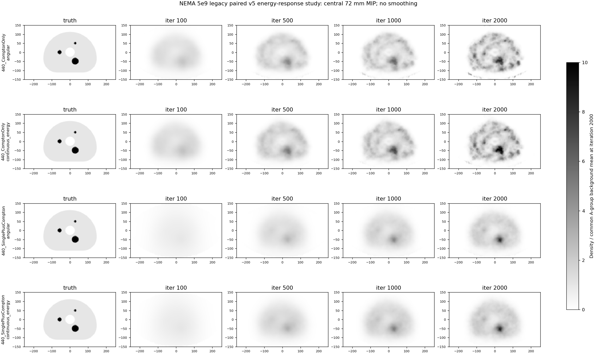

# 5e9两核配对：图集、40帧曲线与复现文件

作业1667869实际正式结果：A角度核/B连续材料能量核，共同483743 legacy事件、78920完整柱单元，440 Compton和JSCC各2000次，每50次保存。四条各40帧及80个双通道检查点已严格验收并逐文件SHA取回。[完整科学报告](../ACCEPTANCE.md)及[独立QA](../final_analysis_qa_1667869.json)。

2000次最大密度/峰背景降幅：Compton76.63%/78.76%，JSCC62.05%/65.65%。背景CV仅小幅改善，13 mm球恢复仍弱；Compton端部仍有19.05倍背景峰。中央72 mm MIP不能显示该−58.5 mm残余峰，完整120 mm统计及冠/矢位须同时阅读。

## 固定尺度逐迭代图

每张图包含真实440三维球体真值和A/B的Compton/JSCC，列为100/500/1000/2000次。灰度gray_r，无平滑、无XY裁边；两组同通道全部迭代用A2000背景均值（Compton945.671875，JSCC853.9879150390625），显示范围0–10，统计不截断。

- [中心轴位，z=+1.5 mm](iterations_center.png)
- [冠状位，y=−1.5 mm，显示完整轴向范围](iterations_coronal.png)
- [矢状位，x=−1.5 mm，显示完整轴向范围](iterations_sagittal.png)
- [中央72 mm轴向MIP](iterations_mip72.png)：z边界±36 mm，上下各去掉8层，保留24层中心±34.5 mm。
- [2000次最终多平面概览](final_multiplanar.png)

## 全部40帧指标曲线

- [最大密度、峰背景、背景CV、源外轴向泄漏](spike_noise_leakage_curves.png)
- [13/22/37 mm三球CRC及CNR](crc_cnr_curves.png)
- [p99.9、背景均值、总积分及积分恢复](tail_integral_curves.png)

原生峰、分位数、积分及泄漏在完整120 mm活动域计算；ROI采用真实H60三维球体及既有背景定义。全部40帧没有CRC损失>5个百分点。完整单元f<0.1指标不适用。JSCC在100/500/1000次未达双50%判据，不能把2000结论写成全部迭代都改善。

## 数值与复现

- [原生指标160行](native_iteration_metrics.csv)：2组×2通道×40帧。
- [球体指标480行](sphere_iteration_metrics.csv)：再乘3个440球。
- [预选迭代配对判断24行](selected_comparison_metrics.csv)。
- [对照身份、显示尺度、最终与预选判断](comparison.json)。
- [逐文件SHA清单](artifact_manifest.json)：图像、表、脚本及本地真值。
- 实际执行脚本：[比较入口](scripts/compare_energy_5e9_v5.py)、[既有分析工具](scripts/analyze_nema_result.py)、[中央MIP规则](scripts/mip_projection.py)、[独立验算](scripts/verify_delivered_analysis.py)。

真实truth_3mm.npz副本按Git规则仅留本地，SHA为2612f0ed6839f9460722711e1017a10102e83adf77cf715d5c2553cfaec948af。原真值仍在本工程generated/NEMA_Body_H60；完整原始历史/final/80检查点在本实验generated/compton_energy_probability_v5_5e9/formal_results/1667869。大数组和矩阵不进Git。

这是同一批5e9 legacy事件上的核及匹配S配对；前一轮1e9使用ideal首散射规则，不能作为纯剂量对照。446个独立联合类别仍未判定，2000次不证明10000次稳定性或实际设备性能。
