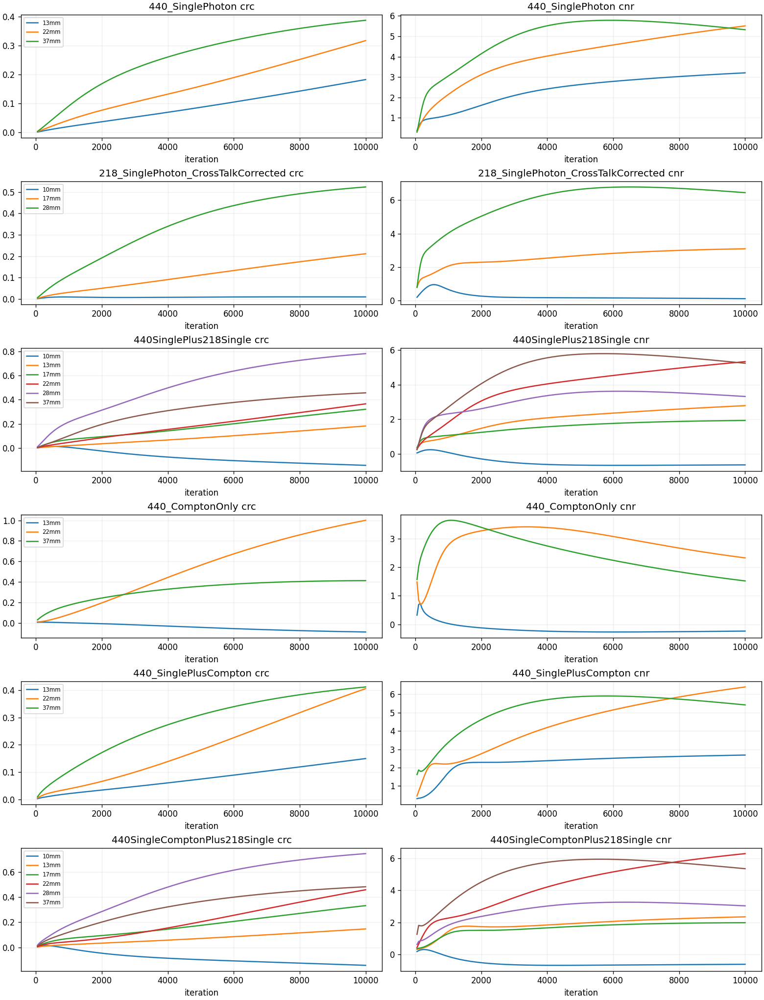
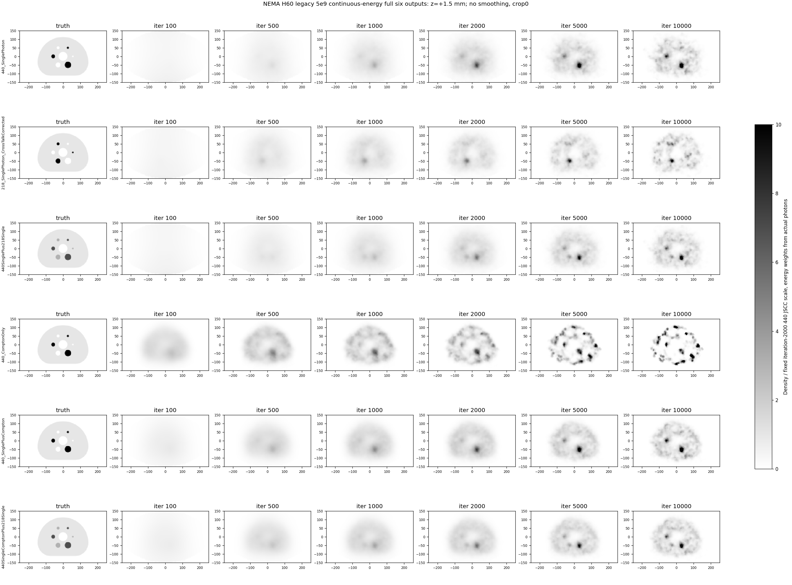
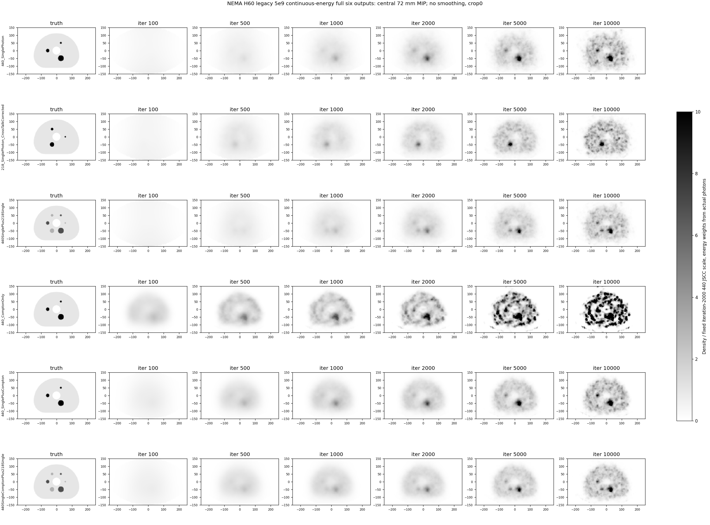
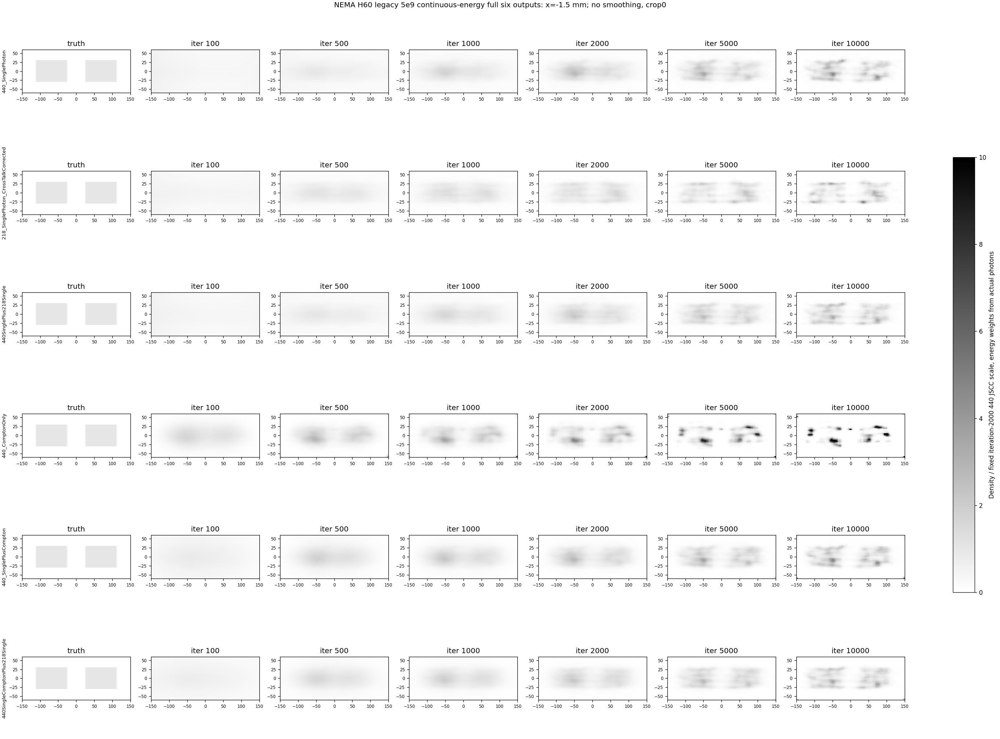
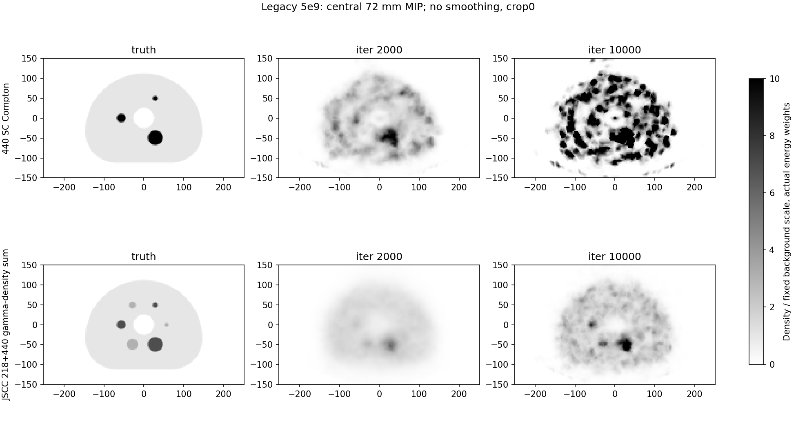
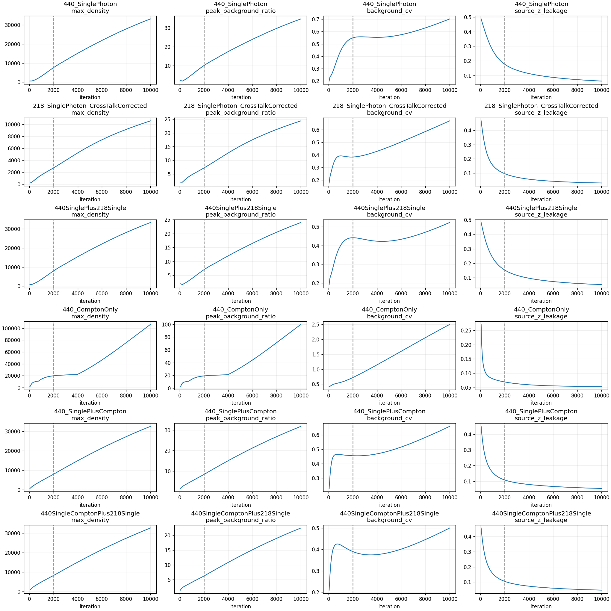
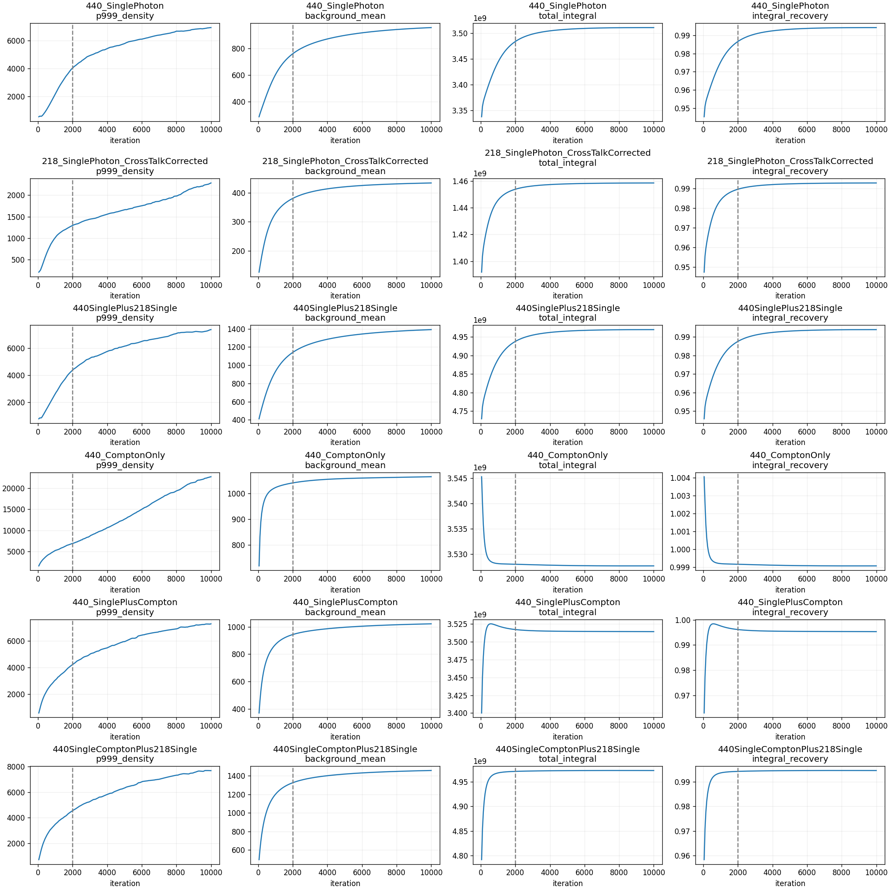

# 完整六路10000次图集与曲线

作业1669255：六路各200帧/600阶段检查点严格验收。

使用本实验真实H60双能3D球体；gray_r、无平滑、crop0，轴/冠/矢及中央72mm MIP。
固定440 JSCC第2000次背景尺度，各能量按实际发射数/真值积分转移尺度；组合真值按对应背景gamma密度加权。
native指标覆盖120mm全活动域，f<0.1不适用。组合CRC按自身混合真值对比度归一，组合不代表Ac225活度。
本轮没有角度核10000次配对，报告只比较连续核2000→10000演化；独立联合类别统计不足仍未判定。

[原生200帧指标](native_iteration_metrics.csv) · [球体CRC/CNR](sphere_iteration_metrics.csv) · [科学摘要](comparison_report.json)

定量结论：2000→10000次SC Compton峰/背景19.05→99.72、背景CV0.717→2.500；JSCC218+440为6.22→22.44、0.390→0.500。泄漏分别6.94%→5.34%、10.40%→4.65%，较大球CRC提高，同时13mm Compton和10mm两种组合有CRC下降>5pp。详见[完整科学与执行验收](../ACCEPTANCE.md)及[独立科学/视觉QA](SCIENTIFIC_VISUAL_QA.json)。

色标固定0–10，超出范围的像素显示为黑色饱和；原图和指标不截断。XY插值只用于显示及既有ROI，定量峰值/位置/高分位/体积积分来自原生完整120mm域。两能组合真值背景权重为218=30.5633%、440=69.4367%，不是两幅单能真值简单相加，也不是Ac225活度。
