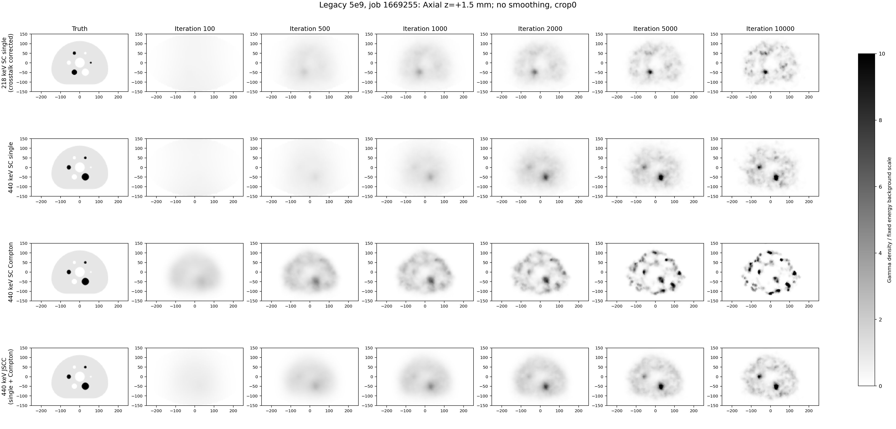
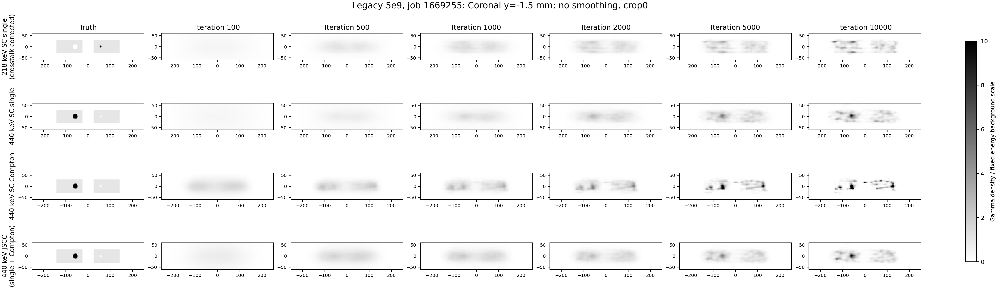
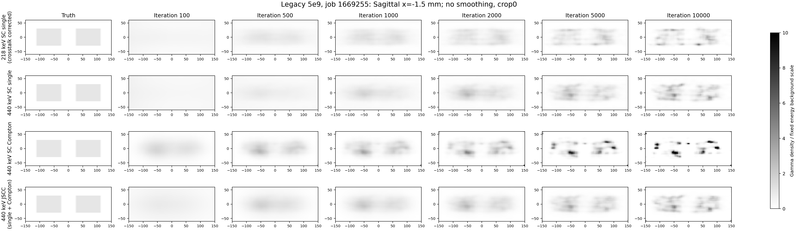
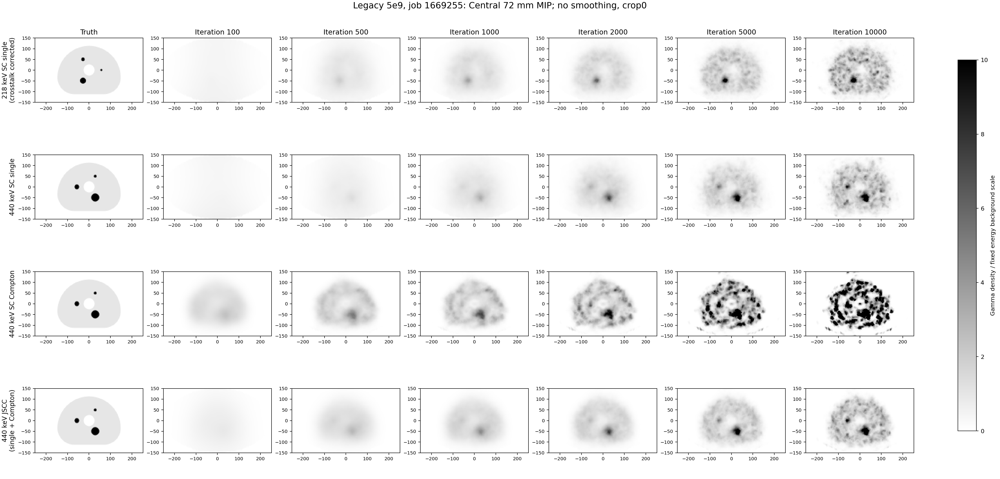

# 218/440单光子、440康普顿与440 JSCC随迭代图像

复用严格验收的作业1669255，四路200帧原始历史SHA全部复核；本次只生成图像。

行顺序：218单光子（固定440→218串窗背景校正）、440单光子、440 SC Compton、440 JSCC（单光子+康普顿）。
列顺序：真实H60三维球体真值、100、500、1000、2000、5000、10000次。未插值迭代帧。

gray_r白低黑高；无平滑、crop0，色标固定0–10，超过10显示黑色饱和而不改原数组。
440三路共同固定为本次440 JSCC第2000次背景尺度943.35180664；218按实际发射数/真值积分转移为415.22638575。
显示使用既有3mm XY插值，无轴向插值；中央72mm MIP为24层中心−34.5～34.5mm，冠/矢图展示完整120mm。
真值为工程generated/NEMA_Body_H60/truth_3mm.npz，SHA和位置记录在metadata.json；没有使用二维NEMA替代。

[原始六路科学结果与200帧曲线](../comparison_1669255/README.md)

四张图已完成视觉QA；24个选择帧的原生最大密度与原验收指标逐值一致，原始四路历史SHA再次通过。
[QA证据](VISUAL_QA.json) · [帧/尺度清单](selected_frames.csv) · [来源与显示设置](metadata.json)
