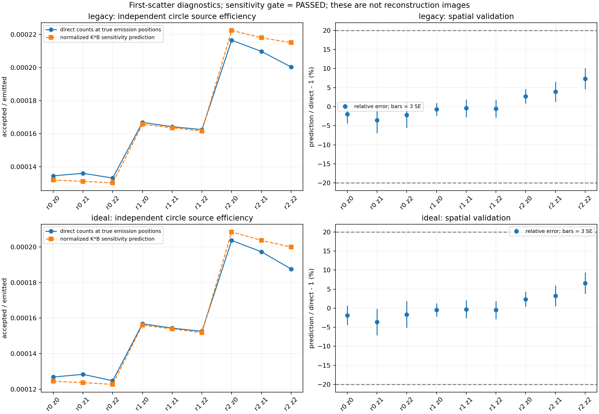
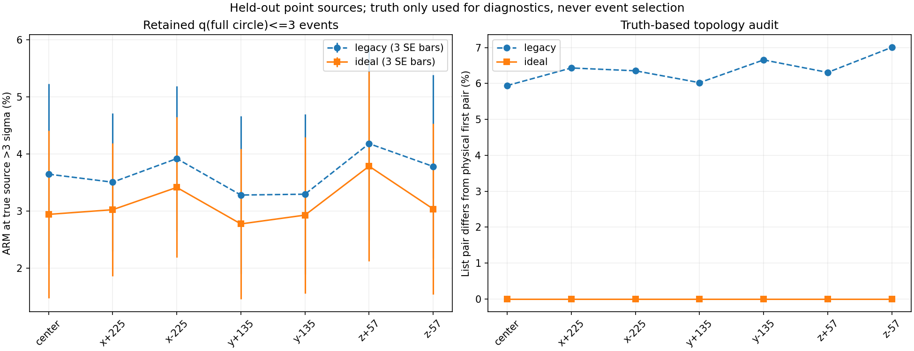
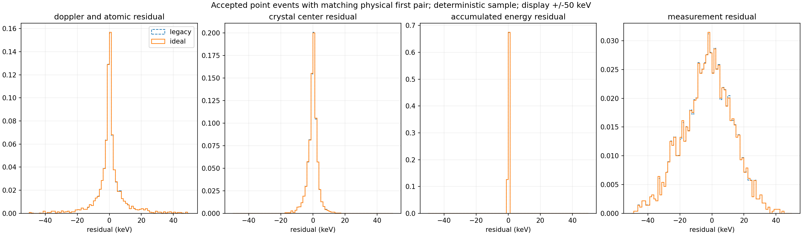
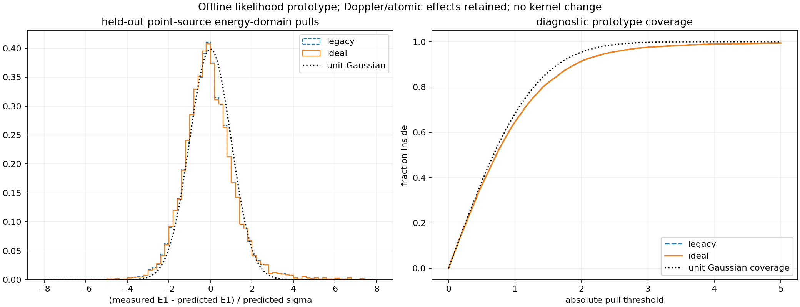
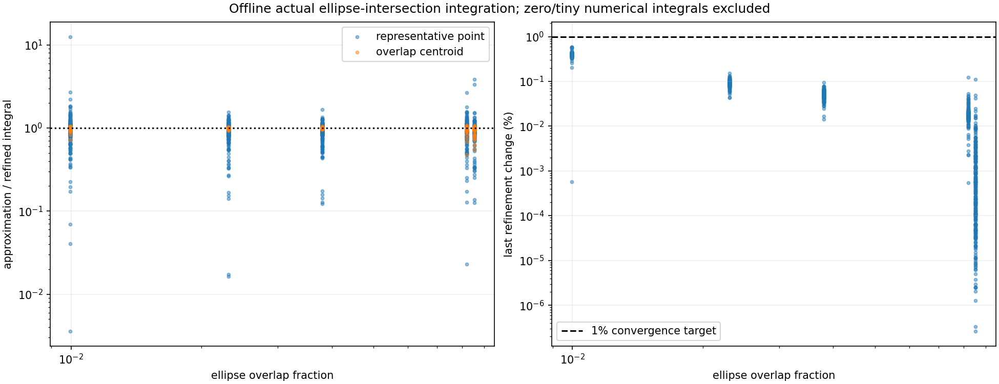

# 首散射修正：输运、响应和灵敏度阶段报告

> 本文件保留为成像前阶段诊断。后续1660254配对2000次已完成；当前结论、图集及恢复代价见[最终验收报告](ACCEPTANCE.md)。
2026-10-04。本报告覆盖真实配对输运与离线验收；旧候选作业1660099在PENDING时被资源门控修复替代；新发布等待账号空位，没有A/B配对图像、CRC变化或尖峰改善结论。完整2000次四条历史的验收仍待完成。

## 数据与兼容性

760个独立worker合计3.17e9实际初级γ，逐数据集数量、种子、视角、PrimaryCount、事件关联与输出SHA闭合。NEMA为200×5e6、20视角；218/440光子分别293821153/706178847。所有200个worker的旧List、两个CntStat与PrimaryCount共800文件与原1e9生产字节一致。三个独立1e4短程诊断开/关也保持旧输出一致。16项C++分类器测试、5项共享算子数值测试、6项结果拒绝门槛测试及11项既有Geant4接口测试通过。

事件识别观察primary离散过程，不再以局部沉积>0为前提；沉积归属与真实交互分别记账，次级后代保留交互来源。理想首散射选择没有杀轨迹，诊断不抽随机数，原展宽每晶体只执行一次。C2允许多次交互/部分吸收。这是有模拟真轨迹的理想选择，尚不能等同设备上的可测规则。

## 最终接受事件与原因

| 口径 | A旧规则 | B首散射修正 |
|---|---:|---:|
| 原能量/层对/响应支持筛选后，q3前 | 97299 | 91385 |
| 全圆132040点严格q>3删除 | 221 | 154 |
| 本轮成像保留 | 97078 | 91231 |

共同90778，A独有6300，B独有453；净接受损失6.023%。B独有453全部是旧List未记录而新规则恢复的事件。新集合不是旧集合子集。原始旧List包含218和440，不能用原始两套List总数计算440效率损失。

A独有原因：測量晶体对不对应首两次primary交互2558；C2之前中间/同晶体交互2100；首次非晶体Compton1409；C1转移—沉积不闭合229；外来C1污染1；primary返回C1为3。拒绝原因按固定分类器的首个失败条件登记，不是互相独立的物理归因比例。这些事件虽然在完整圆域某处有3σ匹配，仍可能对应错误的拓扑。

证据：[事件数量](paired_event_counts.json)、[拓扑统计](paired_topology_counts.json)、[全量输运](transport_collection.json)。删除清单和保留身份的完整CSV在`generated/compton_first_scatter_v2/analysis`，包含输入SHA、worker/seed/view/event及原始行号，大数据不进入Git。

## 独立匹配灵敏度

训练和验证独立、两组各用同一接受策略和同一3σ规则；S分母仍为实际发射数和完整圆体积，保留20视角旋转平均。NEMA事件未用于拟合S。

| 检查 | A | B | 固定门槛 |
|---|---:|---:|---|
| 独立圆源平均闭合偏差 | −0.0682% | +0.0080% | max(2%,3SE) |
| 独立椭圆总效率偏差 | −1.7497% | −1.3708% | max(5%,3SE) |
| 九空间分区最大绝对偏差 | 7.3557% | 6.5776% | 统计充分时>20%且>3SE则HOLD |

全部通过。九分区仍表现为外圈预测偏高，平均闭合不代表每个体素模型精确。没有新增预算消除剩余偏差，也没有以归一化行和替代空间检验。详见[validation_gate.json](validation_gate.json)。

## 点源真实位置的响应一致性

七个独立点源覆盖中心、x=±225、y=±135、z=±57mm及20视角，使用成像实际接受的List晶体对和测量能量，计算真实发射位置的当前非对称ARM。真实位置只参与诊断，不用于新增筛选。

旧组约5.94%–7.01%的接受事件，实际测量晶体对不对应真实首两次交互；新组为0。真实位置q>3的比例旧组约3.28%–4.18%、新组约2.77%–3.78%。事件定义修正清除了错误拓扑，但响应尾部只是部分下降。全域q≤3仅说明某处可以解释事件，不能保证真实源位置落在3σ内。详见[point_consistency.json](point_consistency.json)。

## 能量、位置与累计沉积分解

原始候选的28242条确定性样本包含同层和成像最终拒绝事件。它们晶体中心能量误差RMS约54keV，不可直接称为重建接受事件误差。新增图使用实际接受、测量对与物理首对一致的点源子样本A2234/B2243；错误旧晶体对通过前述全接受点源诊断单独核查，不强行用不对应的物理位置分解。

| 子样本残差RMS，keV | A | B |
|---|---:|---:|
| 真实交互几何的自由电子预测与真实转移差异 | 11.843 | 11.825 |
| 晶体中心代替真实交互位置造成的预测变化 | 3.351 | 3.347 |
| C1累计真实沉积与首次能量转移差异 | 1.508 | 约2e−14 |
| 展宽测量与累计真实沉积差异 | 15.909 | 15.964 |

上述量相关，不能把RMS平方相加直接当作总响应宽度。首散射修正消除了新组C1能量污染，但没有消除测量展宽或自由电子近似与保留物理模型的差异。Geant4的Doppler/原子效应保持原设置；自由电子预测差异不能全部标为程序错误。

预测沉积对应的13% FWHM@511keV高斯原型在真实交互位置上的3σ覆盖率A97.566%、B97.554%，均有比单位高斯更重的尾部。这是诊断原型，不是已经替换生产核的证据，也不是全接受错误拓扑事件的覆盖率。当前成像仍使用原非对称角度核。

## 椭圆边界积分

1440个真实椭圆交集案例全部相邻加密变化≤1%；1435个非微小/非零案例单独进入比值图。代表点在少数小交叠单元可偏离加密积分一个数量级，交叠质心明显接近积分。这证明边界代表点近似值得进一步研究，尚不证明它造成本轮图像尖峰。

积分以物体坐标真实交集产生，之后旋转；已有B除完整体积得到A，避免重复乘体积。A用已有离散场XY三角/轴向线性插值，端层最大1.5mm外推，因此是数值近似上的离线收敛，不等于真实连续响应已经精确。生产K、B、边界体积和MLEM未改变。

## 成像交付仍待完成

新配对任务按50次旧基线回归、两组10次完整试跑、A2000、B2000顺序执行；每50次持久保存，并核对实际分配主存/GPU≤80%、哈希及全部输出。两组各Compton/JSCC，四条40帧历史。正式结果通过后才生成100/500/1000/2000并排图及完整指标；同通道共用A2000背景尺度，中央72mm MIP，无平滑，全部尖峰/质量指标仍在完整120mm域统计。

最终判断继续遵守最大密度和峰/背景比同时下降≥50%，CRC损失>5个百分点标记代价。现在只能确认事件拓扑与能量闭合修正和独立灵敏度门槛通过，不能声称尖峰已经消除、整个FOV有效或2000次可以外推10000次。
