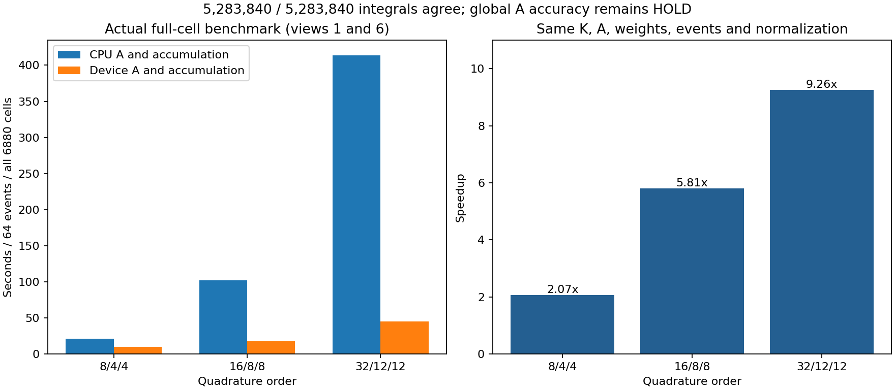
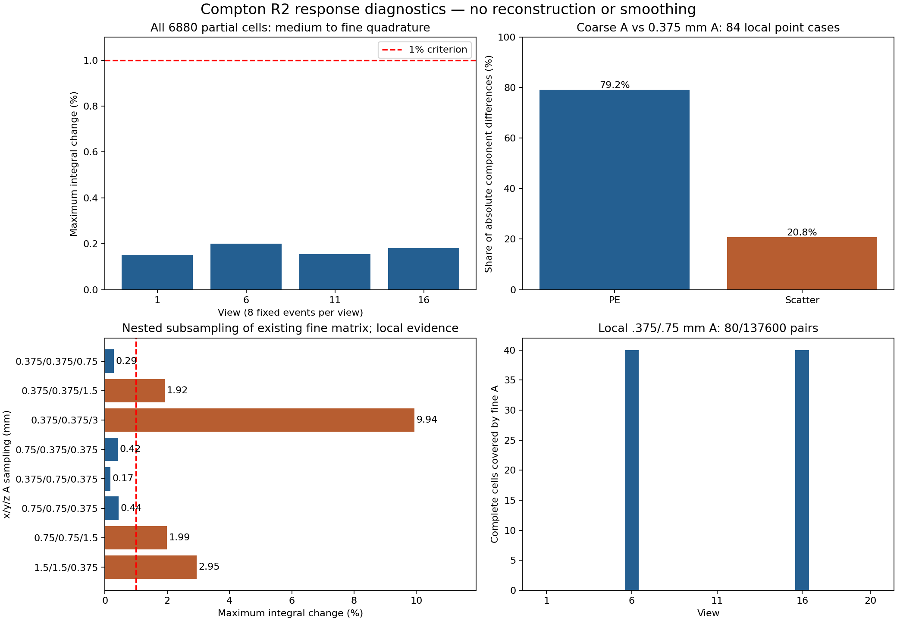

# 完整边界响应算子：CPU/GPU一致性、A误差拆分和覆盖

2026-10-05后续状态：区域与分块门控已通过，完整候选场已启动，见[TILED_FULL_PRODUCTION.md](TILED_FULL_PRODUCTION.md)。本文保留各阶段实际证据；全场科学精度、S2和正式成像仍未验收。

2026-10-04至2026-10-05续作。**完整6880个部分单元的积分与装配已接入诊断入口，CPU/GPU实现已通过真实事件逐项对照；完整物理A场精度仍HOLD，S2和正式2000次配对成像未完成。** 以下图为响应诊断，不是NEMA重建图，也不能作为尖峰改善证据。

## 本次实现和未改变的合同

`compton_overlap_integrator.py`在物体坐标中为真实椭圆交集和完整圆单元分别生成三维节点及dV，再旋转至探测器坐标。`compton_cell_response_field.py`先按完整参考单元的包围盒选择A场；同一单元的交集积分与完整参考积分使用同一场，不能仅因交集更小而选取更精细的局部场。全部6880个部分单元都处理，包括归一化所需的椭圆外部分。

其余圆单元保留R1的K×B，部分单元换为积分K×A×dV；完整圆参考用于混合归一化，82040个活动列用于前反向。权重中体积只乘一次，不再乘f。固定事件不因新场响应全零或非法数值被删除；这类情形HOLD。`CellResponseField.assert_production_ready()`目前明确拒绝生产，不能通过开启“诊断”标志绕过正式入口。

共享K、stable_float64几何、非对称能量角误差、q≤3、132040点筛选网格、原校准和原单光子链均不改变。正式R1/R2事件身份仍须为同一组91225个；本次性能测试只取其中固定前缀，不构成新的成像事件集合。未新增Geant4、Huber、TV、绑定、平滑或迭代任务。

## 完整单元门控

先在视角1/11各2事件完成全6880单元，随后在1/6/11/16各8事件验证缓存。XY三角插值索引按视角、横向单元和积分域复用，轴向索引独立构造；与原索引逐值相等，缓存不改变积分值。节点块32768，单元块8，节点缓存128MiB、XY缓存64MiB，避免全部事件×子节点驻留。

最终CPU批量与GPU版都取视角1/6各64个已冻结接受事件，三档积分阶数为8/4/4、16/8/8和32/12/12；每个事件都覆盖全部6880单元、两个积分域。

| 检查 | 真实结果 | 解释 |
|---|---:|---|
| CPU/GPU全部积分对照 | **5283840/5283840通过** | 128事件×6880单元×2域×3阶数 |
| 混合完整圆归一化 | 六个视角/阶数组合均通过 | 两后端使用相同事件、A、K和体积 |
| 16/8/8→32/12/12 | **1761280/1761280通过** | 最大有效相对变化0.213722%，仍只限于这些样本 |
| 8/4/4→16/8/8 | 视角6有2/880640项超过1% | 最大1.064374%，不能把最粗阶数直接用作统一生产精度 |
| 全82040活动列前后向 | 误差低于1e−5 | 验证实际装配行及其转置 |

CPU/GPU一致性采用`|Δ|≤1e−10|M_CPU|+1e−14 Z_R1`；汇总相对误差的近零下限为`1e−10 Z_R1`。加密积分门槛采用`|Δ|≤0.01|M_fine|+1e−10 Z_R1`。两种容差目的不同，不能把近零单元的相对变化写成整体图像误差。独立证据：[逐项后端门控](overlap_backend_validation.json)、[CPU批量](overlap_benchmark_batched_summary.json)、[GPU批量](overlap_benchmark_cuda_summary.json)、[32事件缓存门控](overlap_benchmark_cached_summary.json)。

## GPU计算修正与实测性能

`compton_overlap_cuda.py`只将当前事件块所需晶体的A行传到GPU，保留原三角/轴向或Cartesian插值公式；共享K继续输出float32，插值及积分累加用float64。连续单元段使用双精度前缀和归约，不使用浮点原子更新，不改变事件、核宽、支持阈值或空间采样。两项独立插值/分块归约测试与既有10项积分/装配测试在服务器通过。

| 阶数 | CPU插值/累加，秒/64事件 | GPU插值/累加，秒/64事件 | 比值 |
|---|---:|---:|---:|
| 8/4/4 | 20.96 | 10.13 | 2.07× |
| 16/8/8 | 101.98 | 17.56 | 5.81× |
| 32/12/12 | 413.90 | 44.69 | 9.26× |

GPU总流程164.60秒，含哈希读取及全部两视角/三阶数；峰值预留2.68GB，占该卡5.27%，主进程峰值RSS约7.27GiB。CPU批量流程1092.39秒。两种后端有一段并行诊断，表中是实际测量，不是独占机器性能或S2耗时承诺，也不能替代未来scxi717实际授予资源的检查。

## 物理A误差来自哪里

使用已有独立点源的同84个案例，保持32/12/12积分阶数、晶体、校准和公共R1归一化，分开读光电窗PE与完整散射矩阵。两部分之和逐项复现原粗场与0.375mm场的积分，84/84通过；最大相对加和误差分别4.70e−8、2.40e−9。

在这些案例中，先按每个事件共同Z归一化，再累加两个分量绝对变化，PE占**79.24%**、Scatter占**20.76%**。这是局部A插值误差的分解，不是两类检测计数的比例，也不是它们对NEMA尖峰的责任比例。不能因此删掉散射项或截断11520个计算探测单元中的钨耦合来源。[分量证据](guard_components_summary.json)保留原矩阵、输入和核哈希。

在同一0.375mm物理矩阵内进行嵌套降采样，保留各方向两端面，进一步区分轴向/横向采样。它不新增矩阵、不更改物理模型。

| A采样x/y/z，mm | 1%门槛通过数 | 最大积分变化 |
|---|---:|---:|
| 0.375/0.375/0.75 | 84/84 | 0.2864% |
| 0.375/0.375/1.5 | 82/84 | 1.9238% |
| 0.375/0.375/3 | 60/84 | 9.9362% |
| 0.75/0.375/0.375 | 84/84 | 0.4182% |
| 0.375/0.75/0.375 | 84/84 | 0.1747% |
| 0.75/0.75/0.375 | 84/84 | 0.4381% |
| 0.75/0.75/1.5 | 82/84 | 1.9873% |
| 1.5/1.5/0.375 | 80/84 | 2.9462% |

轴向3mm不能仅凭较小的全局效率变化视为足够；同时，以上通过结果只覆盖局部预定案例，不能直接作为全FOV粗化依据。[采样证据](guard_sampling_summary.json)与此前独立0.75→0.375mm实际矩阵84/84收敛证据共同用于确定下一小块规格。

## 全场覆盖与资源门槛

将全部6880部分单元完整参考域旋转20视角并去重，需要探测器坐标下**52800个参考单元、1320种横向单元**。检查包围盒而非代表点，三块0.375mm细场原先仅覆盖**6/137600个单元—视角组合**。加入全轴向0.75mm小柱后，完整覆盖为**80/137600**：视角6和16分别40层，已有三个更细轴向层优先使用0.375mm场。因此，已接入细场的完整积分器仍大部分使用原粗场；覆盖率、积分收敛和物理精度证书必须分开。[覆盖证据](A_coverage_plan.json)明确区分原细块6项与当前混合细场80项。两块试生产数据尚未接入此完整积分器，不加入80项的统计。

仅按这些唯一参考单元体积除采样体积，不计box补空白、插值halo和共享面额外点，0.375mm全向采样四个11520行原始文件估计约**35.98TB**，一个10496行float32合并场也约8.20TB；0.75mm全向分别约4.50TB和1.02TB。这些是体积估算，不是可用生产点数或存储承诺。不能直接启动全环高密度矩阵，更不能通过省掉物理散射来源降低模型。[完整覆盖与存储估算](A_coverage_plan.json)。

## 全轴向小柱已完成

全轴向补点`A440_near_column`在65114 GPU4完成，PID2269731，发布`6e7adfc3ead95a5d`，总562.05秒，45分钟上限、防重复锁。块为x=−6:0.75:6、y=248.25:0.75:255.75、z=−60:0.75:60，总30107个辅助A采样点、11520个计算行，四文件合计5.55GB；不改变成像网格。PE-v4、完整ScatterGen、材料、窗和校准均保持原模型。

四分量有限非负、文件大小和SHA全部检查通过；原Cartesian40个轴向公共点的光电矩阵逐值一致，Scatter相对L2为3.09e−11；三块独立0.375mm参考的公共点光电响应逐值一致，Scatter最大L2为4.06e−10、合并响应最大1.11e−10。[物理小柱证据](guard_column_summary.json)。这证明公共采样值一致，不能替代所有中间位置的插值精度验证。

接入小柱后，CPU在视角6/16各2事件完整积分，146.74秒；CUDA各8事件完整积分，125.34秒，峰值预留约0.76%、RSS约6.76GiB。两视角16/8/8→32/12/12的220160项全部通过，最大有效相对变化0.3260%；本次最粗一级也通过，但不推翻此前128事件发现的两项最粗级失败。CUDA与CPU共同4事件×6880×2域×3阶数=165120项通过既定一致性门槛，前后向误差最大6.19e−8。该对照的独立CPU前缀只有4事件，不能把整个16事件结果都写成CPU独立复核。[CPU小柱积分](column_operator_cpu_summary.json)、[CUDA小柱积分](column_operator_cuda_summary.json)。两进程2307296、2316013均退出，GPU释放。

后续分块场的准确几何、存储和公共面试生产见[TILED_FIELD_PREFLIGHT.md](TILED_FIELD_PREFLIGHT.md)。完整场未启动；独立全场A精度通过后，才能生成同一算子的S2、验证独立圆/椭圆与空间闭合，再执行R2完整10次和R1/R2顺序2000次。当前未生成S2，未提交正式配对作业。

## 可复现证据和入口

从实验目录运行`compton_geometry_v3_workflow.py`，新增入口为`overlap-benchmark[-cached/-batched/-cuda]`、对应`fetch-*`、`verify-overlap-backends`、`guard-components`、`guard-sampling`、`guard-column`、`column-operator-cpu/-cuda`及其取回入口；分块为`tile-pilot`、`fetch-tile-pilot`、`verify-tile-reader`。已登记作业拒绝重复提交。大矩阵、积分数组和原始List留在独立generated目录，只将代码、小型JSON及图入Git。

`audit_compton_integral_sources.py`对历史与本次发布逐文件找当前或冻结原字节；改动后的早期执行源码保存于`frozen_execution/发布ID`，不把当前代码冒充已经跑过的代码。原数据、原矩阵、旧停止任务和旧图保持只读。所有科学结论以门控JSON和匹配哈希为准。
