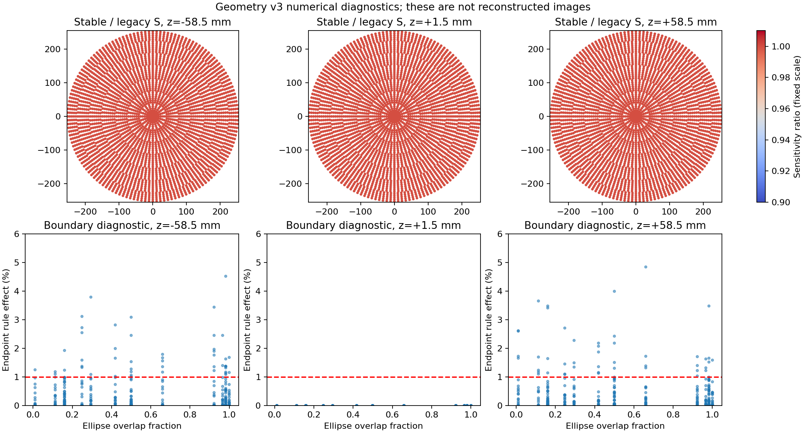

# Compton稳定几何与边界积分：实施和门控结果

本轮已落地[实施计划](PLAN.md)及冻结配置，修复共享`process_list`近共线几何计算，并完成真实事件全量扫描、新S和独立响应检查。**配对成像尚未提交**：必须先解决边界积分门控问题。旧自动任务、Huber/TV、旧10000次任务保持停止；未新增Geant4输运。

## 已完成

- stable_float64先转双精度再相减，使用叉积/atan2和切向量梯度，q与K共用实现，最终响应存float32。默认legacy保留原计算路径。
- 65114上8项CUDA数值测试全部通过；4个真实视角、每视角32个候选的完整132040列K/q与冻结旧核逐值一致。此核回归不能替代尚未执行的50次图像回归。
- 全量NEMA筛选前91385，稳定q3后91225。相对R0的91231退出6个，无新增；[新增删除清单](newly_removed_events.csv)保留身份、原行号和输入哈希。
- 训练圆源1e9、独立圆源1e9、椭圆源1e8和七点源7e7全部使用现有数据重算。圆源平均闭合1.00006892；独立椭圆效率相对误差-1.367%，原有九分区通过。新增边界/内部空间门控状态见[空间证据](spatial_summary.json)。圆源视角池化的真实源标签与S必须同时进行20视角平均，worker内部旋转作为相关样本。
- S1完整圆网格最小新旧比0.919487，中位数1.00000000；这说明少量数值异常对个别位置的灵敏度仍有影响，不能只看全局闭合。它不是新的图像尖峰改善证据。
- 积分布局增加`object_active_integrated`合同，直接使用已含旋转/体积的活动列和S，避免再次乘f；常量体积、仿射场插值和严格伴随测试通过。正式R2行生成/S2仍受门控，不把接口测试写成生产完成。

## R2为何HOLD

在15个预定部分单元、中心/上下端层、七独立点源的四方位，完成1260个响应案例。1260个均达到相邻加密1%收敛要求，但94个端层案例对线性外推与端点固定规则的变化超过1%容限，最大约5.48%。这些都是离线响应诊断，不是重建结果。

完整圆归一化参考还有6个外圈部分单元超出极坐标A场的凸包，8阶测试约半个完整单元体积没有插值支持，积分点到r=254.59mm。原Cartesian矩阵虽已找到，但横向采样同样止于±252mm，不能保证所有视角的255mm计算支持；轴向采样止于±58.5mm，同样缺少端面依据。不能静默径向外推，也不能只积分椭圆后按圆体积估S。

分段精确交叠积分还发现4种每层小单元的冻结体积相对误差为0.10281%，略超预定0.1%容限；包括原Compton峰对应的cell1596。它与响应收敛是不同问题，不能混在一起视为通过。原网格不覆盖；若生成更精确有效体积，需独立manifest及一致的积分/指标合同。

下一实施门槛是：独立补充A场端点/径向支持，验证新旧公共采样响应和端点敏感性；生成独立精确交叠体积并记录SHA；保持R1事件集合，重新验证完整圆归一化参考和R2的S2。所有门控通过后再执行旧路径50次、两组完整10次及2000次配对成像。未通过时不提交生产任务，不放宽门槛来制造图像。

## 数值可视化与证据

[R1扫描和灵敏度](R1_summary.json)、[R2边界门控](boundary_summary.json)、[运行簿](PRODUCTION.md)、[发布/输入哈希](deployment.json)。生成数据和完整响应案例位于`generated/compton_response_geometry_v3`，不进入Git。当前结果限于数值正确性和离线误差，尚不能宣称尖峰减轻。
