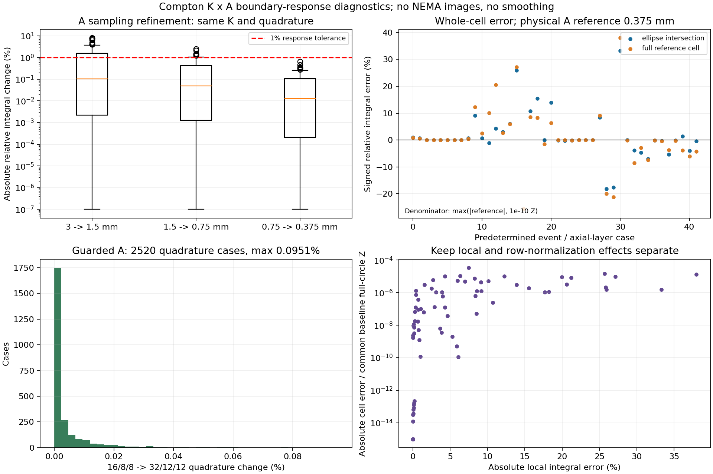

# Compton稳定几何与边界积分：实施和门控结果

> **2026-10-05 当前状态：精细 A 场按用户要求停止，相关辅助矩阵已清理，不再续跑或生成 S2。** 见[停止与清理收据](STOP_AND_CLEANUP_20261005.md)和[保留柱坐标的新调查计划](../process_list_global_audit_v4/PLAN.md)。下文生产进度、预计完成时间和旧计划属于停止前历史，不再执行。

2026-10-05北京时间14:26进度：2018/10720块（18.82%），较上次增加454块；四worker正常运行约13.1小时，GPU0/1/4为100%、GPU3为98%。收据/大小核查无异常，日志无故障、磁盘预留满足；最近每块97–103秒，剩余矩阵计算规划58–75小时，续跑空隙另计。首轮20小时停止点约今晚21:20，尚未到点。[运行说明](TILED_FULL_PRODUCTION.md)记录现场检查；全场精度、S2和正式配对2000次尚未完成。

2026-10-05北京时间11:22进度：完整候选A场1564/10720块（14.59%），GPU0/1/3/4正常推进；四日志未见故障，已扫描1562份收据/大小合同通过、磁盘预留满足。约10小时新增1533块，剩余矩阵计算条件估计60–80小时，分批停止及续跑间隔另计。[现场审查](tiled_field_full_live_audit_20261005.json)和[运行说明](TILED_FULL_PRODUCTION.md)区分块级存储通过与尚未完成的全场科学验收。S2、正式配对2000次仍待门控。

2026-10-05最新生产：[完整可续跑A候选场](TILED_FULL_PRODUCTION.md)已在65114 GPU0/1/3/4启动，PID2542514/2542646/2542872/2543046。区域168/168精度、21块读取/12公共面及四卡完整索引8块资源试跑均通过，复用29块，目标10720块/2.211TB。20小时tile边界停止、24小时外部上限；全场科学精度仍HOLD，S2和正式2000次未运行，尚无尖峰改善结论。

本轮已落地[实施计划](PLAN.md)及冻结配置，修复共享`process_list`近共线几何计算，并完成真实事件全量扫描、新S和独立响应检查。**配对成像尚未提交**：必须先解决边界积分门控问题。旧自动任务、Huber/TV、旧10000次任务保持停止；未新增Geant4输运。

最新续作：[完整边界算子与GPU验证](FULL_OPERATOR_PREFLIGHT.md)。6880个部分单元已接入物理交集/完整圆参考积分；128个固定事件的CPU/GPU全5283840项积分与归一化一致，最高阶积分实测约快9.26倍。全轴向0.75mm小柱完成公共点回归及CPU/CUDA积分检查；完整细场覆盖由6增至80/137600单元—视角对。**全A精度仍HOLD，S2和正式2000次配对未完成。**

[分块响应场试生产和读取](TILED_FIELD_PREFLIGHT.md)也已完成：两相邻块保留完整11520行物理计算，10496晶体合并响应提取逐值一致，公共面及确定性读取通过；211.90秒完成，进程退出、GPU释放。精确几何规划为10720块、持久化约2.21TB，完整候选生产状态见顶部最新记录。局部A误差PE/Scatter占比79.24%/20.76%和上述数值检查均不是NEMA尖峰改善证据；区域精度现已通过，下一门槛是完整候选场的覆盖、接口和独立精度验收。

[四区域×三轴向层独立物理采样及精度](REGIONAL_A_VALIDATION.md)已完成：98463辅助点及公共回归通过；168/168真实交集/完整参考响应通过，141项有可判别响应，0.75→0.375mm最大变化0.5040%、积分加密最大0.02988%。28个预定点源事件在三层重复使用，不能当成168个独立MC样本。引用修复携带冻结原measure，严格哈希保持，未改变响应模型。21块多worker区域生产、12公共面及四卡完整索引8块试跑均通过，完整候选场已启动；全场精度、S2、正式配对仍HOLD。

## 已完成

较早的阶段证据见[完整单元与A插值检查](WHOLE_CELL_VALIDATION.md)：2520个积分案例全部收敛，但独立物理A加密显示原插值场在具体近侧单元仍有显著差异。3→1.5、1.5→0.75、0.75→0.375mm分别通过60/84、75/84、84/84；最后一级最大变化0.6553%。这些是响应诊断，不能写成成像改善。R1作业1661583的50次回归两路L2均0，完整10次试跑通过、显存峰值44.58%、Slurm主存峰值24.20%。局部密采样现已接入完整R2诊断积分器，但尚未取得全场物理精度证书；未生成S2或提交正式2000次配对成像。

2026-10-04续作：[A440补点与精确体积](SUPPORT_EXTENSION.md)。18点公共回归已通过，六面补点在GPU4执行；精确体积本地验收通过，原网格不变。A场及独立插值检查已安排有界顺序接续，实时状态见[guard_summary.json](guard_summary.json)。R2仍待新场门控和S2，配对成像未提交。

续作最终状态：九部分补点、A场、服务器精确体积和两类独立插值检查已完成，GPU释放。径向近探测器侧响应分布L2差3.80%–3.85%，总效率差仅约0.1%；114个独立点源事件的K加权诊断仍有2.41%–2.63%径向差异。完整响应积分门控仍待细化验证，未生成S2或提交重建。轴向逐晶体检查HOLD与整体L2<1%并存，不把其直接解释为完整算子失败。14项本地测试和有界CPU修复通过，详见补点报告。

- stable_float64先转双精度再相减，使用叉积/atan2和切向量梯度，q与K共用实现，最终响应存float32。默认legacy保留原计算路径。
- 65114上8项CUDA数值测试全部通过；4个真实视角、每视角32个候选的完整132040列K/q与冻结旧核逐值一致。另在1661583完成50次图像回归，两路L2=0；两项证据分别保留。
- 全量NEMA筛选前91385，稳定q3后91225。相对R0的91231退出6个，无新增；[新增删除清单](newly_removed_events.csv)保留身份、原行号和输入哈希。
- 训练圆源1e9、独立圆源1e9、椭圆源1e8和七点源7e7全部使用现有数据重算。圆源平均闭合1.00006892；独立椭圆效率相对误差-1.367%，原有九分区通过。新增边界/内部空间门控状态见[空间证据](spatial_summary.json)。圆源视角池化的真实源标签与S必须同时进行20视角平均，worker内部旋转作为相关样本。
- S1完整圆网格最小新旧比0.919487，中位数1.00000000；这说明少量数值异常对个别位置的灵敏度仍有影响，不能只看全局闭合。它不是新的图像尖峰改善证据。
- 积分布局增加`object_active_integrated`合同，直接使用已含旋转/体积的活动列和S，避免再次乘f；常量体积、仿射场插值和严格伴随测试通过。正式R2行生成/S2仍受门控，不把接口测试写成生产完成。

## R2为何HOLD

在15个预定部分单元、中心/上下端层、七独立点源的四方位，完成1260个响应案例。1260个均达到相邻加密1%收敛要求，但94个端层案例对线性外推与端点固定规则的变化超过1%容限，最大约5.48%。这些都是离线响应诊断，不是重建结果。

完整圆归一化参考还有6个外圈部分单元超出极坐标A场的凸包，8阶测试约半个完整单元体积没有插值支持，积分点到r=254.59mm。原Cartesian矩阵虽已找到，但横向采样同样止于±252mm，不能保证所有视角的255mm计算支持；轴向采样止于±58.5mm，同样缺少端面依据。不能静默径向外推，也不能只积分椭圆后按圆体积估S。

分段精确交叠积分还发现4种每层小单元的冻结体积相对误差为0.10281%，略超预定0.1%容限；包括原Compton峰对应的cell1596。它与响应收敛是不同问题，不能混在一起视为通过。原网格不覆盖；若生成更精确有效体积，需独立manifest及一致的积分/指标合同。

以上是初次门控的问题记录。端点/径向支持与精确体积已补齐，当前HOLD是全场物理A插值精度；完整参考积分、归一化和CPU/GPU诊断已接入。保持R1的91225身份，完成独立区域精度门控后再生成匹配S2、验证独立圆/椭圆空间闭合、执行R2完整10次及两组顺序2000次。R1的50次回归与10次试跑已完成，不能继续记为未执行。

## 数值可视化与证据

[R1扫描和灵敏度](R1_summary.json)、[R2边界门控](boundary_summary.json)、[运行簿](PRODUCTION.md)、[发布/输入哈希](deployment.json)。生成数据和完整响应案例位于`generated/compton_response_geometry_v3`，不进入Git。当前结果限于数值正确性和离线误差，尚不能宣称尖峰减轻。
