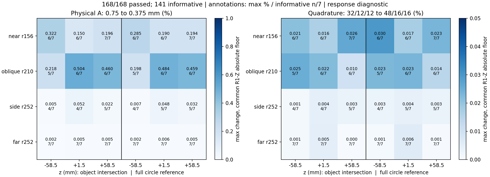

# 独立区域A采样及K加权精度：区域验收通过

2026-10-05后续状态：区域与分块门控已通过，完整候选场已启动，见[TILED_FULL_PRODUCTION.md](TILED_FULL_PRODUCTION.md)。本文保留各阶段实际证据；全场科学精度、S2和正式成像仍未验收。

2026-10-05。继[分块试生产](TILED_FIELD_PREFLIGHT.md)通过后，继续检验物理A的区域精度。**三个物理生产组及168项K加权区域检查均完成；仅区域精度通过，全场精度仍HOLD，未生成S2或提交重建。** 未新增Geant4光子。原材料、PE-v4、完整ScatterGen、距离、窗及四层校准保持不变。

## 预定控制和预算

控制只由所有部分单元旋转20视角后的完整参考几何选取；不看NEMA图像或峰位置。按预定物理目标选择最近的可用参考单元，同时冻结它对应的原物体单元和采集视角，后续真实椭圆交集不会错误地固定在探测器坐标下。

| 控制 | 目标r/角度 | 实际探测器坐标中心x/y，mm | 原物体横向单元 | 采集视角，1基 |
|---|---|---|---:|---:|
| 内圈近侧 | 156mm / +90° | 0 / 156 | 1311 | 2 |
| 中圈斜向 | 204mm / +45° | 148.492 / 148.492，实际r210mm | 2292 | 7 |
| 外圈侧向 | 252mm / 0° | 252 / 0 | 3161 | 1 |
| 外圈远侧 | 252mm / −90° | 0 / −252 | 3161 | 6 |

单元编号是0基。中圈目标r204/45°在所需参考集合中没有完全相同的单元，按预先的最近几何规则得到r210/45°，实际位置明确保留。每种横向单元取z=−58.5、+1.5、+58.5mm，对应层0、20、39，共12个控制。

各控制按完整参考单元包围盒向外对齐0.75mm格点，两个独立物理计算分别0.75和0.375mm，后者包含全部前者公共点。总98463个辅助A采样点、四分量原始输出18148700160 bytes，约**18.15GB**；全部11520物理来源/目标行参与计算。成像网格和q网格不变。具体形状、包围盒、视角、几何、精确体积和源码SHA见[regional_a_plan.json](regional_a_plan.json)。该冻结文件禁止静默重写。

3项真实几何测试通过：原单元经旋转确实落在声明的探测器单元；两种场同时包含完整参考域及真实交集的32/12/12积分点；每个粗采样点在独立细场中有完全相同的坐标，原ScatterGen索引量低于2³¹。测试不依赖NEMA真值。

## 当前作业与门控

发布`63d405cde5eef50a`，每组32821点、四个控制×两个场，独立输出、flock和45分钟总上限：

| 组 | z | 65114 GPU | PID |
|---|---:|---:|---:|
| 0 | −58.5mm | 0 | 2367129 |
| 1 | +1.5mm | 1 | 2368489 |
| 2 | +58.5mm | 3 | 2369219 |

三个生产进程已退出，分别32821点、全部公共PE逐值一致，Scatter/合并响应数值门槛通过；物理计算耗时合计分别757.54、744.58、770.39秒，含8个矩阵计算阶段，不冒充完整墙钟。GPU2的其他项目不受影响；前面的积分/小柱/相邻块进程均已结束。全部路径为既有椭圆工程独立`generated/compton_response_geometry_v3/regional_a_gGROUP`。

每个块检查四分量文件大小、SHA、有限非负值；0.75/0.375公共PE点要求逐值一致，Scatter/合并响应要求原公共点数值门槛。失败保留原输出并停止组内后续，不能覆盖失败文件或重拟合校准。只有这些生产检查通过，才生成`regional_ready.json`，其状态仍是**ACCURACY_PENDING**。三个组先各自检查，不能只凭后台进程退出判断完成。

## 已完成误差分析及引用修复

取现有七个独立点源、该控制冻结采集视角中按原行顺序找到的首个稳定q≤3事件（最多扫描前32候选；没有合格事件标未判定，不改筛选），保存原行号、晶体和输入SHA。初始控制覆盖至多84个事件—单元组合，分别计算真实物体交集及完整圆参考。两种场使用相同事件、共享稳定K、校准和共同R1完整圆Z。

先检查积分加密，再比较独立0.75→0.375的响应变化，容差保持`|ΔM|≤0.01|M_fine|+1e−10 Z_R1`。完整参考与物理交集都检查，绝对近零项、区域/轴向差异逐项保留。区域矩阵公共点一致并不保证中间位置精度，不替代此分析。初步区域通过仍不自动认证整个场；据误差分布确定下一完整或自适应场方案，然后做覆盖/接口/独立精度门控。

实际分析采用28个预定独立点源事件（四个视角各七个），每个横向控制在三个z层复用同一事件，再分别计算真实交集/完整圆参考，共168项。它们不是168个独立MC样本。全部168项通过A采样及积分加密门槛；141项高于共同Z绝对误差地板，27项为近零、不能单独作为区域精度充分证据；未缺少预定事件。独立0.75→0.375mm最大有效变化**0.504028%**，32/12/12→48/16/16最大变化**0.029879%**，体积相对误差最大4.22e−15。共同Z保持原R1完整圆K×B、最终K仍float32，不更改核或接受规则。

启动PID2394289在创建分析输出前被身份检查拒绝：冻结计划使用本地精确measure SHA `bf29705…`，服务器此前独立重算为`a21010…`。并非仅manifest字节不同，底层NPZ数值也有机器舍入差异；活动/部分索引逐值一致，体积最大绝对差1.7053e−13mm³、相对L2 5.11e−17，比例最大差8.33e−16。原文件和失败发布均保留。新分析PID2402343在独立冻结发布中携带**计划原measure文件及其manifest**，严格哈希不放宽；10.95秒完成退出。[身份诊断](regional_measure_identity_diagnostic.json)、[实际分析](regional_validation_frozen_measure_summary.json)、[逐项案例](regional_validation_cases.csv)保存全部来源。

| 控制 | z，mm | 可判别项/14 | A最大变化 | 积分最大变化 |
|---|---:|---:|---:|---:|
| 内圈近侧 | -58.5 | 12/14 | 0.3217% | 0.0299% |
| 内圈近侧 | +1.5 | 12/14 | 0.1901% | 0.0173% |
| 内圈近侧 | +58.5 | 14/14 | 0.1962% | 0.0263% |
| 中圈斜向 | -58.5 | 10/14 | 0.2178% | 0.0251% |
| 中圈斜向 | +1.5 | 12/14 | 0.5040% | 0.0234% |
| 中圈斜向 | +58.5 | 12/14 | 0.4599% | 0.0144% |
| 外圈侧向 | -58.5 | 8/14 | 0.0072% | 0.0026% |
| 外圈侧向 | +1.5 | 9/14 | 0.0516% | 0.0044% |
| 外圈侧向 | +58.5 | 10/14 | 0.0324% | 0.0033% |
| 外圈远侧 | -58.5 | 14/14 | 0.0017% | 0.0008% |
| 外圈远侧 | +1.5 | 14/14 | 0.0064% | 0.0060% |
| 外圈远侧 | +58.5 | 14/14 | 0.0052% | 0.0006% |

该结果支持0.75mm作为下一完整场的**候选**采样，不能把有限区域检查写成所有单元均通过，也不说明尖峰已改善。下一步是可续跑分块生产的小批多worker确认：覆盖这12个参考域所需的全部tile，核对原物理公共点、跨块面、逐值提取、实际吞吐和GPU/主存/磁盘余量。完整候选场生产后还需覆盖与独立精度检查，才能生成S2和放行成像。

已有近侧外圈84例和本批区域均是独立响应诊断，不是重建结果，不宣称尖峰减轻。只有匹配S2及独立空间闭合、R2完整10次通过后，才按既有计划顺序启动R1/R2各Compton与JSCC2000次。

## 取回和防重复

从实验目录使用`compton_geometry_v3_workflow.py status`；本次已运行`fetch-regional-a --group 0`、1、2及`fetch-regional-validation`，取回小型收据并验SHA。已有job.json拒绝重启。若超时或失败，先确认对应旧PID退出，检查console与输出完整性，单独处理失败组；不取消其他工程。SSH仍沿用既有agent，不保存凭证。大响应保留远端，Git仅提交计划、代码、作业登记、小型证据和报告。
