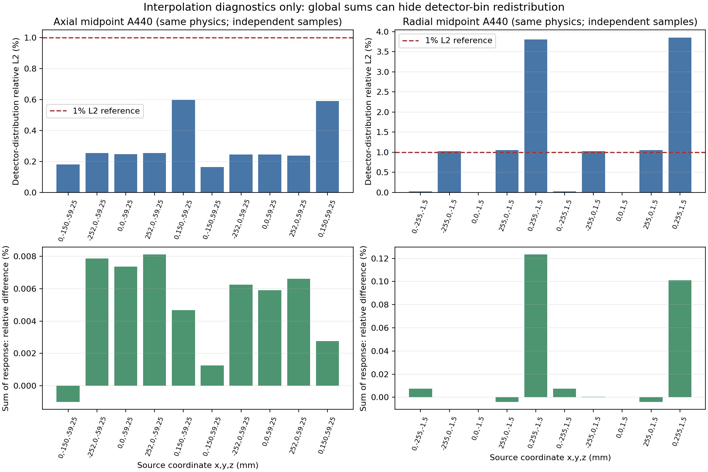

# A440支持补点与精确交叠体积

2026-10-04按已授权计划继续实施。原R2门控的三个问题分别处理：端面缺采样、完整圆参考超出横向凸包、小交叠单元体积误差略超容限。补点是已有响应模型的辅助采样，不增加Geant4输运，不扩大重建或q筛选网格。实际完成状态见[guard_summary.json](guard_summary.json)。

## 补点与原模型合同

原Cartesian为85×85×40，x/y=-252:6:252，z=-58.5:3:58.5mm。补两个87×87端面z=±60、x=±258的1×87×40侧面、y=±258的85×1×40侧面，六部分无重复共28,898点。扩展盒覆盖r≤255、|z|≤60的完整计算单元。原矩阵、三个单光子Factors及四层校准系数保持只读。

使用原PE/Scatter生产二进制，SHA分别为`58f1fbc62b7c24f572a0a57818cded6d2278a7c988097ed9832d0bbe57af9c94`、`717ce146cd56a00717cf0a8d440e464578fa80490a075ab867b3cce832596c2c`。四份原参数先验SHA，只改变Params_Image的采样范围。PE-v4、face-subdiv16、材料、散射窗、270mm距离及全部11,520计算晶体保留；不删掉作为散射源的钨晶体行。每块元素数低于2³¹，避免旧ScatterGen索引溢出。所有结果检查大小、有限非负和SHA。

先生成18个公共点：中心3×3×2，x/y=-6/0/+6，z=±1.5mm，逐晶体对照原矩阵。门控通过后才允许补点生产。

| 响应 | 相对L2差异 | 逐值一致 |
|---|---:|---|
| 未加窗PE | 0 | 是 |
| 加窗PE | 0 | 是 |
| Scatter | 1.81355e-9 | 否，最大绝对差7.11e-15 |
| PE+Scatter | 2.21633e-10 | 否，最大绝对差1.42e-14 |

逐项误差容限也通过，见[公共点证据](anchor_gate.json)。这是旧数值模型的兼容证据，不证明该模型与真实输运完全一致。

## 精确体积与A场

172种每层部分单元使用解析角度断点分段、独立自适应积分，再由32阶Gauss积分复核。新measure保留82,040活动单元和6,880部分单元的身份/顺序，原geometry.npz不改写。理论椭圆体积14,137,166.941154mm³，新积分14,137,166.940753mm³，相对差-2.84e-11；32阶与独立参考最大相对差2.22e-14。见[本地精确体积验收](local_measure_manifest.json)。

A插值场保留原3,301横向点，加r258的140个辅助方位，z保留原40层并加±60端面。辅助点不参加q，不改变132,040计算单元。内部节点严格为float64(原Bfloat32)/完整单元体积；原凸包内保留旧Delaunay权重，外部才使用补点。新三角剖分须保留旧凸包边，避免拼接不连续。轴向只能在实测采样端面之间插值，禁止固定端点或外推。

A场布局为detector×z×xy的float64文件，便于按C1读取。补点沿用四层校准一次，内部B除完整体积一次；真实交叠权重已含dV，不能再乘f或ΔV。

## 独立检查与共享装配

独立z=±59.25采样检查端层插值。另一个接续检查使用x/y=0/±255、z=±1.5的响应；r255以外的角点仅标为范围外。分别检查L2、总效率及逐晶体差异，1%容限，近零值有明确绝对底限。它们是同模型插值检查，不替代独立输运或S2验证。

compton_overlap_assembly.py实现混合完整圆参考：未修改单元保留原K*B，部分单元的完整积分进入分母，真实椭圆交集积分进入活动列。逆旋转表定位替换单元；分母直接累加剩余单元和完整积分，避免大数相减。不允许椭圆内单独归一化、重复乘f或静默删除零活动响应事件。S2贡献保持实际发射分母和20视角平均。

13项本地测试通过，包括4项合成数学算子测试、完整参考域20视角覆盖及原内部插值兼容。它们不算真实事件或成像验收。正式R2积分生产、S2和四条图像历史尚未完成。

## 登记与后续门槛

- 补点PID1985661，65114物理GPU4，4小时有界，flock防重；公共点门控已通过。
- A场/精确体积/轴向检查PID2003014，仅CPU等待补点后接续，2小时有界。
- 径向检查PID2015061，等候A场并确认GPU4空闲后才计算，等待不占卡，2小时有界。

三份job/deployment和guard_summary登记实时证据。A场接续发布0b857a3803d4ba3a使用最初轴向检查版本，字节保存在frozen_execution目录；径向发布使用显式parts的新版。已启动发布不改写。大矩阵/A场留在generated，不进Git。

接下来仍需原1260控制案例在新场上的复核、完整参考归一化、生产吞吐/分块检查及独立S2验收，再执行50次历史图像回归、R1/R2各10次试跑与各2000次Compton/JSCC。补点或A场诊断完成不会自动将R2门控标成通过，也不会自动提交成像。

## 实际完成后的新证据

九部分（公共点、六面及两个轴向独立检查面）全部完成，A场已构建并验SHA。原CPU接续在体积阶段因Windows/Linux的libm坐标差约2.84e-14mm触发逐位相等检查。没有重新生产A，也没有覆盖旧发布：旧进程退出后，用独立修复发布db8cc160e98677f1/PID2039093完成缺失的体积和轴向诊断。几何输入仍逐文件验SHA，坐标核查采用1e-10mm绝对容差，并增加测试证明1e-6mm真实漂移仍拒绝。初次失败日志及实际执行旧脚本字节保留，14项本地测试通过。

精确体积服务器验收PASSED。[轴向检查](midpoint_gate.json)整体L2为0.163%–0.597%，总效率差绝对值≤0.00814%，但少量晶体超过逐项1%诊断，因此该严格诊断仍标HOLD。[径向检查](radial_midpoint_gate.json)远离探测器侧L2约0.028%，长轴±255处约1.02%–1.06%，靠近探测器的y=255处为3.80%–3.85%；后者总效率差只有0.101%–0.123%。这些是当前矩阵模型的插值误差，不是独立输运失配或图像尖峰因果证据。

为进一步判断这些误差是否会进入Compton算子，PID2047834使用七个已有独立点源、四个预定视角、每文件前32行，经原能量/运动学与稳定全圆q3得到114个诊断事件。对相同K和相同完整圆参考，比较K*A直接独立点采样与K*A插值。该确定性小样本的轴向加权L2最大0.521%，靠近探测器y255的径向加权L2为2.411%和2.627%。加权和差仍仅0.292%–0.457%。证据见[weighted_interpolation.json](weighted_interpolation.json)，实际发布以guard_weighted_deployment.json为准。它说明径向分布误差在K加权后仍可见；不是3D积分、S2或总体检测效率门控，也不能据此判断NEMA峰值改善。

所有本轮PID已经退出，GPU4释放。未生成S2，未提交新重建。下一步优先研究近探测器一侧的径向插值细化，并用完整/交叠单元的加密响应检验1%积分门槛；不因总效率接近就忽略响应分布，也不把严格逐晶体诊断直接等同于完整算子失败。没有新增输运、放宽q或改能窗。
