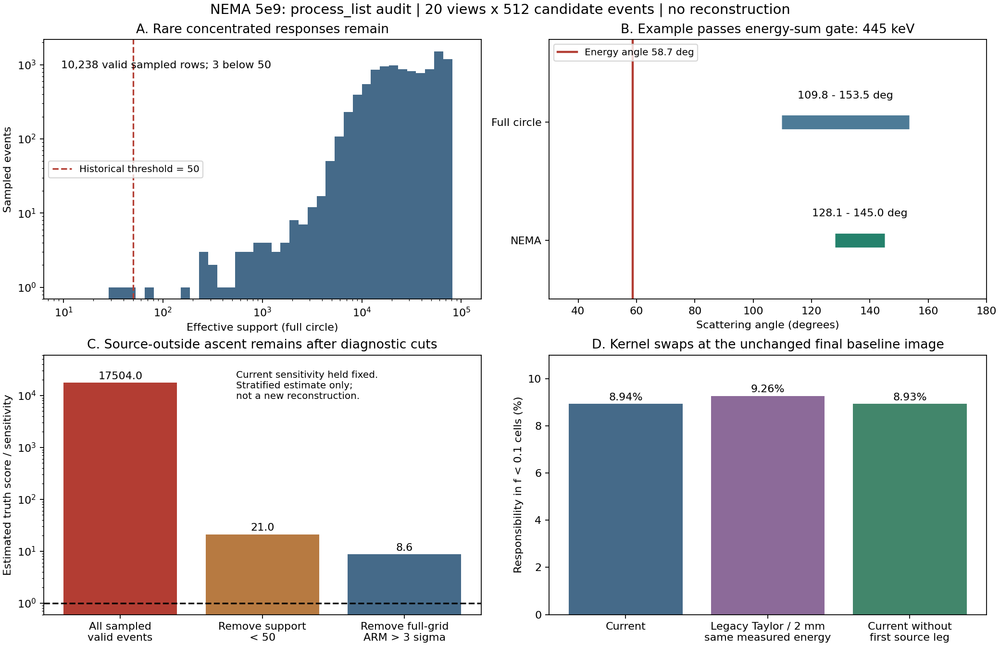
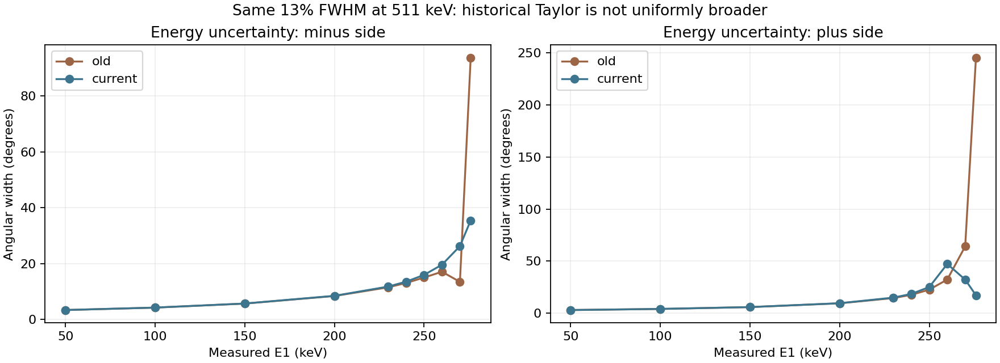

# process_list、Geant4 与 MLEM 的响应一致性审计

2026-10-04。对象：NEMA H60 5e9，500×300×120 mm 椭圆柱重建域，正式 MLEM 基线1644876。**按用户要求停止 Huber/TV 路线；本次仅读已有输入/图像、计算事件响应与诊断量，没有进行新的图像重建，也没有修改生产核、灵敏度、事件筛选或体模。**

## 结论与证据等级

现在最值得优先检查的是：**被 Geant4 写进 List 的测量，有一部分不能由当前的“理想第一击单次 Compton＋自由电子角公式＋局部高斯误差”合理解释；MLEM 又要求用现有响应解释这些事件。扩大后的空间自由度、端层和极小相交单元会放大这种不一致。** 这已不只是“高迭代产生噪声”的一般猜测。

已经找到一条通过生产筛选的具体事件，能量和445 keV正常，但能量角58.7°与整个计算FOV允许的109.8°–153.5°没有重叠，最佳匹配仍差约9.1σ。它能在真实零活度位置产生强增亮项。**这证明存在模型难以解释的事件；尚未证明该条事件的具体输运类别，也未证明全部尖峰都由同一种错误造成。** 当前List缺少源点、完整散射链、真实交互位置及逐步能量，不能仅凭五列记录反推出唯一轨迹。

历史最小支持阈值50→1是确实存在的改变，但要区分两个问题：少量集中响应事件可能强烈影响真值附近的梯度；最终高值已经形成后，很多普通事件也会向它分配责任。因此，不能因最终责任占比小就排除这些事件的触发作用，也不能凭阈值变化就宣布找到了唯一根因。下一步优先做输运轨迹/ARM审计与响应修正，不继续用正则化替代模型核查。



图C只是从相同样本中扣除部分梯度项，灵敏度保持原值，**不是重建，也不是修改筛选后定量有效的新算法**。图D在同一张原始MLEM最终图上评价不同核；不能据此推断这些核重新重建后的效果。

## 已停止的计算与保留范围

- `1651956 / NEMA_ABL_sweep`于集群时间2026-10-04 01:46:10取消，01:46:21全部退出，Slurm为`CANCELLED`，8节点/8卡释放。[取消证据](ablation_stop.json)
- 已完成的MLEM、边界绑定、弱Huber及其历史/验收完整保留。中档Huber没有完整完成；强Huber、TV未启动。不自动恢复或另起正则化组。
- 响应诊断拟在scxi717用1卡15分钟运行，但账户其他工程已达50作业提交上限，未获作业号。没有取消其他工程作业。改用65114的8个CPU线程、20分钟硬超时；全部GPU未占用。实际一次完整审计约2分多钟、主存峰值约16 GiB。[部署记录](cpu_submission.json)
- 本机旧自动任务均为PAUSED；当前入口已明确禁止继续旧Huber/TV计划。

## 1. 先确定现在究竟执行哪条代码

正式链是：

`run_reconstruction.py → process_list_plane_sparse.get_compton_backproj_list_single_sparse → compton_event_response → materialize_sparse_event_rows_to_fine → ActiveGeometry.compact → compton_and_joint_mlem`。

**当前椭圆正式重建并不调用根目录旧的 `process_list_plane.py`。** `sparse`在本次仅为存储接口，角度和z步长都为1，实际计算完整132040列圆网格，再压缩成82040个椭圆活动单元。两条实际事件另通过正式sparse/展开接口与直接共享核逐列回归，结果见[audit.json](audit.json)的`adapter_check`；不是根据函数名猜测等价。

密度响应为：

\[
R_{ej}=K_e(r_j)\,B_{c_1(e),j},\qquad
T^{\rm circle}_{ej}=R_{ej}/\sum_kR_{ek},\qquad
T^{\rm ellipse}_{ev,j}=T^{\rm circle}_{e,P_v^{-1}(j)} f_j.
\]

`B=A·diag(ΔV)`已经含完整圆网格单元体积，`f`为物体坐标下的椭圆相交比例。检查未发现这里重复乘B或再额外乘一次体积。回投影和灵敏度采用对应活动列。第一击晶体编号为1-based；能量以MeV输入；Detector表为mm。

对Geant4的CrystalMatrix逐个复现摆放顺序，10496个晶体ID和坐标全部与Factors一致，最大差约`6.104e−6 mm`；四层法向距离为300/330/360/390 mm，已包括源中心世界y=−345 mm的坐标变换。**本次未发现旧的法向平移遗漏、晶体ID乱序或3mm/6mm单位混用。** [几何及矩阵检查](geometry_factor_checks.json)

## 2. 6月前代码有两条，不能混为一谈

Git中找到`64ff63a`（4月14日）、`d8f83c1`（5月29日）以及更早版本。用户当时具体使用哪一个入口、哪个Sensi_d文件，尚无已定位的运行清单来证明；以下是代码事实，不是对旧实验运行状态的推断。

| 项目 | 旧 `main_plane.py → process_list_plane.py` | 5月 strict/sparse 分支 | 当前椭圆生产链 |
|---|---|---|---|
| 角度能量误差 | 一阶导数＋二阶Taylor近似，正负两侧不同 | E1±σ经Compton关系转换的有限角差 | 共享有限角差 |
| 位置误差 | 旧入口默认δr1=δr2=2 mm，经验公式 | 晶体尺寸方差；sparse关闭第一击源侧项 | 晶体尺寸方差＋相关Jacobian源侧项；无附加δr |
| 最小有效支持数 | 没有同样的50阈值 | 50 | 1 |
| 能量随机展宽 | 在process_list内，无条件、原地修改E1/E2切片 | 当时也在重建内随机展宽 | Geant4已展宽，重建不再抽样 |
| 参考能量分辨率 | 旧入口10% FWHM@662 keV | 同类旧入口10%@662 | 13%@511 |
| 网格 | 旧入口默认并非当前双能椭圆实验 | 默认z stride=2，可轴向合并 | theta/z stride=1，完整40层 |
| 灵敏度 | 依具体入口和文件而定 | 可读Sensi_d；缺文件或显式重算时，用成像事件自身反投影构造并缩放 | 独立均匀源、共享K×B、固定哈希 |

支持阈值50→1发生于**7月21日 `ec96a97`**；7月27日`b39f1dc`引入共享密度响应/闭合链。不要把所有变化都归到一次提交。

旧分辨率折算到440 keV约12.27%，当前约14.01%，所以不能简单说“现在能量核更窄”。旧2mm位置误差一般比前层晶体3mm均匀分布的标准差0.866mm宽，但两者公式不同。旧Taylor在Compton边缘附近既可能膨胀也可能因两项抵消而变窄：相同当前分辨率、E1=276 keV时，旧正侧宽约245°，当前约17.3°；E1=270 keV时旧负侧13.4°，当前26.2°。**旧图较平滑不自动证明旧核更正确。** [数值表](angle_widths.json)



旧代码原地`e1 += noise`还可能在重复处理同一输入张量时累积展宽。若把旧函数直接接到现在已经展宽的List，会再次展宽。回归时必须冻结同一份测量，不把“双重展宽使图变平”当成正确修复。

旧sparse入口的“由成像事件自身重算Sensi_d”也需追查实际是否曾启用：这会让分母吸收体模本身的结构。在极端情况下，用同一组归一化行之和作灵敏度，会使均匀初值成为人为固定点。没有尖峰可能来自归一化/数据依赖分母或更粗网格，未必来自更准确的事件响应。

## 3. 这次真实数据抽样做了什么

[audit_compton_response.py](../../../audit_compton_response.py)逐视角读原始List并核对正式run_manifest输入SHA，读取同一套已校准440 B、Sensi_d、完整网格和未滤波的最终Compton图。20视角各从通过能量/层间筛选的候选中无放回随机取512条，固定种子20261004；共10240条候选。两条在完整核阶段无有效float32响应，按生产规则排除，余10238条进入主要统计。

所有List候选经过能量/不同层筛选得到484980条；生产全核阶段最终接受484936条。**484980不是正式接受数**；本审计未全量重算48万条核，不用样本替换正式接受数。

各视角统计按`该视角候选数/512`加权。以下比例是分层抽样估计，并非全量计数。各核使用完全相同的已展宽测量和当前B；“旧Taylor/2mm”只替换角/位置误差表达式，保持当前分辨率，不伪称复现旧实验。

| 检查 | 实测/估计 |
|---|---:|
| 当前核完整圆网格有效支持数中位数 | 约28823 |
| 当前有效样本支持数<50 | 3/10238，权重约0.0286% |
| 上述事件占最终小f单元责任总量 | 约0.227% |
| 完整圆网格最佳标准化ARM仍>3 | 24/10238，权重约0.234% |
| 它们占最终小f单元责任总量 | 约1.77% |
| 能量和350–400 keV的有效样本比例 | 约10.65% |
| 当前核，最终图分给f<0.1单元的事件责任 | 约8.94% |
| 换旧Taylor/2mm核、最终图保持不变 | 约9.26% |
| 只关闭第一击源侧位置误差项、最终图保持不变 | 约8.93% |

责任为`r_ej=T_ej x_j/(T_e x)`，与图像体积积分不是一回事；不能把8.94%和此前7.31%的Compton体积积分占比直接当作同一个指标。最终图的有效样本没有触发生产`1e−12`分母下限。

这组结果降低了“第一击源侧Jacobian开关是主要原因”及“直接换回旧Taylor便能解决”的优先级，但不是各旧核匹配灵敏度后的重建对照。

## 4. 找到了一条不能被当前几何合理解释的已接受事件

[逐项数值证据](example_incompatible_event.json)：第7视角，筛选后候选索引10254（0-based），`c1=7629`、`c2=1936`。

| 量 | 数值 |
|---|---|
| 第一击测量E1 | 128.853 keV |
| 第二击测量E2 | 316.147 keV |
| E1+E2 | 445.000 keV，350/400 keV门槛都会通过 |
| 第一击晶体中心 | (40.95,390,−40.95) mm |
| 第二击晶体中心 | (39.90,360,−60.90) mm |
| 固定E0=440、按E1反算散射角 | 58.731° |
| 在完整R255/H120计算网格上的几何角范围 | 109.813°–153.501° |
| 在实际NEMA源所占单元上的几何角范围 | 128.070°–145.022° |
| 最佳标准化ARM：完整网格 / 实际源单元 | 9.138 / 12.505 |
| 整个完整网格要求的理想第一击能量范围 | 235.63–272.80 keV |
| 当前有效支持数 | 29.34；现阈值1通过，旧阈值50会拒绝 |

这是能量与晶体几何的矛盾，不是MIP显示尖峰。归一化保留了一个绝对非常小的尾部响应：它仍必须在有限FOV里选择相对更能解释该事件的位置。这里“9.1σ”是按当前模型计算的失配尺度，**不是声称真实输运误差严格服从该高斯，也不是已判定这条MC记录非法**。

更换float64不能解决这种物理解释不足。样本中有两条生产有效事件在真实源支持上的float32预测为零；float64复算恢复极小正数，且B在源内并非全零。这证实存在尾部下溢，但“得到一个非零数”并未让事件与真实源相容。不能简单把全部数值改成双精度后宣布尖峰修复。

## 5. 为什么最终责任很小的事件，仍可能很有影响

定义真值处Compton归一化得分：

\[
G_j(x_*)=\frac{1}{s_{C,j}}\sum_{e\in\mathrm{accepted}}
\frac{T_{ej}}{(Tx_*)_e}.
\]

在真值为零的源外单元，`G>1`表示从零向上增加密度有提高当前似然的方向；不是说乘法MLEM能从严格零值自动长出活度。有限统计下真值不必恰为最大似然解，应该看失配量级、独立重复及空间模式。

本次将**实际输运使用的3mm立方体常值源**按极坐标单元体积平均，分别采用32×32和64×64的r²/角度积分；z网格与源完全对齐。源积分相对误差分别约−0.00274%和+0.000206%。使用实际440发射数3530946267归一，不误用双能总5e9。[真值映射证据](truth_mapping.json)

在原始Compton最大值的位置，分层样本外推的`G`约`6.73e5`；使用当前生产分母下限`1e−12`约`1.75e4`。这个样本外推对极端事件敏感，**不作为精确的全量梯度或可靠区间估计**。但上一节那一条真实事件单独贡献就约**355.4**（采用生产下限），其它事件项均非负；无需把罕见事件数量外推，也已经能看到很强的源外增亮驱动。

在相同样本中，仅扣除`N_eff<50`事件的得分项，峰点得分降到约21.03；仅扣除完整网格`ARM>3σ`的得分项，降到约8.64，仍大于1。源体积积分加密后这几个判断稳定。**这只是固定原Sensi_d的诊断减项，不是新的合格筛选方案；修改实际筛选后必须重新计算灵敏度。** [得分分解](peak_attribution.json)

另一方面，已形成的最终图上，扣掉支持数<50事件几乎不改变该峰的最终责任总量。这说明“哪条事件使真值不稳定”和“最终谁被该峰解释”并非同一个问题。可能存在异常事件推动源外自由度、随后普通事件也被错误结构分配解释的过程。**本次没有重跑迭代追踪因果，不能把这个机制猜测写成已证实的生成顺序。**

## 6. Geant4 与解析核之间，具体哪里需要追查

maty的200个5e9 worker记录了同一个可执行文件和CrystalMatrix哈希，当前二进制哈希也一致；本地与远端EventAction、SteppingAction、DetectorConstruction源码哈希一致。生产采用Geant4 11.1.0和`G4EmStandardPhysics_option4`。[生产程序核查](geant4_provenance.json)

### 6.1 “两晶体命中”不等于核假设的“两次理想交互”

EventAction记录每个晶体**所有轨迹**的能量沉积总和，然后加能量展宽。List要求展宽后超过1 keV阈值的晶体恰有两个，并满足`FirstScinCount==1 && NumCompt==1 && NumPhot==0 && Flag_Compt==1`。

但SteppingAction的实际含义是：

- `Scin_CopyNum`和`NumCompt`只在**primary track、且local energy deposit>0**的分支里更新；它不是无条件记录gamma第一次Compton交互。
- `NumCompt`只统计被标记的第一个晶体中的相应步，且受local deposit>0条件约束；不能当成整个光子的总散射次数。
- **NumPhot的累加代码被注释。** 因而`NumPhot==0`目前不提供预期的排除作用。
- `Flag_Compt`只要求primary后来在另一个晶体有正局部沉积，不要求第二击就是一次完整光电吸收。
- 第一击能量`TempEnergy[c1]`是整个事件在该晶体内累计的沉积，不一定等于第一次散射中gamma损失的能量。

例如“C1 Compton → C2散射 → 返回C1光电吸收”的链，在上述计数逻辑下可能被放行，但累计E1不能再直接代入单次散射公式。晶体内二次电子/荧光逃逸及再沉积也会改变E1的含义。**这是代码允许的路径例子，尚未证实上节那条事件就是此类。** 第二晶体有多次交互也不一定无效：只要第一击能量/方向假设仍成立，就需要按实际测量模型判断，而不是笼统丢弃全部多步事件。

### 6.2 用local deposit>0识别交互，会受物理模型影响

Geant4 11.1.0的option4在440 keV范围使用LowEP Compton模型；该模型包括束缚电子动量、原子壳层与退激发。primary的局部沉积和gamma转移给全部次级粒子的总能量不是同一个量。官方实现将部分能量交给次级粒子，最后以剩余壳层能量作为局部沉积，因此应核查`elocal>0`是否遗漏了实际gamma交互。[对应版本物理构造器](https://github.com/Geant4/geant4/blob/v11.1.0/source/physics_lists/constructors/electromagnetic/src/G4EmStandardPhysics_option4.cc)，[对应LowEP模型](https://github.com/Geant4/geant4/blob/v11.1.0/source/processes/electromagnetic/lowenergy/src/G4LowEPComptonModel.cc)

此外，探测器前的Rayleigh可能改变方向却不产生正局部沉积；当前“首次晶体前发生了正外部沉积才标记拒绝”的条件无法等价排除所有前置散射。源到第一击的直线方向可能因此不是真实入射方向。具体发生比例需要MC轨迹，不可凭源码猜数。

### 6.3 能量展宽与E2的用途

当前Geant4在晶体总沉积层面展宽，13% FWHM@511 keV；process_list只传播这一分辨率来计算核宽，不再次随机抽样。两端公式尺度一致，2.35482与2.355的差异远不足以解释本次问题。

当前用E1和固定E0反算角；E2只参与阈值，E1+E2>350 keV没有上限。后者保留部分不完全吸收事件，但它们并非必然无效。提高能量和到400 keV会改变约10.65%的样本，而上节445 keV的严重失配事件仍通过，**仅收紧能窗不能保证解决**。

现有核没有显式的材料相关Doppler尾分量、输运散射链边缘化或离群背景分量。应先以独立点源测出按散射角、层对、能量和拓扑分组的ARM分布，区分真实物理长尾与事件标记错误，再决定核形状。

## 7. process_list自身与Sensi_d/MLEM的配合问题

### 7.1 单光子B并非严格的第一击Compton概率

当前`B[first_hit,:]`是440单光子光电峰及对应散射响应的密度基底，而List条件是第一晶体发生特定Compton交互、后续第二晶体命中。两种条件概率不完全相同。只差一个“对该事件所有体素相同”的常数会在MLEM比值中抵消；但入射方向、晶体内深度、gamma逃逸方向及第二晶体接受度造成的空间差异不会抵消。四层经验校准也不保证修复这些空间条件分布。此项是待独立点源验证的物理近似，尚未证明是最大贡献者。

角高斯宽度依赖候选源位置，但没有显式`1/σ`幅度；还用能量到角度的近似误差传播处理强非线性区。必须从测量概率密度及变量变换推导正确测度，不能随手加一个归一化因子。可以把直接能量域似然、晶体内位置积分与实测ARM核作为受控候选；更换时同步重算Sensi_d。

### 7.2 当前均匀源闭合并不充分验证非均匀体模

Sensi_d由独立均匀圆源的归一化K×B行累加，经`Vsupport/Nprimary`及20视角平均得到。若事件条件模型正确，这与密度灵敏度可以一致。若核只是近似，那么这种构造可能在均匀源分布下自洽，却错误分配非均匀源事件到空间位置。

`sum(Sensi_d)/Vsupport=accepted/Nprimary`很大程度由每行和为1保证。独立均匀源检验比同数据闭合更强，但仍不能单独证明点源/热球的条件响应正确。因此接下来应按**真实发射位置**统计被接受事件率，形成与核反投影无关的灵敏度对照，同时检查点源响应，而不继续只看总和闭合。

本次峰位置的单位体积灵敏度并非异常低谷；之前测得约第71百分位。没有证据支持用提高分母下限来修复“近零Sensi_d”。

### 7.3 纯MLEM会忠实放大不能被现有源解释的事件

Compton项为`Tᵀ[1/(Tx)]`，JSCC将其与单光子Poisson反投影相加，分母为两类灵敏度之和。这是真正联合MLEM，不是图像相加。当前没有Compton加性背景/异常事件分量，错误建模的事件只能被图像解释。某个事件在真实源区域的`Tx`极小时，便可形成很大的反投影得分。

逐行乘常数在无背景、数值下限不触发时不会改变比值；“只换行归一化”不能从物理上修复这个问题。数值下限触发时该不变性会被打破，应单独记录，不能把epsilon当成未标定的物理背景。

单光子CntStat和List在Geant4中是独立统计分支，可能包含同一个primary的贡献；若按完全独立Poisson通道解释联合似然，属于需量化的近似。但Compton-only也出现尖峰，故“仅JSCC两通道相对权重/相关性”不能解释全部现象。

## 8. 边界体积与更大FOV是放大因素

原始峰点约`(−102.275,−140.769,+58.5) mm`，椭圆方程值1.04807，代表坐标在物理椭圆之外；该单元仍有2.3077%的体积落在椭圆内，所以是合法的相交单元，有效体积约4.541 mm³。当前是在外部代表点计算K，再乘相交比例，**不是对真正交叠部分积分**。

整个活动域有3120个这样的“代表点在外、体积部分在内”的单元，占有效体积约0.869%；800个f<0.1单元的中心全部在椭圆外。常规几何体积积分通过，并不能证明`∫cell K(r)A(r)dr`的积分误差很小。这种代表点近似应对极小交叠单元特别检查，但不能把部分体积单元本身说成非法，也不能额外再乘一次f当修复。

密度参数把分配到极小体积的量放大成很高浓度；小单元还提供额外的局部自由度。FOV由原小圆柱变大、探测器后移、轴向从20层到40层，以及旧sparse可能z合并，均会改变可辨识性。旧图没明显尖峰不构成只回滚一个函数就能恢复的证据。

## 9. 下一步应按什么顺序定位和修复

1. **先增加独立诊断轨迹记录。** 保留现有List格式和原生产文件；小批量诊断旁路记录primary event ID/源坐标、所有gamma交互的pre/post能量和方向、物理体/晶体ID、process名、local deposit、转移给次级粒子的能量、真实首次Compton位置、返回首晶体和前置散射标志。交互统计不依赖local deposit>0。用这些字段核对旧`Scin_CopyNum/NumCompt/NumPhot/Flag_Compt`的实际语义。
2. **完整事件质量统计。** 对已有484936个接受事件做完整FOV的最佳ARM、有效支持体积、峰点及端层得分分解；同时给出晶体层对、能量、视角。支持数随网格划分变化，不能把50原封不动作为跨网格物理阈值。报告异常类别与数量，不为消尖峰随意删事件。
3. **分别隔离事件定义与核误差。** 同一小批MC比较：真位置/真能量的理想首散射核 → 晶体中心但真转移能量 → 测量能量 → 当前累计晶体能量与旧标记。如此区分标记/沉积归属、位置离散、展宽/Doppler与前置散射，避免一次改变所有因素。
4. **再处理空间响应与边界积分。** 验证第一击条件响应是否可以继续用单光子B；对峰点邻域比较中心K、交叠质心K、实际交叠体积积分，处理多视角物体坐标约束。使用独立点源及源位置直接计数得到的效率对照Sensi_d。
5. **仅在上述闭合后做无正则MLEM小对照。** 原MLEM、修正事件定义/筛选＋匹配Sensi_d、修正响应核＋匹配Sensi_d；若需要尾模型，必须以MC类别/独立数据确定。先验证真值处得分、无噪声闭环和小问题数值，再决定是否完整重建。当前不启动这些新重建，也不自动恢复Huber/TV。

所有诊断保持原500×300×120 mm椭圆重建域。中央72mm MIP只是显示策略，不拿裁切或平滑证明算法问题消失。218/440两套热球真值不同，不能互相强行绑定。

## 复现与数据目录

- [停止记录](ablation_stop.json)、[主要统计](audit.json)、[梯度减项](peak_attribution.json)、[具体失配事件](example_incompatible_event.json)、[角宽](angle_widths.json)、[真值映射](truth_mapping.json)、[G4程序](geant4_provenance.json)、[几何/矩阵](geometry_factor_checks.json)。
- `generated/Diagnostics/process_list_audit/events.csv`为10240候选×3核的逐事件诊断，约11MB，保留在本地，**不进Git**；同目录保留真值映射、Detector表和梯度数组。
- 65114隔离工作区：`/home/lipeize/JSCC_FOV120_20260924/experiments/ELLIPSE500x300_H120/generated/Diagnostics/process_list_audit_20261004/`。最终结果目录`result_final`；早期序列化和筛选范围修正尝试作为诊断历史保留，不作科学结论依据。没有改写生产Factors/Lists/图像。
- 可复现入口：[真值体积映射](../../../prepare_response_audit_truth.py)、[事件审计](../../../audit_compton_response.py)、[图表](../../../plot_response_audit.py)。远端执行时共享核和sparse适配器一起冻结，执行哈希在audit.json；脚本支持有界CPU运行。

```bash
python prepare_response_audit_truth.py
python audit_compton_response.py --base <experiment-root> --output <new-audit-directory> \
  --device cpu --threads 8 --sample-per-view 512 --truth <polar_truth.npz>
python plot_response_audit.py
```

报告不包含密码、私钥或解密凭据；网络连接沿用仓库已审核的SSH/DPAPI方法。此次交付是响应失配的证据和有判别力的定位路径，**不是已经修复尖峰或验证有效FOV的声明**。
