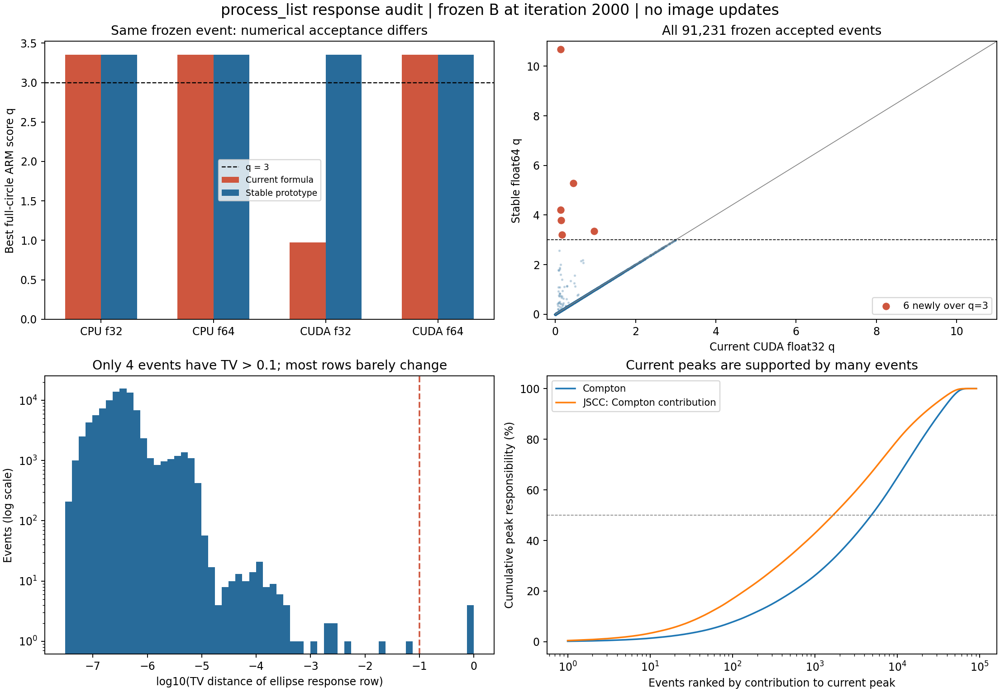

# process_list进一步研究：数值稳定性、真实体积响应与误差模型

2026-10-04。接续已完成的`compton_first_scatter_v2`，本轮为离线诊断和独立原型验证。没有修改生产`compton_event_response.py`、事件输入、Sensi_d或已有图像，没有新增Geant4输运或重建，旧作业和自动任务保持停止。

**结论：发现一个必须修复的GPU单精度几何错误，但全量归因不支持它是当前两个主峰的主要来源。后续应把process_list的重点放在真实椭圆相交体积内的响应积分，以及与Geant4一致的能量/散射误差分布；不继续用删除少量事件代替模型修正。**



图为响应诊断，不是新的重建。下左TV指两条归一化响应行的总变差距离，不是之前已停止的TV正则化。

## 1. 明确复现的数值错误

共享核`_position_angle_sigma`用`sqrt(clamp(1-cos²β,1e-12))`计算角度梯度的分母。近乎反平行时，CUDA float32内积可舍入成−1，而梯度分子仍保留非零的小量。分子、分母的消减误差不一致，使位置角误差出现非物理放大；`build_compton_cone_weights`和`min_standardized_compton_arm`都使用该结果。

同一冻结事件：NEMA ideal第4视角、合并List零基行11822，晶体9554→1091，E1=204.927keV、E2=179.933keV。输入、晶体表和几何哈希一致：

| 计算方式 | 当前公式的全圆最小q | 最大位置角σ | 稳定原型最小q |
|---|---:|---:|---:|
| CPU float32 | 3.354681 | 1.159934° | 3.354681 |
| CPU float64 | 3.354681 | 1.159934° | 3.354681 |
| CUDA float32 | **0.972542** | **91.198929°** | 3.354681 |
| CUDA float64 | 3.354681 | 1.159934° | 3.354681 |

GPU错误最小值位于圆网格61729，那里计算出的cosβ=−1，但向量叉积模为9.5575e−5，并非零。结果把本应超过3σ的事件变成通过。完整复现、软件版本与哈希见[witness_cpu_cuda.json](witness_cpu_cuda.json)。这不是事件行号错配，也不是再次展宽造成的。

独立原型使用float64先做坐标差，`atan2(||u×v||,u·v)`计算角度，再以叉积法向计算单位切向量及位置梯度，避免以两个接近1的数相减计算sinβ。若C1、C2位置协方差为对角矩阵，其梯度方差满足：

\[
\sigma_{\beta,pos}^2\le
\lambda_{\max}(\Sigma_1)(1/d_{01}+1/d_{12})^2+
\lambda_{\max}(\Sigma_2)/d_{12}^2.
\]

此上界用于检出算术错误，不是人为截断响应宽度。严格共线时标量角度梯度方向不唯一；原型仅在sinβ≤1e−12处使用明确记录的有限保守上界。生产替换前应保留这一分支的专门验证，必要时在这一极小退化集合对晶体位置做积分，不能再通过任意极小分母放大核。

四项测试通过：有限差分梯度、近同向/反向极限、平移不变性、CPU/CUDA一致性；[GPU测试记录](prototype_tests_cuda.txt)。共享生产核尚未替换。

## 2. 全量影响：必须修，但不宜期待单靠它消除主峰

对B组已经接受的**91231个事件、20视角、每事件完整132040点**扫描。在65114空闲GPU0运行329秒，最大已分配显存约5.59GiB，完成后GPU0进程/显存归零。没有占用重建集群的新作业。比较包含原B矩阵、旋转、椭圆相交比例，未只比较裸高斯核。

| 指标 | 结果 |
|---|---:|
| 至少一列位置σ超过导数上界的事件 | 2557 / 91231，约2.80% |
| 当前错误σ最大值 | 1139.567° |
| 已保留事件中，稳定计算后q>3 | 6，约0.00658% |
| 椭圆内条件响应行总变差>0.1 | 4 |
| 椭圆响应行总变差中位数 / 99分位 | 3.16e−7 / 6.68e−6 |
| 稳定q与原公式float64参考最大差 | 1.06e−14以内 |

大多数错误发生在原B权重极小或不进入椭圆活动域的圆网格列，所以“某列σ很大”不等于“该事件的实际成像响应显著改变”。也确有4条响应发生近乎完全变化，必须保留为故障证据，不能用中位数掩盖。

这次扫描总体是**原已接受集合**，不能据此确定重算所有候选后会新增接受多少事件。正式修复必须从原List重新分类，并重算训练/验证源，不只删除本次找到的6行。见[全量汇总](geometry_stability_full.json)、[改变事件清单](changed_events.csv)、[下载SHA与全量CSV位置](download_manifest.json)。

在冻结B组第2000次图像上计算每事件对主峰的责任：

\[
w_{ej}=R_{ej}\rho_j/(R_e\rho).
\]

| 对当前主峰的Compton事件贡献 | Compton图 | JSCC图 |
|---|---:|---:|
| 全部事件责任之和 | 465.3368 | 27.5231 |
| 上述6个事件占比 | **0.06423%** | **0.01364%** |
| 覆盖50%责任所需事件数 | **4853** | **1663** |
| 覆盖90%责任所需事件数 | 32436 | 20558 |

JSCC列仅统计其Compton似然部分，不包含单光子项。该计算是在原图像上评价一次似然责任，不是修复后的迭代结果，也不是未来图像变化的严格上界。它支持“现有主峰主要由许多事件共同支撑”，不支持“已证明数值修复无用”。详细数字见[impact_summary.json](impact_summary.json)。

## 3. 更值得优先验证的空间问题：代表点不等于实际相交单元

82040个活动单元中，**3120个代表点位于物理椭圆外**。f<0.1的活动单元有800个。B组两个主峰如下：

| 图像 | 主峰代表点(x,y,z)，mm | 相交比例f | 实际体积，mm³ |
|---|---|---:|---:|
| Compton | (+102.275,+140.769,−58.5) | 0.0230767 | 4.54124 |
| JSCC | (−231.351,−63.849,+58.5) | 0.00996895 | 1.93279 |

二者代表点均在椭圆外。当前做法在圆网格代表点求K，再通过B和f近似体积积分。这保持了活动列和伴随关系，但数学上不能保证等价于真实体积内的响应。若锥面/空间响应变化快，即便f算得准确，`K(center)×B(center)×f`也可能错误。

应比较的是：

\[
R_{ej}(v)=\int_{V_j\cap\mathcal E}
K_e(\mathcal R_vx)A_{C1_e}(\mathcal R_vx)\,dx,
\]

不是把同一椭圆掩膜固定在探测器坐标。积分点先在物体坐标真实相交单元内生成，再按视角旋转。已有B是密度基底，插值时先除**完整单元体积**得到A；积分权重已含体积，不再次乘f或ΔV。

此前1440个独立点源/边界案例已全部达到相邻积分加密变化≤1%。本报告对最终积分>1e−15的1316例统计：代表点/积分的5–95分位为0.616–1.206，最大12.59；质心/积分5–95分位为0.976–1.006。说明质心是有价值的低成本近似，但不能保证所有事件足够准确；仍须检查锥面穿过小单元时的积分收敛。

这些案例用既有A的横向插值和轴向端点最多1.5mm外推，并非重新生成的连续精确矩阵；也不是上述两个主峰的逐事件积分。所以目前是**优先候选机制**，还不能宣称边界积分已经解决主峰。下一步离线应在当前峰以及与图像无关的预定边界/内部对照单元，对完整事件责任加权响应、训练源S变化和独立点源预测同时做比较。不能只选能压低峰的积分参数。

## 4. 物理误差模型：首散射正确仍不等于自由电子锥面正确

已接受理想点源事件中，真实发射位置在当前3σ外的比例仍约2.77%–3.78%。此前分层样本显示，自由电子真实几何预测与primary转移的RMS差约11.825keV，晶体中心近似约3.347keV，测量展宽约15.964keV；这些量相关，不能平方相加当作总方差。

Geant4 LowEP/Monash模型包含束缚电子初始动量与结合能；当前“自由电子角度关系＋测量能量转换的非对称角σ＋位置σ”没有显式描述同一原子散射分布。应保留输运中的物理效应，修正响应侧概率模型。[Geant4物理参考](https://geant4.web.cern.ch/documentation/pipelines/master/prm_html/PhysicsReferenceManual/electromagnetic/gamma_incident/compton/monash_compton.html)、[本工程版本11.1.0模型源码](https://github.com/Geant4/geant4/blob/v11.1.0/source/processes/electromagnetic/lowenergy/src/G4LowEPComptonModel.cc)。

建议先在独立点源上验证**能量域条件概率**：

\[
p(E_{1,m}\mid\beta)=\int g(T\mid\beta,\mathrm{GAGG})
\mathcal N(E_{1,m};T,\sigma_E(T)^2)\,dT,
\qquad\sigma_E(T)=\frac{0.13}{2.355}\sqrt{0.511T},
\]

其中能量用MeV；g描述与实际物理列表一致的转移分布，不能直接假设δ自由电子关系或任意调宽高斯。散射截面和条件分布必须采用一致约定，避免重复乘Klein–Nishina权重。使用**预测真实沉积T**的展宽尺度，不再把测得E1当作所有候选位置的共同真实值；保留位置相关的概率归一化因子。

GAGG层/晶体尺寸、散射角、C2部分吸收和接受门槛可能改变条件分布。C2允许能量逃逸，不能在代码中硬设E1+E2=440keV或把E2当作完整散射光子能量。本轮旧List已展宽，process_list不得再次随机展宽。

先看七个独立点源的残差偏置、分层/能量覆盖率和空间方向偏差，再决定是否进入成像。此前纯能量高斯原型也只有约97.55%的3σ覆盖率，因此“改成能量高斯”本身不是已经验证的完整修复。

## 5. 为什么不建议回滚旧代码、仅取消行归一化或继续加迭代

**旧Taylor角误差在Compton边缘可异常大。** 对E1=270keV，旧正侧σ约64.17°，当前约32.35°；277keV时旧两侧约286.80°/487.35°，当前约38.54°/13.17°。旧核可能通过很宽的响应弱化局部约束，但这不能证明旧核物理上正确；旧代码还含随机展宽，整段回滚会破坏当前单次展宽约定。数值表见[summary.json](summary.json)。

**对已固定的物理灵敏度，事件整行缩放会在LM-MLEM中抵消。** 对任何正数c_e，`(c_e R_ej)/(c_e R_e·ρ)=R_ej/(R_e·ρ)`；本次独立正矩阵实验相对L2=6.42e−17。因此单独取消每行归一化，不会按直觉自动抑制弱响应事件。当前S的MC估计又依赖特定行约定，擅自只改一边反而形成不匹配分母。

**q是全圆最佳匹配，不是实际源位置正确的证明。** 随机1280个B事件中，525个全圆最优代表点在椭圆外。稳定全圆q>3有1个；仅物理椭圆内代表点加边界质心探测q>3有2个。后者只是离散探测对连续最小q的上界，不能据此新删事件。当前证据不支持将筛选域改变作为下一项主要干预。

**S平均闭合是必要而非充分条件。** 归一化核在均匀源上的回投即使总和正确，局部概率质量仍可能放错；粗9分区通过不证明1.93mm³小单元的S准确。应比较单位体积灵敏度、同真实发射区域直接计数效率、边界/相邻内部的空间误差，并报告MC不确定度。尖峰处`ρ×S_d`不能当作总JSCC期望计数。

## 6. 建议的具体修改顺序

1. **先落实确定的数值修复。** 在共享响应层统一角度与位置误差计算；q和核使用同一稳定函数。只在构建核时用float64做几何，最终响应可存float32。新增原始失败事件与近共线测试，不依赖普通随机测试发现此类问题。保持默认旧路径用于回归和冻结对照。
2. **用已有输运重算候选与S，先不长程成像。** 从完整原List重扫NEMA及纯440训练/验证；报告共同/新增/退出集合，核实分块/rank不变性、匹配S和独立效率。无需新增Geant4。数值修复可以作为正确性基线，但依据本轮主峰归因，不值得预先承诺单靠它取得显著改善。
3. **在稳定基线上优先验证相交体积响应。** 先离线比较代表点、质心、加密积分的K×A、主峰事件责任及S；采用预定边界和内部控制点，查明影响方向。若误差显著且收敛，再做唯一“稳定代表点—稳定积分”配对，保持事件规则和误差模型一致。这是process_list的系统矩阵离散修正，不是图像平滑或边界密度绑定。
4. **另行验证能量域＋材料散射分布。** 先拟合训练数据并对独立点源验证；不与边界积分同时换入同一首轮成像。不要仅在角σ上加一个可调常数，以图像好看决定宽度。
5. **任何核改变都同时更新对应S。** 通过输入/事件/算子与空间闭合后，才运行既有范围的50次兼容回归、完整事件10次资源检查、2000次Compton/JSCC配对；保留全120mm指标和中央72mm MIP。具体下一项成像尚未提交。

## 7. 复现与文件

- `research_process_list_followup.py`：冻结图像峰、单元几何、行缩放抵消、旧/新能量角宽及1280事件物理域探测。
- `diagnose_compton_geometry_stability.py`：稳定几何独立原型、全圆核扫描、椭圆响应行距离及冻结图像事件责任。
- `reproduce_compton_geometry_witness.py`：同一实际事件四种设备/精度复现。
- `test_compton_geometry_stability.py`：4项独立数值验证，CUDA主机全部通过；无CUDA主机对应一项跳过。
- `summarize_process_list_followup.py`：从验SHA全量CSV生成小型证据与图。
- 全量91231行CSV留在`generated/compton_first_scatter_v2/geometry_stability_full/events.csv`，不进Git；[download_manifest.json](download_manifest.json)提供远端位置、大小与SHA。
- [provenance.json](provenance.json)记录实际执行代码、原B矩阵、传输图像包和两份冻结历史SHA；图像包逐元素等于原B2000末帧，且本地/远端SHA一致。

全量审计命令（在65114使用已有实验路径；不含凭证）：

```text
python diagnose_compton_geometry_stability.py --base EXPERIMENT_ROOT --release FROZEN_RELEASE --output NEW_OUTPUT_DIRECTORY --all-events --images images.npz --device cuda:0
python -m unittest test_compton_geometry_stability -v
```

`images.npz`来自已冻结B2000的Compton/JSCC活动列原始密度，仅用于责任分析。原始共享核SHA为`ac7757c1793b86d36f5a6b787d9c91460250c7f48e1ec04ba66f7141a5afb225`，几何SHA为`82b60494e8444978869ba94b93b62dea80a6b12911bdcb186c430fe5a4414f71`。全量执行脚本SHA、每视角输入SHA保存在[geometry_stability_full.json](geometry_stability_full.json)。该JSON的通用`interpretation`字段仍含抽样描述，**本次以`all_events=true`及91231条逐事件CSV为准**；样本版独立保留于`geometry_stability_sample.json`。

先前配对实验的“验收通过”指已冻结GPU实现的输入/输出/门控通过，不涵盖本轮新发现的跨设备近共线算术问题；原结果和哈希证据完整保留。本报告没有将旧成像改标为新算法成像。
