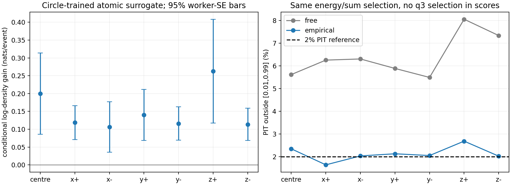
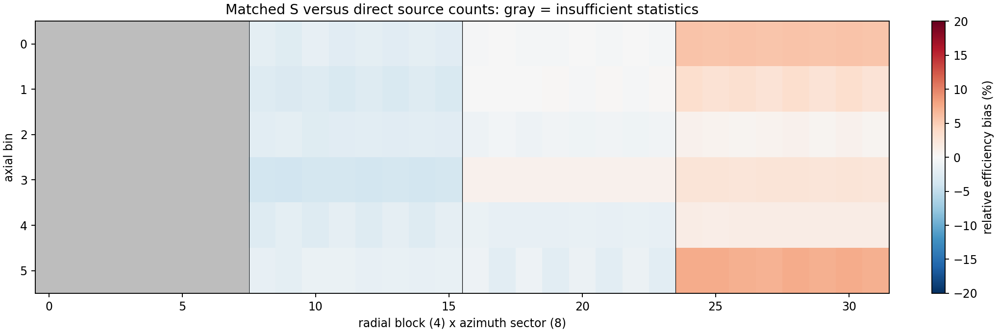
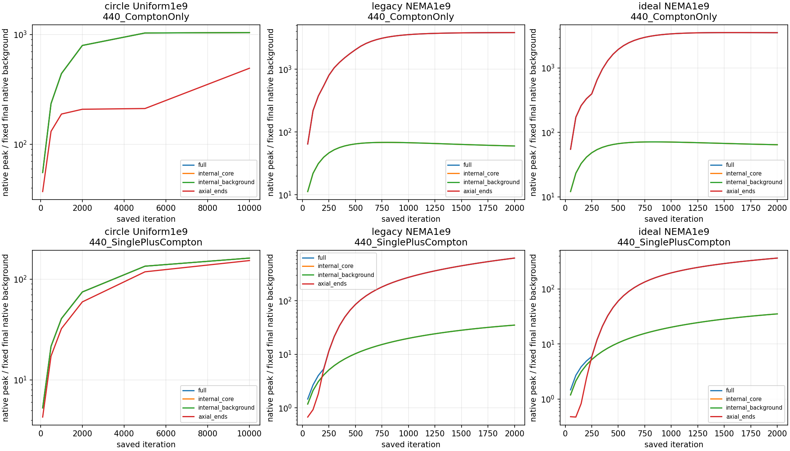

# 柱坐标 process_list 调查：首轮执行与科学结果

2026-10-05。按用户“开始执行计划”执行 `process_list_global_audit_v4`。**离线调查、完整单元基底和有限能量原型已完成；新的正式响应及配对成像仍未通过生产门控。** 下面区分代码事实、独立数据证据及尚未判定的假设。没有新增Geant4光子、恢复精细A场、修改原List/Factors/S/图像，也没有恢复正则化或旧重建任务。

## 1. 最重要的发现

1. **内部尖峰不是只有小相交体积才能出现。** 原圆柱均匀源的Compton最强峰在 `(14.56,10.58,-10.5) mm`，JSCC在 `(0,-18,-1.5) mm`，均位于内部。NEMA理想首散射结果在 `(117.66,-72.10,-7.5) mm` 也有背景局部峰；该单元 `f=1`，完整体积195.093 mm³，不能用椭圆小切割单元解释它。
2. **该NEMA内部峰由很多事件共同支持。** 使用当前稳定核在固定历史图像上分解，Compton前10条仅贡献0.192%，50%贡献需要12628条；全部20视角和200独立种子参与。极少数失配事件不是这个内部峰的充分解释。
3. **材料真实转移尾部是本轮证据最强的响应修正方向。** 七处点源中，真实primary转移相对自由静止电子关系的残差RMS为11.31–13.11 keV。仅用独立圆源训练的经验转移卷积，在七处点源的同条件能量概率评分中全部改善，尾部比例接近2%的PIT参照值。
4. **晶体内首交互并非中心均匀分布。** 厚层C1靠源侧偏移明显，例如中心源厚层C1的平均y偏移−1.380 mm。它是新的位置模型证据；本轮先量化，不和能量改动同时加入成像。
5. **尚未发现所测分辨率下的大尺度S错误或普遍严重的内部K代表点错误。** 192空间区中的144个统计充分区均通过门槛；43控制单元的K积分检查全部达到加密收敛。不能将这两项通过扩大为逐体素或完整K×A物理模型正确。

## 2. 输入冻结、预算与执行

复用 `compton_first_scatter_v2` 的3.17e9既有初级γ输运：NEMA1e9，圆训练/圆独立验证各1e9，椭圆独立验证1e8，七处点源各1e7。所有集合的种子唯一且互不重叠。圆数据只有原探测器方向的一个集合，其20次旋转复用按同一worker合并；不能作为20个独立样本。NEMA和点源均有20实际视角。

初轮保持原132040点网格、82040相交活动列和冻结stable_float64事件集合。NEMA保留91225条。此次诊断没有重新筛选、改核宽/能窗/有效支持门槛。真源位置与历史图像只用于分析，不影响接受规则。原Factors按只读memmap读取，一份440完整圆B约5.16 GiB；不保存完整事件×体素响应。

| 项目 | 已执行规模/结果 |
|---|---|
| 点源逐级残差 | 七源全视角；10270条通过重建能量/层门槛的理想事件；另保存门槛前和q3后队列 |
| 细分S检验 | 159919条圆训练保留事件；独立验证；192区、200独立worker误差 |
| K有限单元积分 | 固定320条NEMA事件×43单元；2/4/8阶，未选尖峰或球体决定这些控制点 |
| 固定图像责任 | NEMA全部91225条×15探针，两种历史图像；仅后验诊断，无MLEM更新 |
| 能量概率原型 | 275468条独立圆训练记录；10265条点源共同可评分事件；5条稀疏角度/层组合未评分 |
| 晶体位置 | 七点源原始交互记录，504行分层/队列/坐标矩统计；位置越界0 |
| 有界Poisson模型 | 64源单元、512个C1/C2/能量测量箱，保留零计数箱；120/1200预期接受数 |

主要GPU阶段114.42秒，峰值预留7.01 GB，占A6000显存13.77%；诊断最大RSS12.28 GB，占该服务器实际内存0.757%。所有本轮PID已经退出，GPU0核验时显存0、利用率0。未启动自动任务。资源、实际输入计数、种子及矩阵哈希见 [收据](resource_and_factor_receipt.json)。原440矩阵SHA仍为 `e5966782fe4e38f7324e56122e92d378d2307f215a8ce8afa36f6e3342542d38`，与上一轮审计一致。

## 3. 概率合同与代码路径

当前生产核沿用

`K_ej = exp[-(β_ej−θ(E1m))²/(2σ_ej²)] × [E0/(E0−E1m)+(E0−E1m)/E0−sin²β_ej]`，

其中E0=0.440 MeV，σ由实测能量转换的非对称角误差与位置误差合成。`build_compton_cone_weights` 返回的是现有角度匹配权重，没有声称它已是完整正规化的 `p(C1,C2,E1m,E2m|x)`。E1/E2为同一次Geant4展宽的晶体累计沉积；List已经展宽，重建没有二次随机展宽。展宽为13% FWHM@511keV，对沉积T的σ为 `0.13/2.355 sqrt(0.511 T)`，单位MeV。

`normalize_event_response` 先在完整圆域构造 `K_ej B[C1,j]` 并按行归一，再由物体坐标活动索引、f和视角置换压缩。`B=A diag(ΔV_full)`。S训练使用同一归一化行、实际初级数、完整圆域体积与旋转平均。MLEM使用 `R_ej/(R_e·ρ)` 以及匹配S；JSCC还加同密度基底的单光子项。

若只给每个事件行乘正常数c_e，在物理S固定时，该事件对更新的比值严格不变。此次独立数值检查的相对误差为1.97e−16。因此“取消行归一化”本身不是纠错实验。若同步改变由反投影得到的S，图像变化可能来自分母，不能归因于常数消除。

正式响应的测量变量应明确为 `y=(C1,C2,E1m,E2m)`。原角度变量转换的Jacobian、KN/立体角、晶体条件位置、物理转移分布及接受域必须在同一测度下处理。event-only因子可以消去；候选位置相关的σ、预测散射能量、晶体位置积分和接受概率不能凭外形增加或省略。尤其不能仅补`1/σ`或`sinβ`就称为概率修复。

理想事件策略还含模拟真拓扑条件。完整生成模型应包括该条件的接受概率，而不能只在接受后归一化并忽略其位置依赖。新核使用的q接受域必须仍是冻结的旧stable核 `q≤3`，不以新核重新选择事件。

## 4. 能量物理：逐级残差与独立原型

有符号分解逐事件严格闭合：

`E1m − T_free(crystal centres) = [T_primary − T_free(true hits)] + [T_free(true hits) − T_free(centres)] + [D1_true − T_primary] + [E1m − D1_true]`。

分量分别为真实转移物理残差、晶体位置离散、累计沉积记账、电子学展宽。均以同事件计算协方差；不将相关RMS平方相加。累计沉积项在理想事件中处于固定闭合容差内，RMS小到表中舍入为0。

| 点源 | 能量/层门槛事件 | 物理残差RMS keV | 位置RMS keV | 展宽RMS keV | 总残差RMS keV | 真源位置ARM>3 |
|---|---:|---:|---:|---:|---:|---:|
| 中心 | 1193 | 12.377 | 3.454 | 15.624 | 20.243 | 3.185% |
| x+225 | 1955 | 12.453 | 3.434 | 15.758 | 19.931 | 3.171% |
| x−225 | 1968 | 12.019 | 3.249 | 16.174 | 20.350 | 3.659% |
| y+135 | 1410 | 12.938 | 3.277 | 15.348 | 20.286 | 3.050% |
| y−135 | 1366 | 11.510 | 3.295 | 16.034 | 19.993 | 2.928% |
| z+57 | 1192 | 13.109 | 3.466 | 15.881 | 21.252 | 4.027% |
| z−57 | 1186 | 11.309 | 3.316 | 16.208 | 20.012 | 3.035% |

这些接受后样本经历能量、层和记录条件，不能直接将ARM比例与标准正态0.27%比较后宣称失配率超标。Geant4 LowEP/Monash显式包含束缚电子动量和结合能，非自由静止电子的残差有物理依据。[官方模型说明](https://geant4.web.cern.ch/documentation/pipelines/master/prm_html/PhysicsReferenceManual/electromagnetic/gamma_incident/compton/monash_compton.html)、[11.1.0模型源码](https://github.com/Geant4/geant4/blob/v11.1.0/source/processes/electromagnetic/lowenergy/src/G4LowEPComptonModel.cc)。本轮保留这些输运物理。

### 有明确测度的诊断原型

从独立圆训练的真实转移残差建立层/角度条件经验分布，固定128分位节点，卷积预测T对应的电子学高斯；对比自由电子高斯。两者都在相同的实测E1变量上正规化，条件窗口为 `L=max(50keV,350keV−E2m)`、`U=ComptonEdge−1keV`。不在q3后队列上评分；这样避免未实现q接受归一化时比较随意缩放的K值。极小接受概率使用稳定log-CDF差计算，有独立truncnorm测试。

训练只用圆源，不用点源/NEMA/尖峰拟合。评分采用同一交集10265事件，原10270中5条因角度—层训练统计不足而未评分，原事件文件和接受集合未删改。七个位置的晶体中心预测均改善：平均log密度增益0.119–0.262 nats/event；PIT外侧1%+1%尾部由5.49%–8.05%降为1.64%–2.68%。均值改善主要来自尾部，逐事件增益中位数约−0.047至−0.054 nats，不能说每个事件都更好。置信图按20独立种子估计误差，局部worker编号会在不同视角重置，不能当全局worker身份。

**这仍是诊断原型。** 经验g已经条件于理想多命中记录及E2>50keV，不是无条件材料散射分布；角度分箱离散，尚缺稀疏角度覆盖、晶体位置积分及完整q接受测度。它支持优先改进能量概率，尚未证明新的全事件响应/S或者重建尖峰会改善。

## 5. K×A 与灵敏度

原A440来自440光电峰+散射单光子矩阵，再转换、体积加权与四层校准；不是已经校准的首Compton C1/C2联合概率。当前 `K×B[C1]` 保留了这个代理假设。

检查真实Geant4旁路源码发现：摘要只对至少两个测量晶体命中或legacy/ideal接受的事件保存。它不包含所有初级γ首次Compton落入C1的情况。因此本轮**不能直接估计无条件首Compton C1效率**，也不能从已接受列表反推它。`K-only`只能作为诊断，缺少屏蔽/探测效率，不能当生产替代。

对最终冻结事件效率则能独立检验。径向边界固定0/81/159/219/255mm，8角区，z边界−60/−45/−24/0/24/45/60mm，共192区。直接计数来自独立验证源真实发射位置，分母用实际初级数×对应完整柱单元体积比例；并不使用反投影推断源位置。训练侧分区S重新累计全部159919条并复现原S。误差按200独立worker估计，同事件的20旋转并入worker。

144区旋转平均接受质量≥400，偏差−3.803%至+7.394%，无一区同时超过20%和3SE；另48区统计不足，未判定。最大偏差约7.4%，有些差异已超3SE但没有达到预设20%HOLD门槛，不把它表述成完全无偏。旧九大区、圆总闭合1.000069、椭圆效率−1.367%的证据继续保留。

该检验支持现有**旋转平均分区**S的总体空间趋势，不证明逐体素、逐个视角或每个C1/C2概率正确。在内部峰单元，S/完整体积约1.367e−4，非零且不是异常小分母；它仍可能存在未检出的细尺度偏差。K×A完整物理假设保留为未判定。

## 6. 内部单元与有限晶体

43个控制单元按固定物理位置选定，覆盖不同半径和z，不依据峰/球体选择。320事件×43单元中13032项K≥1e−6；所有这些项的4→8阶相对变化≤1%。代表点相对8阶平均的误差RMS2.358%，中位−0.0084%，1%分位−9.49%；尾部个别单元仍有较大相对误差。接近0的项另报告绝对误差，不能只凭相对值排序。这里A在每个完整单元内保持常数，只隔离K采样，不能称为完整K×A积分验收。

晶体真实交互记录越界0，支持编号、位置和尺寸匹配。当前方差模型前三层为3×3×3mm，后层2×6×2mm，均假设中心均匀。统计充分的126坐标矩行中，真实方差/均匀方差为0.588–1.114；厚层C1有明显前侧偏置。中心源厚层C1样本363，y均值−1.380mm、SD1.383mm，当前均匀SD1.732mm；z+57对应偏置−1.423mm。位置离散RMS约3.25–3.47keV，显著小于物理转移和电子学项。它可能是第二项修正，但不能把已接受条件矩直接当无条件晶体位置分布写入核。

## 7. 原生峰、责任与统计可辨识性

历史目录按已验收的字节大小、SHA与保存帧读取。所有峰/积分使用原生3D单元，不插值、平滑或裁掉上下端；NEMA背景标签仅用匹配3mm真值在单元中心的最近样本作分类。各实验/通道固定自己的末帧体积加权背景尺度，不做跨实验绝对峰比较。

| 历史结果 | 迭代 | 内部背景峰/该通道固定末帧背景 |
|---|---:|---:|
| 圆柱Uniform1e9 Compton | 2000 / 10000 | 794.50 / 1040.39 |
| 圆柱Uniform1e9 JSCC | 2000 / 10000 | 74.73 / 162.16 |
| NEMA理想首散射 Compton | 2000 | 64.36 |
| NEMA理想首散射 JSCC | 2000 | 35.25 |

对NEMA内部背景峰57231单元的固定图像责任：

| 指标 | Compton | JSCC中的Compton项 |
|---|---:|---:|
| 前1事件贡献 | 0.0245% | 0.0240% |
| 前10贡献 | 0.1922% | 0.1897% |
| 50%贡献事件数 | 12628 | 12547 |
| 90%贡献事件数 | 45862 | 45803 |
| 有效贡献事件数 | 32224 | 31977 |
| 参与视角/独立种子 | 20 / 200 | 20 / 200 |
| 在该单元ARM>3的责任 | 0.595% | 0.623% |

Compton赋予该单元的事件质量338.877，与当前S×固定历史密度339.898相近。这表明当前响应下更新已接近局部平衡，不能据此证明物理位置正确。K-only在固定同图像上的质量319.445，但这一后验同样受图像影响，不能用作A是否正确的因果结论。使用的是当前stable核/91225事件评价历史1660254的2000次图像，并非旧核/91231事件的精确原迭代责任；报告保留这个区别。

独立有界合成实验定义512个完整C1/C2/能量箱，零计数箱也进入同一Poisson前向与S=列和。64源单元的响应列余弦中位0.941，95%分位0.995。无噪声均匀源在2000次保持均匀，L2约1.4e−12；同模型Poisson实现预期120/1200事件时，最大值为均匀真值13.00/6.88倍。**这是明确的玩具模型，不是Geant4/NEMA闭环。** 它证明相关列和有限计数的ML集中可以独立存在，不能定量解释原工程数百倍峰，也不能排除真实响应失配。

## 8. 完整柱单元实现与下一门控

独立新几何保留132040点、40层和20置换，只按代表点是否在名义椭圆内选78920完整单元，不再连续乘f。实际体积14135997.192mm³，名义体积差−0.0082743%；最小完整体积33.929mm³。体积仍不等大，B保留完整ΔV，只用0/1活动选择。

正反投影内积相对误差2.74e−16，分块误差1.10e−16，事件常数缩放不变性1.97e−16，旋转与完整体积映射检查通过。几何位于独立`generated/process_list_global_audit_v4/WholeCellGeometry`。没有覆盖原几何或部署到正式入口；这些小算子检查也不替代未来50次生产回归和完整事件10次试跑。

**当前进入成像的决定为HOLD。** 证据支持能量域材料尾部，但诊断g还没有覆盖全部事件角域、完整接受合同、晶体位置条件及匹配S；不能把这次条件概率评分通过等同于生产核验收。本轮没有提交新的2000次配对。

下一项最小实现已确定：只改一个含材料转移尾部的、正规化能量响应；保留当前稳定几何、K×A代理和固定事件集；稀疏角区须有明确定义的连续模型，不丢事件。先明确同一y测度下KN、位置、E2部分吸收及固定q接受的处理，再用现有圆训练重算独立S，并对圆/椭圆/点源复验。只有通过这些门槛，才进入双方同完整单元基底、50次兼容回归、10次资源试跑及2000次Compton/JSCC配对。若仍未通过，继续交付诊断，不启动精细场或新增光子，也不同时叠加位置修正。

## 9. 复现与证据

- 远端主链：`process_list_audit_v4_workflow.py start`，已执行时会拒绝重复启动，当前收据见 [PRODUCTION.md](PRODUCTION.md)。
- 附加响应概率/责任：同入口`energy`/`responsibility`；已有收据同样拒绝重复。晶体检查命令在运行簿记录。
- 本地几何：`build_whole_cell_geometry_v4.py`，独立输出目录已存在时拒绝覆盖。
- 原生历史：`catalog_native_spikes_v4.py`；有限测量模型：`compton_identifiability_toy_v4.py`；汇总：`summarize_process_list_audit_v4.py`。
- 单元测试：将工程根和椭圆目录加入PYTHONPATH，运行`python -m unittest test_process_list_global_audit_v4 -v`。六项物理/测度/极端尾部测试通过。
- [结构化结论](scientific_summary.json)、[输入/资源收据](resource_and_factor_receipt.json)、[逐文件取回哈希](diagnostic_collection.json)、独立energy/responsibility/crystal collection收据及[evidence](evidence/)保留。完整CSV/响应责任数组位于独立generated目录，不进入Git。

诊断脚本的序列化精度、可选依赖、极端CDF和全局worker身份错误均已定位、修复并重试，旧失败/被替代收据保留。尤其是每视角worker编号重置：误差与参与worker统计统一使用独立种子身份，最终报告不存在跨视角误合并。该修复没有改变科学输入、事件选择或生产核。
