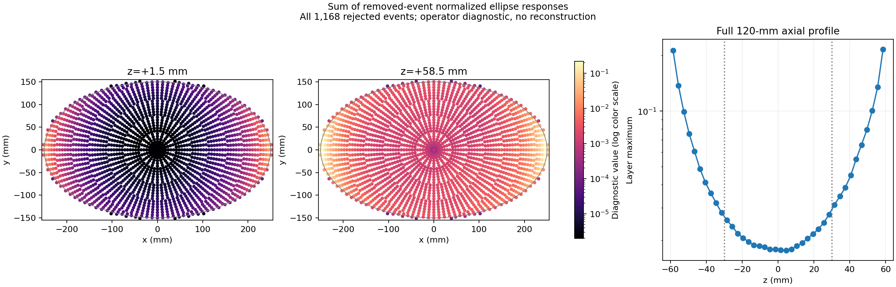
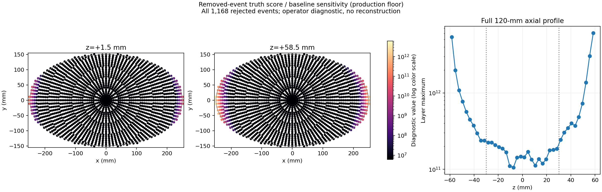

# NEMA 5e9：删除严重失配 Compton 事件的唯一对照

## 当前状态（按用户要求停止）

后续另行批准的[compton_first_scatter_v2](../compton_first_scatter_v2/README.md)使用新的NEMA1e9配对输运和匹配独立S，不恢复本目录的5e9/10000次任务，也不套用本目录1168条行号。

2026-10-04用户要求停止继续重建，转为研究响应代码修正。1657887已取消并确认退出队列，释放8节点/8GPU；自动任务nema-5e9-3已PAUSED，禁止自动重启。最后日志为2950/10000，正式10000次验收未完成。仅第2000次的两路各40帧已持久化取回、逐文件核验并交付；不能将2950日志作为已保存完整2950次结果。见[停止证据](stop_requested_1657887.json)。

保留原1168个q>3删除集合、483768个保留事件及独立匹配Sensi，作为当前模型的显式质量控制版本；原List只读，不物理删除，不悄悄改变兼容入口。全20视角扫描、删除清单、两张诊断图、匹配S，以及50次回归/10次试跑均已完成。关闭筛选接受484936，两路与基线第50帧相对L2均为0；试跑GPU预留最高46.714%、进程峰值RSS/实际授予主存最高45.129%。原1657719/1657745不恢复。

新的[响应代码修正研究](../process_list_audit/RESPONSE_CORRECTION_STUDY.md)复核Geant4事件标记、累计晶体能量、共享K×B、边界积分和MLEM分母；六组合成轨迹说明当前事件合同确有逻辑缺口，但真实输运类别比例尚需独立诊断旁路确认。本次不修改原生产核、不启动新重建。

## 第2000次中期图集

[中期报告及全部图像/曲线](comparison_interim_1657887/README.md)已取回并核验两路各40帧；中心轴位、冠状/矢状、中央72mm MIP共用固定基线尺度，无平滑。JSCC最大密度/峰背景比下降80.81%/80.65%，Compton下降29.20%/28.26%；背景CV和源外泄漏基本未改善，Compton99.9%密度分位数反而升高。所有数值采用完整120mm，最大峰仍在z=+58.5mm，球CRC变化小于0.2个百分点。这只是中期观察；用户现已终止后续10000次，原最终工作判据未完成验收。

## 冻结问题和算法

本次只有A/B两组：A直接复用1644876的10000次MLEM基线，B仅删除当前模型严重失配的原有效事件，并换用同规则独立灵敏度。B仅输出 `440_ComptonOnly` 和 `440_SinglePlusCompton`；后者为原JSCC联合MLEM，不是两张图简单相加。二者共享同一批事件响应块，从全1初始化；不运行218、440单光子或串窗预测，不引入Huber、TV、边界绑定或平滑。

判据固定为 `q_e = min_j |beta_ej-theta_e|/sigma_ej > 3`。遍历完整圆网格132040点，不用椭圆、体模或重建图来限制筛选候选位置。`sigma_ej`直接调用当前生产核的能量角非对称误差和位置误差公式。先执行原有效性和有效支持筛选，再计数新增删除；恰好等于3保留。List已经展宽，本次不再次展宽。

共享实现位于根目录 `compton_event_response.py`。配置默认关闭；sparse响应、独立灵敏度适配器和本次扫描都调用同一评分及选择函数。密度基底仍为K×B，保留行在完整圆网格归一化；随后按物体坐标旋转映射、椭圆重叠比例压缩为82040活动列。MLEM更新公式、分母约定和计算FOV均保持原实现。完整120mm的数值统计包含轴向两端，显示MIP才取中央72mm。

冻结参数见[配置](../../../response_mismatch_cut3_v1.json)。它记录23个原输入、三套Factor清单、几何、原/新Sensi_d、扫描清单哈希和逐视角接受数。原List及原Factors不覆盖；派生大文件仅在 `generated/response_mismatch_cut3_v1/scan`，不会进入Git。

## 全量扫描证据

| 数据 | 原始行数 | 原接受数 | 新增删除 | 保留 |
|---|---:|---:|---:|---:|
| NEMA 5e9，20视角 | 5462327 | 484936 | 1168 | 483768 |
| 纯440训练均匀源，实际1e9初级γ | 1280771 | 170539 | 484 | 170055 |
| 独立纯440验证源，实际1e9初级γ | 1281294 | 170705 | 466 | 170239 |

全量扫描在65114的空闲GPU完成，约333秒；GPU预留峰值6.45GiB，主存峰值11.07GiB，未进行图像迭代。NEMA新增删除比例低于预设1%暂停门槛。此前视角7、准备后索引10254、晶体7629→1936、总能量445keV、最佳匹配约9.14σ的事件已确认删除。

事件清单[rejected_events.csv](rejected_events.csv)包含输入SHA256、视角、原始零基行号、CSV一基行号、准备后索引、q、两次命中晶体及能量。原文件无标题行，因此一基CSV行号为零基行号+1。每视角保留行索引另存于忽略目录的20个NPY，不修改原始文件。逐视角/原无效类型见[progress.json](progress.json)，独立统计见[scan_manifest.json](scan_manifest.json)。

删除事件的q中位数4.247，90%分位8.701，最大13.536。840/1168（71.92%）首命中在法向390mm的最远层；最常见层对是390→360（495个）。能量和中位数418.37keV、范围350.19–501.74keV，每25keV分箱及逐视角/层对明细均在[diagnostics.json](diagnostics.json)。这是删除子集的描述统计，不构成重新设定能量门槛的依据。

## 两张响应诊断图

第一张将被删事件的归一化响应旋转、施加椭圆重叠比例后累加。它是累积反投影响应，不是密度重建：



第二张在本实验真实3D球体体素真值处计算被删事件对MLEM增亮得分的贡献，再除以原基线Compton灵敏度。采用生产的预测分母下限1e−12；真值只用于此处分析，不进入筛选：



两图显示原生极坐标点，没有平滑；分别展示中心z=+1.5mm、端层z=+58.5mm和全部40层的最大值曲线。累积响应在长轴与轴向边缘更高。真值处得分的全局最大值约6.09×10¹²，位于无源长轴端区；这种极大数包含接近零预测、分母下限及灵敏度除法的作用，**不是重建密度，也不能换算成未来图像改善幅度**。在原基线Compton最终峰位置（−102.275,−140.769,+58.5）mm，被删子集的该诊断得分约47661.4。

## 匹配灵敏度和独立闭合

Sensi_d来自原纯440均匀圆支持域数据，使用同一3σ规则。训练与独立验证的随机种子不重叠；发射数都保持实际1e9，不以保留数重缩放，不用NEMA成像事件估计分母。保留原体积归一化和20视角旋转平均。新旧文件分别保留。

| 核查 | 实测值 |
|---|---:|
| 关闭筛选重算S与原S相对L2 | 3.206×10⁻⁷ |
| 独立验证/训练S比值，体积加权平均 | 1.000950729 |
| 全圆网格比值的非体积加权空间CV | 0.293412% |
| 独立空间比值范围 | 0.944633–1.059735 |
| `sum(S_new)/Vsupport` | 0.0001700550003 |
| 原实际发射数分母下训练接受效率 | 170055/1e9 = 0.000170055 |
| S_new/S_old最小/中位/最大 | 0.901628 / 0.999831 / 1.000001 |

新S的少量数值上浮约1.2×10⁻⁶，是浮点累加差异；没有按保留比例上调全图。来源、完整独立验证种子与参数在[Sensi_d_provenance.json](Sensi_d_provenance.json)。

## 后续验收和复现入口

`verify_response_mismatch.py`分别检查50/10/10000次契约、逐视角/各rank接受数、8个唯一rank与8个节点、输入/几何/Factor/灵敏度哈希、两路活动/完整/历史图、有限非负值、椭圆外严格零值和末帧一致。关闭筛选50次与原第50帧相对L2必须≤1e−5。GPU预留/物理显存及进程峰值RSS/Slurm实际授予主存均必须≤80%；以实际授予值核查，不用推测的节点物理总内存。任一失败立即停止执行链，禁止带着错误分母进入正式对照。

结果完成后，在工程根执行：

```powershell
$job = (Get-Content experiments/ELLIPSE500x300_H120/reports/NEMA_Body_H60/response_mismatch_cut3_v1/job.json | ConvertFrom-Json).job_id
python experiments/ELLIPSE500x300_H120/fetch_response_mismatch.py --job $job --phase regression
python experiments/ELLIPSE500x300_H120/fetch_response_mismatch.py --job $job --phase pilot
# 中期快照只用于观察，不判定最终效应
python experiments/ELLIPSE500x300_H120/fetch_response_mismatch.py --job $job --phase interim
# 正式验收后取回两路全部200帧，逐文件检查传输SHA256
python experiments/ELLIPSE500x300_H120/fetch_response_mismatch.py --job $job --phase formal
# 上述工具打印对应的compare_response_mismatch.py执行命令
```

`compare_response_mismatch.py`使用本实验实际3D球体真值及已有ROI，以各通道**基线最终背景均值**作为两组/全部迭代共同显示尺度，固定0–10色标，无平滑。输出中心轴位、冠状/矢状、中央72mm MIP；比较100/500/1000/2000/5000/10000次，保存全部200帧指标。2000次快照模式输出至2000的40帧曲线，明确标为中期观察，不产生最终通过结论。

完整120mm活动域统计最大密度、峰/背景比、峰位置、密度高分位、体积加权高分位、`f<0.1`质量比例、源外`|z|>30mm`质量、总积分；真实13/22/37mm球按相同ROI计算CRC/CNR，背景计算均值/CV。预先固定工作判据为同迭代最大密度及峰/背景比均下降≥50%；CRC下降超过0.05绝对值即5个百分点需标出恢复代价。这不是有效FOV或临床验收标准。

若仅极端峰值下降，结论只限于这些事件影响局部尖峰；若无明显下降，只能说明本次3σ子集不足以解释主要问题。此轮不扫描阈值、不增大光子数、不恢复正则化。

## 本地验证和安全

新增4项共享响应/阈值/分块/只读检查点测试通过；默认核与87d1713逐元素一致，检查点启用后的Compton/JSCC MLEM与原实现逐元素一致。原Compton算子等价与密度闭合5项测试通过。完整图集工具用同一真实历史对比自身验证：最终曲线800行、球指标2400行、全部差值零；中期模式单独检查，不提前给出结论。

原灵敏度流水线8项测试中有2项旧断言失败；在冻结87d1713中复现同样失败，分别仍假定B会去体积权重、以及旧的`final_average`元数据。未为此改动生产物理约定或更改旧测试以掩盖问题。具体记录见[validation.json](validation.json)。分布式50次数值回归与10次实际资源验收已通过，详见门控摘要；10000次正式验收尚待执行。

SSH只使用既有agent/本机DPAPI。Git保存源码、小型JSON/CSV证据和诊断PNG；不提交矩阵、List、Sensi_d二进制、历史数组、密码、私钥或加密凭证文件。原审计和原1e9/5e9结果保持独立。
