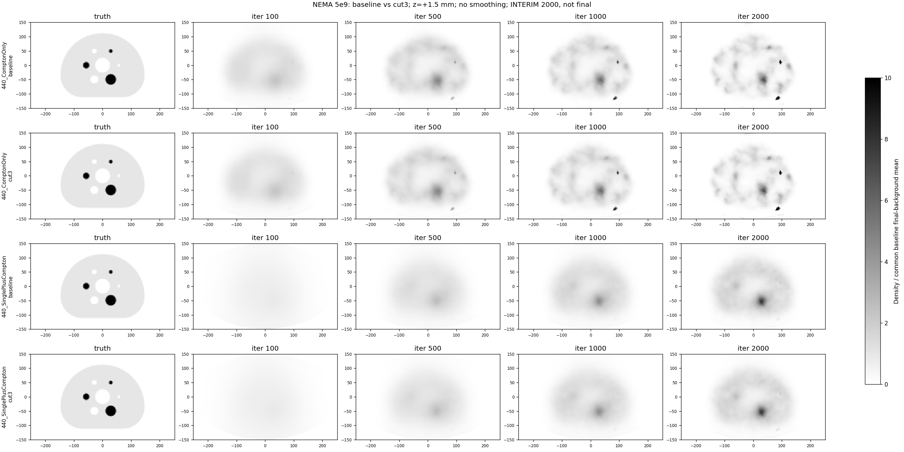
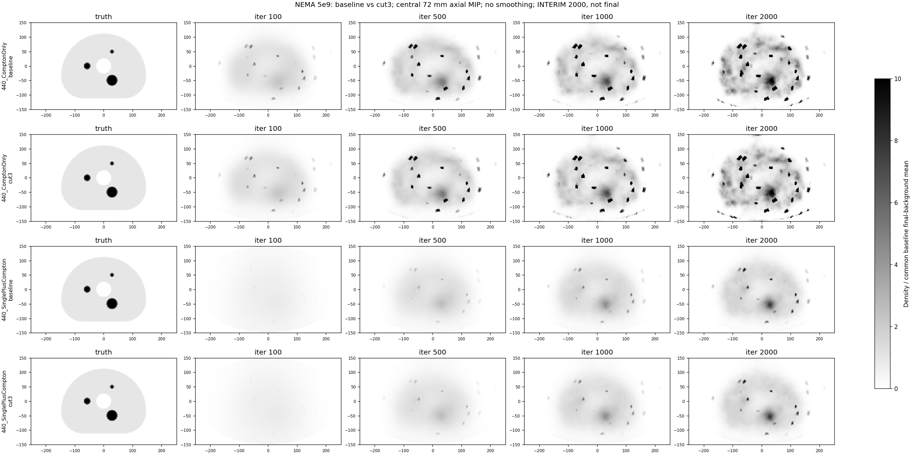
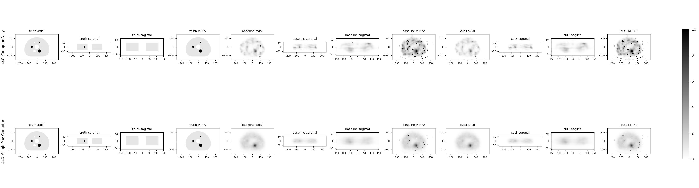
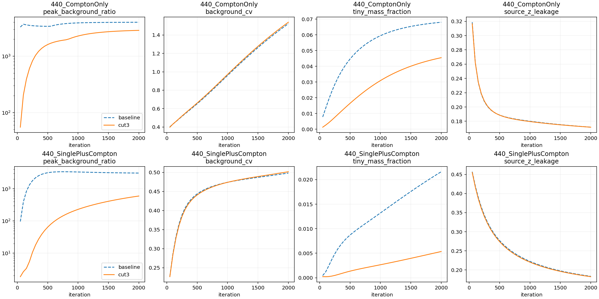
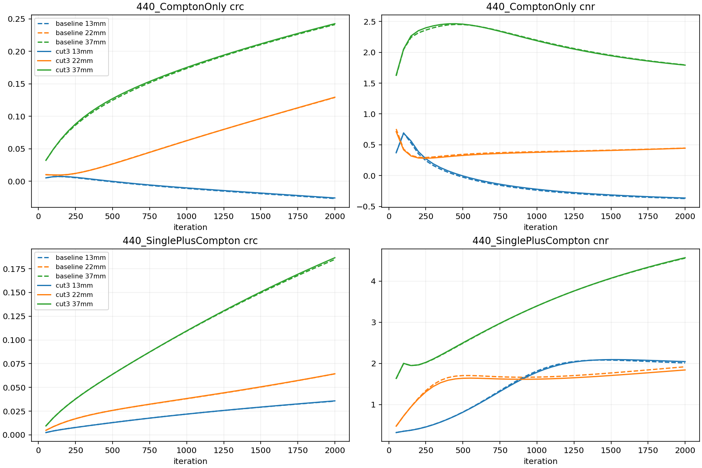

# NEMA 5e9：基线与3σ失配事件删除对照

**第2000次中期观察，不作正式结论，不改变阈值或提前停止。**

两组使用同一真实球体体模、输入及初值，删除组匹配独立灵敏度。完整指标使用120mm，MIP使用中央72mm。所有图像未平滑，共同色标使用各通道基线最终背景均值，两个组及全部迭代固定同一尺度。

440_ComptonOnly，第2000次：最大密度下降29.20%，峰/背景比下降28.26%；背景CV 1.5236→1.5393，源外轴向质量17.17%→17.17%。

13/22/37mm球CRC变化（百分点）：13mm +0.09, 22mm +0.04, 37mm +0.13。

440_SinglePlusCompton，第2000次：最大密度下降80.81%，峰/背景比下降80.65%；背景CV 0.4983→0.5017，源外轴向质量18.34%→18.24%。

13/22/37mm球CRC变化（百分点）：13mm +0.02, 22mm +0.00, 37mm +0.18。

完整原始数值见comparison.json及两份CSV；工作判据是最大密度与峰/背景比均下降至少50%，CRC损失超过5个百分点单独标记。











## 完整120 mm活动域的中期观察

以下都是同一第2000次的数值，极端峰位于z=+58.5 mm。中央72 mm MIP不包含这些端层，因此不能仅从MIP外观评估全域尖峰。

| 指标 | Compton基线 | Compton删除组 | JSCC基线 | JSCC删除组 |
|---|---:|---:|---:|---:|
| 最大密度 | 3.67807e+06 | 2.60404e+06 | 2.61361e+06 | 501428 |
| 峰/背景比 | 3998.15 | 2868.31 | 3075.55 | 595.208 |
| 非体积加权99.9%密度分位数 | 28502.8 | 48697.2 | 29854 | 19580 |
| 体积加权99.9%密度分位数 | 6809.95 | 7305.98 | 5419.47 | 5607.52 |
| 背景CV | 1.52363 | 1.53934 | 0.498304 | 0.501723 |
| f<0.1单元的积分占比 | 6.803% | 4.547% | 2.161% | 0.535% |
| 源外轴向积分占比 | 17.173% | 17.170% | 18.337% | 18.237% |
| 总积分 | 3.55206e+09 | 3.55064e+09 | 3.47368e+09 | 3.47479e+09 |

两路最大值的空间位置均未改变：Compton为(102.275, −140.769, +58.5) mm，JSCC为(−231.351, −63.849, +58.5) mm。删除组仍分别存在约2868和595倍背景的最大密度，不能把相对下降等同于尖峰消失。

JSCC的极端峰值中期下降较大，但背景CV由0.4983升至0.5017；源外轴向积分仅从18.34%降至18.24%。Compton的最大值下降不足50%，其非体积加权99.9%分位数由28503升至48697，说明高值尾部没有一致改善。两路体积加权99.9%分位数也略升。

13/22/37 mm球CRC变化仅约+0.00至+0.18个百分点，本检查点没有超过5个百分点的恢复损失；这不代替10000次最终判断。当前初步证据限于这批事件影响部分极端峰值，尚未表明整体噪声或源外泄漏改善。保持冻结阈值，继续既定两路10000次重建。

## 绘图来源与复现

应用reconstruction-result-visualizer的原始数组核查、真值来源、灰度反转及可复现证据规则；本实验H60三维双能球体不使用该技能旧的二维NEMA热柱目录。真值为generated/NEMA_Body_H60/truth_3mm.npz，形状[40,100,168]，3 mm。每通道使用基线最终背景均值作为两组全部迭代的共同尺度，固定0–10，不逐图拟合、不做Gaussian滤波、不裁剪横向FOV。MIP仅取24个中间z层，即体素边界[−36,+36] mm；完整120 mm用于全部数值指标。

完整历史暂为每路40帧，指标160行、球体CRC/CNR480行；不是正式各200帧交付。数组逐文件SHA及活动/完整列映射、椭圆外零、末帧一致、有限非负已核验。final_multiplanar.png在本目录表示第2000次多平面快照，不是10000次最终结果。

```powershell
python -X utf8 experiments/ELLIPSE500x300_H120/compare_response_mismatch.py --result experiments/ELLIPSE500x300_H120/generated/RemoteResults/NEMA_Body_H60_5e9_cut3_interim_1657887 --output experiments/ELLIPSE500x300_H120/reports/NEMA_Body_H60/response_mismatch_cut3_v1/comparison_interim_1657887 --through-iteration 2000
```


## 第2000次热球恢复与CNR

| 通道/球径 | CRC基线 | CRC删除组 | CNR基线 | CNR删除组 |
|---|---:|---:|---:|---:|
| Compton 13 mm | -2.655% | -2.565% | -0.3718 | -0.3632 |
| Compton 22 mm | 12.892% | 12.929% | 0.4464 | 0.4450 |
| Compton 37 mm | 24.105% | 24.238% | 1.7955 | 1.7922 |
| JSCC 13 mm | 3.556% | 3.580% | 2.0111 | 2.0441 |
| JSCC 22 mm | 6.429% | 6.434% | 1.9181 | 1.8406 |
| JSCC 37 mm | 18.479% | 18.659% | 4.5599 | 4.5705 |

小球恢复仍有限，Compton的13 mm球在此迭代下CRC和CNR均为负；删除该子集没有改变这一现象。两组局部ROI与真实三维球体体积分数完全相同，CRC定义为(热球均值/局部背景均值−1)/9；此处不将基线也有的恢复不足归为筛选带来的代价。
