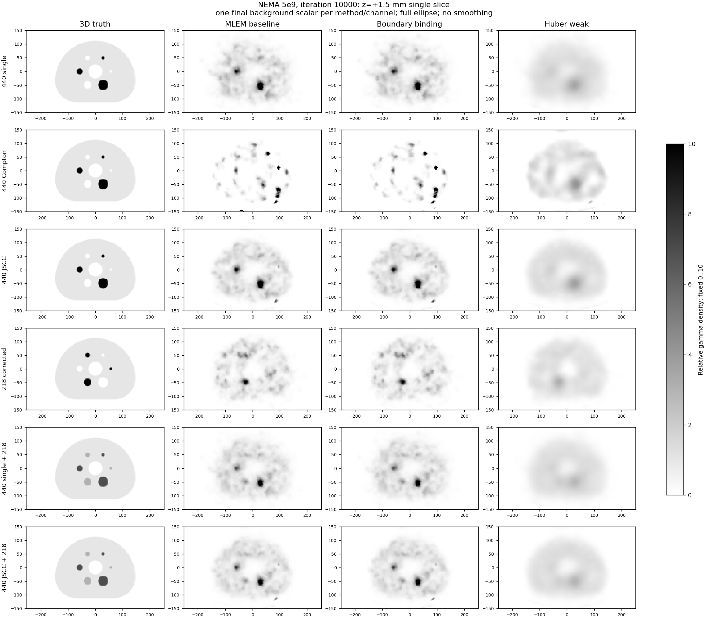
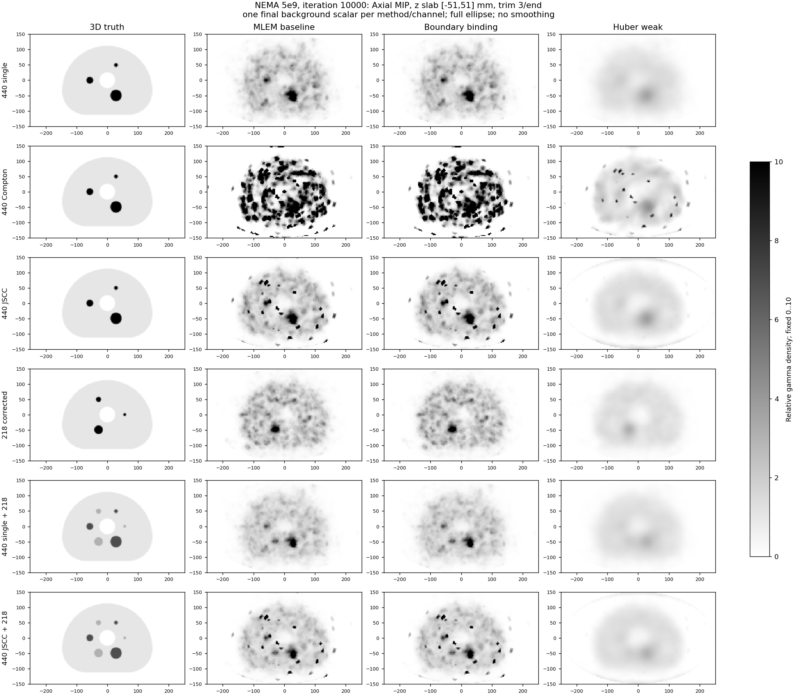
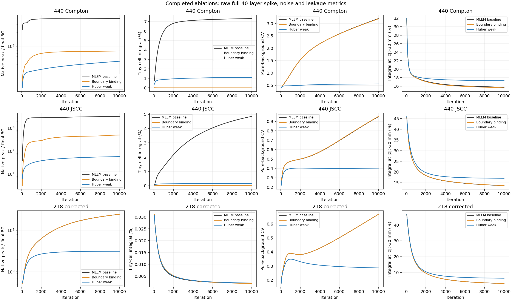
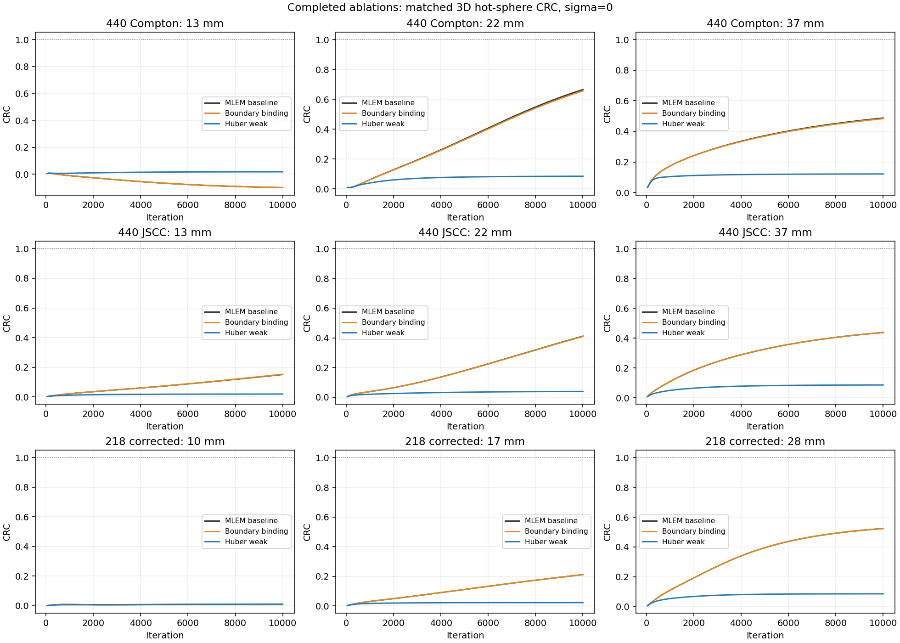
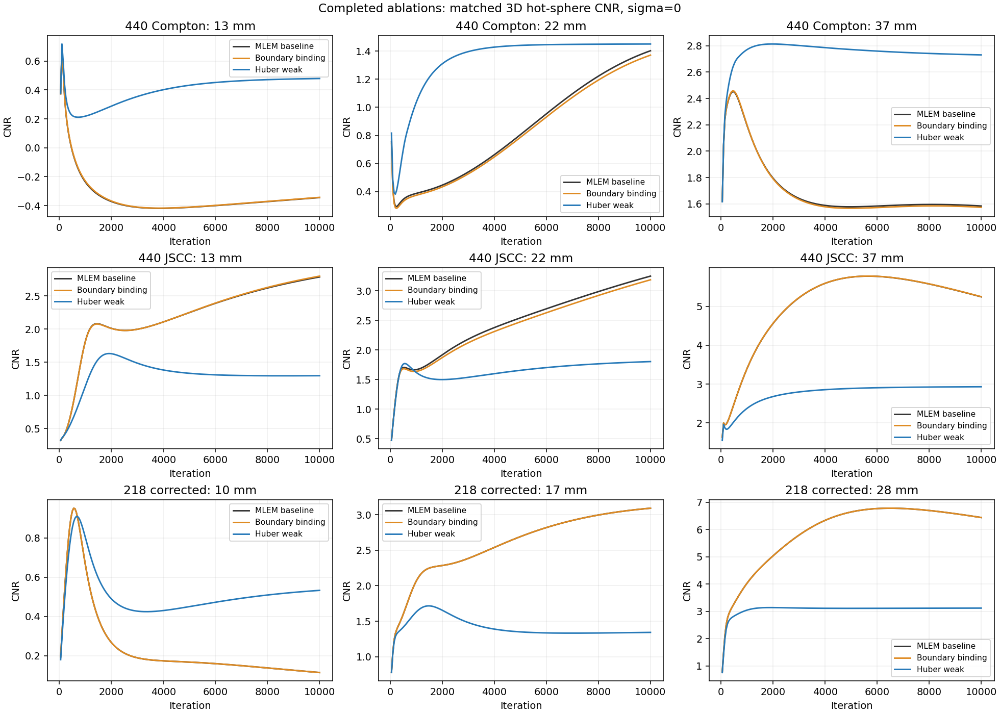

# NEMA 5e9：已完成算法组的阶段对照（2026-10-04）

目前可完整比较已有MLEM、仅边界小单元绑定和弱Huber（λ=0.001、δ=1）。**中档/强档Huber与TV尚未完成，不纳入本报告，不据此选择最终算法。** 三组使用完全相同的5e9输入、484936个Compton事件、Factors、几何与Sensi_d；均10000次、每50次保存，共六路×200帧。基线run_manifest与冻结study哈希一致，新两组通过正式完整性和算法门控，完整历史取回后逐文件SHA256再次核验。

## 已观察到的取舍

1. **仅绑定f<0.1单元确实移除了这些单元中的异常积分，但没有解决整体边界病态。** Compton最大原始密度由3745857降至732734，JSCC由2983527降至463039；新最大值仍在z=+58.5mm，位于相交比例f≈0.112的未绑定边界单元，坐标约(-68.98,-146.58,+58.5)mm。不能把峰值下降解释为所有边界尖峰已经消除。
2. **绑定基本保留了主体图像、球体CRC和背景CV。** 440 JSCC背景CV为0.951→0.953，37mm球CRC为0.438→0.438；这是一项较局部的自由度约束。体积加权P99.9略升，说明大部分高值分布没有随最大值一起改善。
3. **当前弱Huber明显降低噪声和高值，但严重降低热球对比度。** 440 JSCC背景CV降至0.395，37mm球CRC降至0.086、22mm降至0.039、13mm降至0.020。218的17/28mm球也明显欠恢复；10mm球CNR虽由0.115升至0.533，仍不能证明可靠识别。这里“弱”只表示预设λ档位，不能当成作用强度较弱的实验结论。
4. **空间先验增加了轴向源外泄漏。** JSCC在|z|>30mm的积分占比由13.60%增至17.04%；218由3.03%增至6.37%。弱Huber仍有边界端层最大值：440 JSCC峰约51036，位于f≈0.00997、z=+58.5mm。降低峰和CV不能替代对球体恢复、空间扩散和完整FOV的评估。

以下峰值取自**原始活动极坐标密度**，不是插值像素或渲染图；峰/背景使用各方法各通道的最终纯背景均值。积分用`cell_volume_mm3 × ellipse_fraction`，保留完整40层。P99.9按实际单元体积加权。

| 10000次指标 | MLEM | 仅边界绑定 | 弱Huber |
|---|---:|---:|---:|
| 440 Compton：全FOV峰/背景 | 4016.5 | 781.5 | 467.2 |
| 440 Compton：体积加权P99.9/背景 | 28.58 | 29.95 | 6.31 |
| 440 Compton：背景CV | 3.200 | 3.189 | 0.556 |
| 440 Compton：f<0.1单元积分占比 | 7.3118% | 0.000064% | 1.1084% |
| 440 JSCC：全FOV峰/背景 | 3231.1 | 501.0 | 57.4 |
| 440 JSCC：保留MIP层内原始峰/背景 | 62.80 | 62.68 | 3.80 |
| 440 JSCC：体积加权P99.9/背景 | 9.82 | 10.29 | 3.81 |
| 440 JSCC：背景CV | 0.951 | 0.953 | 0.395 |
| 440 JSCC：f<0.1单元积分占比 | 4.8520% | 0.000825% | 0.1595% |
| 440 JSCC：轴向源外积分占比 | 13.60% | 13.65% | 17.04% |
| 440 JSCC：发射γ总积分恢复 | 98.35% | 98.35% | 98.34% |

f<0.1单元占物理FOV体积约0.053%。绑定后的这些单元积分接近零，不表示删除了它们；它们仍参与响应和积分，只是与指定内部单元共享密度。完整坐标、背景偏差和积分数据在 [final_channels.csv](final_channels.csv)。

## 球体恢复

这是项目已有的3D球体体积分数ROI与局部纯背景指标：`CRC=(sphere mean/local BG mean−1)/9`，`CNR=(sphere mean−local BG mean)/local BG std`，标准差ddof=1；与基线完全同一ROI和3mm真值。复合γ通道的球体预期比包含0.114/0.259产额，完整六路结果在CSV中，不能直接解释为母体225Ac活度。

| 通道、直径 | MLEM CRC / CNR | 仅边界绑定 CRC / CNR | 弱Huber CRC / CNR |
|---|---:|---:|---:|
| 440 JSCC、13mm | 0.151 / 2.79 | 0.153 / 2.80 | 0.020 / 1.30 |
| 440 JSCC、22mm | 0.411 / 3.25 | 0.410 / 3.19 | 0.039 / 1.80 |
| 440 JSCC、37mm | 0.438 / 5.25 | 0.438 / 5.25 | 0.086 / 2.93 |
| 218校正、10mm | 0.009 / 0.12 | 0.009 / 0.12 | 0.011 / 0.53 |
| 218校正、17mm | 0.211 / 3.09 | 0.211 / 3.09 | 0.023 / 1.34 |
| 218校正、28mm | 0.524 / 6.44 | 0.524 / 6.44 | 0.085 / 3.12 |

这些结果支持下一轮考虑更低的Huberλ及独立的边界响应核检查；**当前仍按已冻结方案完成中/强Huber和TV，不原地更改参数或把绑定与MAP叠加。** 本阶段尚没有最优正则强度、有效FOV达标或小球恢复达标的结论。

## 图像与全部迭代曲线

使用本实验`generated/NEMA_Body_H60/truth_3mm.npz`的显式双能H60三维球体真值（SHA256为`2612f0ed6839f9460722711e1017a10102e83adf77cf715d5c2553cfaec948af`），不使用技能中旧的二维全热圆柱NEMA。物理重建FOV保持500×300×120mm椭圆柱，所有图sigma=0、无XY裁切，gray_r（白低黑高），固定色标0–10。色标饱和仅影响显示，CSV和原始数组不截顶。

`center_*`为z=+1.5mm单层轴位；`mip_*`为轴向MIP，上下各排除3层（各9mm），保留层中心−49.5～+49.5mm、体积区间−51～+51mm。只有MIP排除端层；统计、轴/冠/矢位使用原始完整40层。

提供两种尺度，避免背景再归一化掩盖定量偏差：`*_final_bg`用各方法各通道的一个最终背景标量，`*_emitted_density`用同通道**三组共同的发射光子预期背景密度**，真值不缩放。后者反映尺度偏差；相应偏差数值见CSV。











共同发射密度尺度：[中心层](center_emitted_density.png)、[端层排除MIP](mip_emitted_density.png)。每50次的完整原始尖峰/积分曲线在 [native_iteration_metrics.csv](native_iteration_metrics.csv)，每路每球的末次结果在 [final_spheres.csv](final_spheres.csv)。

六路完整迭代图集与轴冠矢/MIP：

- [边界绑定：100至10000次图集](../../NEMA_Body_H60_5e9_bind_f010_formal_1651956_0/README.md)
- [弱Huber：100至10000次图集](../../NEMA_Body_H60_5e9_huber_weak_formal_1651956_1/README.md)
- [MLEM基线图集](../../NEMA_Body_H60_5e9_1644876/README.md)

## 优化与复现边界

弱Huber四分量各完成10000次更新，最大实际归一化目标增量为5.10e−9，代理目标增量均不大于0。440 Compton的90次M步达到80次内迭代上限（0.9%），最大记录间隙2.67e−6；其他三分量无内迭代上限，最大间隙低于1e−6。下降与资源门控通过，但本实现仍按记录间隙的广义EM解释，不宣称每个M步或最终MAP最优解精确收敛。正式优化证据见 [huber_weak.formal.optimization.json](../huber_weak.formal.optimization.json)。

本报告由 [compare_spike_ablation.py](../../../../compare_spike_ablation.py)生成，元数据 [comparison.json](comparison.json)记录输入、正式门控、分析、全历史、脚本和真值哈希。分析和绘图源代码已在本目录及各结果的`scripts/`归档，原始图像没有修改。小型分析、图和证据可入Git，原始float32历史、矩阵及凭证排除。

从工程根复现已验收组；新组完成时使用新的输出目录保留本阶段证据：

```powershell
python experiments/ELLIPSE500x300_H120/fetch_spike_ablation.py --results
python experiments/ELLIPSE500x300_H120/compare_spike_ablation.py --variants bind_f010 huber_weak --output-name comparison_20261004
```
