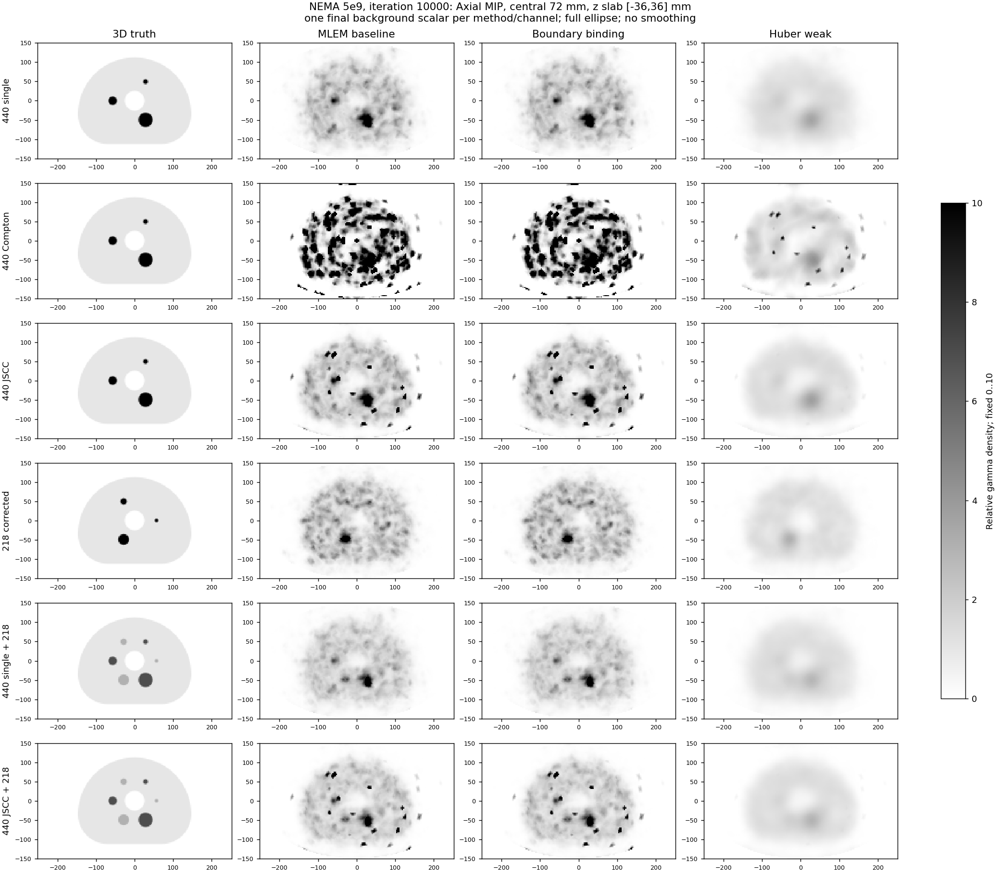

# NEMA 5e9：中央72mm MIP算法对照

2026-10-04按用户要求，将轴向MIP投影区域改为**仅中央72mm，z∈[−36,+36]mm**。仍在500×300×120mm椭圆柱中重建；40个3mm层上下各去掉8层，仅在MIP显示时保留中间24层，零基索引8–31，层中心−34.5～+34.5mm。中央H60源主体完整包含于本次投影区域。轴位、冠状位、矢状位以及定量分析继续读取完整40层，原始数组不改。

当前纳入三组：已有MLEM基线1644876、仅边界小单元密度绑定、弱Huber（λ=0.001，δ=1）。均为同一独立5e9数据、484936个已筛选Compton事件，10000次、六路各200帧。新两组正式门控通过；中/强Huber和TV尚无完整正式结果，不加入本图。没有因显示调整重新模拟或重建。

## 六路最终结果

横向椭圆范围完整，sigma=0，无额外平滑。gray_r为白低黑高，色标固定0–10。每列对应真值、MLEM、边界绑定、弱Huber；六行对应440单光子、440Compton、440JSCC、218串窗校正、440单光子+218、440JSCC+218。

`mip_final_bg.png`用各方法/通道的一个最终纯背景均值，整个图集固定该标量；`mip_emitted_density.png`用同一通道三组共同的初级光子发射预期背景密度。两图均保留同一物理真值，色标饱和只发生于显示，不截顶原始密度。复合图解释为γ通道图，不直接解释为母体225Ac活度。



共同发射密度尺度：[中央72mm MIP](mip_emitted_density.png)。单层轴位保持z=+1.5mm：[最终背景尺度](center_final_bg.png)、[共同发射密度尺度](center_emitted_density.png)。这些`center_*`图不是MIP。

## 观察与显示峰值

中央72mm仍存在局部高值，尤其Compton通道；仅排除轴向端层不会解决内部噪声。边界绑定与MLEM在主体区域十分接近，弱Huber降低局部高值、同时热球对比度明显损失。上述图像取舍与[完整原始FOV阶段分析](../comparison_20261004/README.md)一致；显示裁切不代表边缘单元稳定或算法问题消除。

下面是**同一笛卡尔显示插值上的MIP最大值/最终背景**，仅用于衡量显示变化；它不是原始极坐标单元最大密度，也不与旧报告的原始峰值混用。原始全120mm与中央72mm使用完全同一归一化；数值没有按0–10显示上限截顶。

| 组、通道 | 全120mm MIP最大值/背景 | 中央72mm MIP最大值/背景 |
|---|---:|---:|
| MLEM、440Compton | 2260.35 | 253.60 |
| 仅边界绑定、440Compton | 234.16 | 163.93 |
| 弱Huber、440Compton | 225.60 | 11.86 |
| MLEM、440JSCC | 1818.36 | 51.29 |
| 仅边界绑定、440JSCC | 192.40 | 51.19 |
| 弱Huber、440JSCC | 28.14 | 3.77 |

数值及完整六路峰值见各组`mip_trim8/metadata.json`。MIP对每个(x,y)位置取24层中的最大值，所以较大噪声及球中心以外的高值会叠加到投影中；不能当成中心单层的CRC测量。

## 随迭代变化及裁切前后比较

三组均提供六路真值、100/500/1000/2000/5000/10000次MIP，每一帧采用固定最终背景标量，避免逐帧自动缩放。

- MLEM：[六路迭代MIP](../../NEMA_Body_H60_5e9_1644876/mip_trim8/mip_iterations.png)、[全120mm/中央72mm同色标对照](../../NEMA_Body_H60_5e9_1644876/mip_trim8/mip_full_vs_trimmed.png)、[轴冠矢/MIP及元数据](../../NEMA_Body_H60_5e9_1644876/mip_trim8/README.md)。
- 仅边界绑定：[六路迭代MIP](../../NEMA_Body_H60_5e9_bind_f010_formal_1651956_0/mip_trim8/mip_iterations.png)、[全120mm/中央72mm同色标对照](../../NEMA_Body_H60_5e9_bind_f010_formal_1651956_0/mip_trim8/mip_full_vs_trimmed.png)、[轴冠矢/MIP及元数据](../../NEMA_Body_H60_5e9_bind_f010_formal_1651956_0/mip_trim8/README.md)。
- 弱Huber：[六路迭代MIP](../../NEMA_Body_H60_5e9_huber_weak_formal_1651956_1/mip_trim8/mip_iterations.png)、[全120mm/中央72mm同色标对照](../../NEMA_Body_H60_5e9_huber_weak_formal_1651956_1/mip_trim8/mip_full_vs_trimmed.png)、[轴冠矢/MIP及元数据](../../NEMA_Body_H60_5e9_huber_weak_formal_1651956_1/mip_trim8/README.md)。

## 定量结果及验证

完整历史、正式完整性证据、同一H60双能三维球体真值、Factors/输入/几何/灵敏度哈希重新检查通过。3mm显式真值SHA256为`2612f0ed6839f9460722711e1017a10102e83adf77cf715d5c2553cfaec948af`。没有使用技能中旧的二维圆柱NEMA真值。

与原102mm显示报告相比，`final_channels.csv`、`final_spheres.csv`、`native_iteration_metrics.csv`**逐字节一致**，源数据/分析/200帧历史哈希、ROI和迭代点一致。原始密度及体积积分仍使用完整40层；已有`inner_z_peak_over_final_background`诊断仍表示中心−49.5～+49.5mm范围，并未因显示改变而重定义为72mm。详细验证在[display_validation.json](display_validation.json)，政策、来源和脚本版本在[comparison.json](comparison.json)。

关键球体恢复结论不变：440JSCC的37mm球CRC依次0.438/0.438/0.086，背景CV0.951/0.953/0.395；弱Huber的球体欠恢复不能因MIP端层去除而忽略。完整曲线：[CRC](matched_crc.png)、[CNR](matched_cnr.png)、[全40层尖峰/噪声/泄漏](spike_noise_leakage.png)。球结果在[final_spheres.csv](final_spheres.csv)，完整通道结果在[final_channels.csv](final_channels.csv)。

## 复现及后续约定

本工程默认MIP改为8层/端，即当前网格的中央72mm；后续已完成组的取回绘图、六路多平面和方法对照共享该政策。图像历史、运行中的不可修改代码发布、算法参数和其他视图不改变。原120mm及先前102mm显示保留为历史证据。代码归档于`scripts/`，大数组和敏感凭证不入Git。

```powershell
python experiments/ELLIPSE500x300_H120/compare_spike_ablation.py --variants bind_f010 huber_weak --mip-trim-layers 8 --output-name comparison_mip72_20261004
python experiments/ELLIPSE500x300_H120/plot_nema_mip.py NEMA_Body_H60_5e9_1644876 --trim-layers 8
python experiments/ELLIPSE500x300_H120/plot_nema_mip.py NEMA_Body_H60_5e9_bind_f010_formal_1651956_0 --trim-layers 8
python experiments/ELLIPSE500x300_H120/plot_nema_mip.py NEMA_Body_H60_5e9_huber_weak_formal_1651956_1 --trim-layers 8
```
