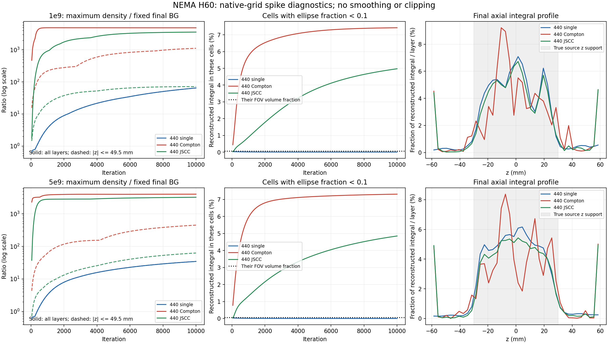

# Compton / JSCC 局部尖峰：诊断与算法改进研究

2026-10-02。对象为已验收的 NEMA H60 独立 1e9（1643142）和 5e9（1644876），均为 500×300×120 mm 椭圆柱、10000 次 MLEM。**本次完成代码核查、原始结果诊断与文献研究；没有改动正式重建算法、响应、灵敏度或原始图像，没有提交新的重建。下面的改进效果仍需对照试验验证。**

建议采用两条并行的研究路线：首先定位椭圆边界单元及 Compton 响应的不一致，再实现保留联合 Poisson 似然的三维 MAP-JSCC。单纯增加计数、减少迭代或对最终图像滤波，不足以解释和解决当前全部问题。

## 1. 这次直接测到了什么

诊断脚本为 [diagnose_nema_spikes.py](../../../diagnose_nema_spikes.py)。以原始极坐标密度计算峰值，以 `cell_volume_mm3 × ellipse_fraction` 计算积分；不采用插值后像素的最大值。两个结果的三个 440 通道、200 帧历史和最终图均重新核对了既有 SHA-256，最后历史帧与最终图对应活动列逐值一致。灵敏度小文件经既有安全连接取回，并核对其 SHA 与两组正式 run_manifest 一致。

证据：[diagnostics.json](diagnostics.json)、[全部1200条迭代诊断](iteration_diagnostics.csv)。背景归一化沿用每路最终图的固定背景均值；不是每帧重设色标，也不是母体 225Ac 活度。

| 5e9，第10000次 | 440单光子 | 440 Compton | 440 JSCC |
|---|---:|---:|---:|
| 全域最大密度 / 该路最终背景 | 34.62 | 4016.49 | 3231.11 |
| 最大值 z / mm | +4.5 | +58.5 | +58.5 |
| 峰值单元椭圆相交比例 f | 1 | 0.02308 | 0.02308 |
| 峰值单元有效体积 / mm³ | 169.65 | 4.541 | 4.541 |
| f<0.1 单元承载的重建积分比例 | 0.0021% | 7.3118% | 4.8520% |
| 上下各3层承载的重建积分比例 | 1.2433% | 10.1298% | 10.2722% |
| 排除端3层后，原始极坐标最大密度 / 背景 | 34.62 | 450.65 | 62.80 |

全部 `f<0.1` 的单元共有 800 个，只占椭圆有效体积 **0.05303%**。在独立 1e9 数据中，同组单元承载的积分也达到 Compton **7.4219%**、JSCC **4.9747%**。两组的 Compton/JSCC 端3层积分均约10%，而这些轴向区域的 NEMA 真值为零。上述比例是重建密度的体积积分，不能解释为实际散射事件比例。

5e9 Compton 最大值在第50、100次已分别达到最终背景的约2300、2978倍，之后才缓慢升至4016倍。JSCC 第100、500、1000次约184、2324、2797倍。内部最大值则随高迭代继续明显增加。**这支持把“较早形成且跨计数重复的边界异常”与“随迭代放大的内部高值”分开研究；尚不能凭这些相关性确定唯一物理原因。**



图左：实线为全域最大值，虚线仅统计 `|z|≤49.5 mm`；图中：小相交单元的重建积分占比，黑虚线是其体积占比；图右：每层的重建积分，灰色区域为真实源的轴向范围。全部图未滤波、未截断数值。这里的原始极坐标峰值与 MIP 图经 XY 插值后的峰值不同，不能混用。

### 不是简单的“灵敏度接近零导致除零”

当前活动列的 Compton 灵敏度最小约 `4.214e-4`，远大于代码的 `1e-12` 数值下限。两个峰值位置的 `s_C` 约 `7.071e-4`，除以有效体积后约 `1.557e-4 /mm³`，处于全椭圆按体积统计约第71百分位，**并非单位体积灵敏度低谷**。这只分析了 Compton 灵敏度，没有在本次下载大矩阵重算 JSCC 总灵敏度。

部分单元小，原始密度基底的灵敏度自然小；应先除以有效体积再比较探测效率。另一方面，峰值单元并非仅有“密度数值大、实际积分可忽略”：5e9 Compton 的最大单元独自承载约0.479%的全部重建积分，JSCC 对应最大单元约0.390%，且在源外。

必须区分检测灵敏度与定位信息量。灵敏度不低的单元，仍可能与其他单元响应高度相似、缺乏足够的轴向定位约束；本次尚未计算局部 Fisher 信息或响应列相关性。

## 2. 当前算法与模型核查

- [torch_active_operator.py](../../../torch_active_operator.py) 中 `compton_and_joint_mlem` 是真正的联合更新：单光子和 Compton 反投影相加，分母为两者灵敏度之和。它不是两张独立重建图简单相加。当前没有空间先验或正则化。
- 活动列前向、转置、灵敏度均乘椭圆重叠比例。若记列响应为 `T_ej=f_j T0_ej`、灵敏度为 `s_j=f_j s0_j`，则同一图像下更新因子中显式的 `f_j` 相消。因此不能未经验证就认定“少乘一次f”，也不能在图像上再乘f作为修复。
- 将密度 `x_j` 改记为单元总量 `q_j=Veff_j x_j`，并严格变换响应和初值，得到的是同一无正则 ML 问题；它能改善量纲解释，但本身不会消除尖峰。
- [compton_event_response.py](../../../../../compton_event_response.py) 使用固定440 keV和第一击能量估角，第二击能量参与筛选；包括能量不确定性、晶体尺寸对应的位置方差，以及第一击到源的几何不确定性。`delta_r1=delta_r2=0` 只表示没有附加位置模糊，不能说位置误差完全没建模。
- 能量分辨率为13% FWHM@511 keV，折算到440约14.01%；List已展宽，不在重建再次抽样展宽。角核宽度是能量与位置角方差合成。
- 当前 Compton 行为 `K × B[first_hit,:]`，随后在完整圆网格做逐事件行归一化，再旋转/压缩/乘椭圆比例。K是在单元代表坐标上评价，没有对每个实际椭圆相交体积积分。`B` 是当前440单光子密度响应；把它作为第一击响应是现有模型近似。
- 角核使用高斯形状乘 Klein–Nishina 形状项，未见单独的材料相关 Doppler 核、事件顺序多假设或离群事件背景项。高斯宽度随候选源位置变化，而代码没有显式 `1/sigma_angle` 幅度因子。这是需要从测量概率密度与积分测度审计的事项，**不能直接断言加上该因子就一定正确**。
- 最小有效支持数是1；其离散定义 `1/sum(p_j²)` 随网格体积和划分变化，不能未经体积修正就作为通用的物理事件质量门槛。

独立圆均匀源的闭合比均值1.00087、CV0.00302是有价值的既有证据，见[报告](../../sensitivity_circle_closure.json)。但灵敏度本身由同类均匀源的归一化响应反投影构造；这类闭合不充分证明每个非均匀源的事件条件分布准确。[椭圆有效灵敏度报告](../../ellipse_effective_sensitivity.json)标注的是预测效率，也不能当作所有局部椭圆空间检验通过。

## 3. 优先级最高：边界单元与事件响应的诊断及修正

### 3.1 先做有判别力的诊断

1. **真值前向与KKT检查**：把实际体素源按体积重叠映射到极坐标密度，使用真实各能发射数。评估 `g_j = H^T[y/(Hx+b)] + T^T[1/(Tx+b_C)]` 与 `s_j`。真实正密度区应接近 `g=s`；真值为零的区域检查是否系统性出现 `g>s`。零密度处不能仅看一次乘性EM更新，因为零会保持为零，掩盖“模型想在此长出源”的趋势。用独立数据或worker级重采样估计统计波动。
2. **事件责任分解**：在当前图或受控正初值上计算 `r_ej=T_ej x_j/(Tx+b_C)_e`，统计端层、小f单元由哪些视角、第一击晶体、散射角、能量和事件贡献。区分少数异常事件与大量事件共同造成的系统偏置。
3. **空间信息检查**：对峰值单元、其邻居及源内代表点计算响应列相似度和局部信息矩阵近似，评估轴向/径向可辨识性。检测效率正常不等于定位能力正常。
4. **有限体积核积分**：对峰值附近、完整边界单元和内部点，比较当前中心点核、交叠区域质心核、实际相交体积多点积分。单独检查几何体积误差并不能保证Compton锥核积分误差也小。

这些工作首先利用已有独立点源、均匀源和NEMA数据，不需要先重做5e9输运。核的检查采用完整事件分块累计，避免为了诊断重建一整套10000次。

### 3.2 小相交单元的参数约束

对 `f<0.05` 或 `f<0.1` 分别做对照，将它们的密度与物理相邻的内部单元绑定，或使用非负局部基函数表示 `x=P u`。保留原有全部物理体积；新的算子为 `H P`、`T P`，新灵敏度为 `P^T s`，反投影为 `P^T H^T`、`P^T T^T`。检查 `P 1=1` 以保持均匀密度，再检查伴随与体积积分。

这属于明确的边界自由度约束，不能宣称仍是原82040个独立未知数的MLEM，也不能靠删除相交单元缩小物理FOV。阈值是待比较的研究参数，不是已确认最优值。它很可能限制极小体积内的密度爆发，但也可能损失边界小源分辨率，必须用边缘点源验收。

**更物理的长期修正**是对实际相交体积计算 `integral_cell K_e(r) A_first(r) dr`，而不是 `K_e(center) × B(center) × f`。多视角下相交域随物体旋转，不能把同一个裁剪质心直接套用旧整数置换。可先用局部子单元积分验证，再决定是否需要重采样响应。

### 3.3 Compton概率模型

检查第一击/第二击识别、晶体内多次散射、未完全吸收、ARM（能量角减几何角）分布及其长尾。当前Geant4源码使用 `G4EmStandardPhysics_option4`；实际模拟与解析核的Doppler/束缚电子处理应通过冻结程序版本和独立点源ARM实测核对，而不是仅凭模块名推断。

Feng等在Compton仿真中表明，角误差分布的单高斯与高斯混合建模会影响空间PSF一致性；简单加宽高斯可能使图更平滑却增加PSF异质性。因此建议用独立点源按能量、散射角和探测层拟合误差核，不任意把13%改成更大的值。[Feng等，2021](https://www.tandfonline.com/doi/full/10.1080/17415977.2021.2011863)

凡改变核、事件筛选或物理响应，都必须重算匹配的 `Sensi_d`，重新做圆/椭圆均匀源和点源检查。单纯给每个事件行乘一个与体素无关的正数，在无加性背景时不会改变 `T_ej/(Tx)_e`；不能把“换一种逐行归一化”当成万能修复。含背景时背景也须同样缩放。

## 4. 首选算法：保持JSCC联合似然的三维MAP重建

令 `x` 为椭圆活动单元内的440密度，`H` 含20视角曝光因子和体积，`T` 为Compton事件响应，`s_C` 为与其匹配的灵敏度。可用以下联合负对数似然加惩罚：

\[
\min_{x\ge0}\;\sum_p[(Hx+b_S)_p-y_p\log(Hx+b_S)_p]
+s_C^T x-\sum_e\log[(Tx)_e+b_{C,e}]+\beta R(x).
\]

当前440重建的 `b_S`、`b_C` 为0；引入事件背景模型须另行估计。218保持440→218固定加性串窗处理，并可在其自己的似然中加入同类空间惩罚。不同通道的绝对归一化、曝光和灵敏度保持一致，不按事件数量把两路人为归一成各50%。

### 惩罚函数的选择

| 方法 | 用途与优点 | 本项目的风险及建议 |
|---|---|---|
| 二次邻域惩罚 | 最容易实现和验证，强制相邻密度平滑 | 会抹平小球；用作实现正确性对照，不作为首选最终方法 |
| Huber / pseudo-Huber | 小差异近似二次，大差异惩罚较温和；兼顾背景噪声与热球边缘 | 仍可能把很大尖峰当成边缘；需边界约束/响应修正配合；推荐第一版工程基准 |
| 三维TV / EM-TV | 对噪声尖峰和零背景区域有控制能力；无需训练集 | 可能阶梯化、压缩小球对比度或使弱小球消失；建议与Huber同时对照 |
| Relative Difference Prior（RDP） | 惩罚相邻浓度的相对差异，适合不同强度并存的发射图像 | 低活度区零点处理、尺度及邻域权重需严格定义；作为下一候选 |

核医学MAP-EM有带收敛证明的替代函数方法；EM-TV也已有收敛方案。应实现明确的目标函数与内层求解，不能把每轮任意高斯滤波都称为MAP。[De Pierro，1995](https://pubmed.ncbi.nlm.nih.gov/18215817/)，[Maxim等，2023](https://link.springer.com/article/10.1007/s11075-023-01517-w)

RDP的原始工作针对发射图像，采用相对差异来适应较大的活度动态范围，且容许较大的邻域差异；它是可研究的先验，不等于商业算法参数可以直接搬到本系统。[Nuyts等，作者稿](https://johannuyts.github.io/publications/TNS2002_prior.pdf)

### 与现有分布式更新的连接

既有完整联合EM中间值记为

\[
z_j=x_j^k\,g_j(x^k)/s_j,\qquad s=H^T1+s_C.
\]

然后解非负惩罚M步的替代问题

\[
x^{k+1}=\arg\min_{x\ge0}\sum_j s_j[x_j-z_j\log x_j]+\beta R(x).
\]

这是适配本项目的推导形式；零系数项按连续延拓处理。内层需满足明确的下降/精度条件，记录原始联合目标与惩罚项。若每步充分降低正确的EM替代目标，可保留广义EM的单调性；固定做一次未经验证的平滑或使用 `s+beta*grad(R)` 直接作分母，则没有这种保证，还可能产生非正分母。

建议先增加 `regularizer=none|huber|tv`、`beta`、物理邻域配置和内层容差；`beta=0` 必须回归到现有结果。在分布式全局反投影归约之后施加先验，避免每个rank贡献一次惩罚导致强度随GPU数量变化。82040个未知数的局部先验运算通常比事件矩阵运算小，但新增耗时仍要实测。

### 必须用物理邻域，不用数组相邻

当前网格每环角点数不一样、角向弧长随半径变化、z步长3mm。不能把82040维向量直接reshape成规则二维图来滤波。应建立有角向周期、跨环连接和上下z邻接的几何图，或使用明确的有限体积梯度；以实际距离/共享面测度设计权重，对**密度**施加惩罚。

先验只连接物理FOV内的单元。外部不存在的邻居不能默认当作观测为零，否则会强迫边界变暗。空间变化权重可以后续依据局部信息/分辨率设计，但不要仅用原始 `s_j` 倒数；它混入了单元体积。罚似然重建的分辨率本来就可能随位置变化，应以点源验证。[Fessler与Rogers，1996](https://pubmed.ncbi.nlm.nih.gov/18285223/)

强度 `beta` 与密度/活度归一化、计数、体积权重和惩罚定义共同相关。文献中的一个数值不能直接复制，也不能未经推导固定为“光子数增5倍，beta必增5倍”。两种计数级别都要检查CRC–CV折衷。

## 5. 其他可用办法及边界

**带离群/背景分量的事件似然。** 采用 `lambda_e=(Tx)_e+b_C,e`，使明显不符合主核的事件有经验证的背景解释，而非必须归到某个尖峰。也可使用窄核与宽尾核的混合响应。背景形状/比例须从独立MC事件类别、点源或实测背景估计；若背景参数参与优化，还要包含其总期望计数项。不能给每个事件任意大背景来降低残差，不能只给分母加一个无单位epsilon并声称物理修正。

**事件质量控制。** 可检查能量一致性、事件顺序概率、晶体间距、可解释的ARM范围。当前350keV阈值会保留部分能量不完全吸收事件，但“能量和低于440”并不自动表示坏事件：既有模型可利用已知入射能和第一击能量。应先按MC来源分层评估，再决定筛选或概率建模。筛选改变探测概率时同步重算灵敏度，不以手工去掉制造尖峰的事件证明成功。

**早停、阻尼和初值。** 留出数据可帮助选择迭代点；单光子热启动、带线搜索的阻尼能改善过程，但不改变无正则ML极限，不能保证最终尖峰消失。本项目的边界尖峰出现很早，而小球需要较多迭代，因此“统一停在100或500次”很可能两头都不理想。保留10000次作为比较范围，在正则化下观察收敛，比仅减迭代更合理。

留出方案可在每个视角与通道内按独立Poisson thinning划分训练/验证，单光子计数做Binomial拆分、Compton事件做独立标记，并匹配曝光/灵敏度；如果两路共享同一初级γ，则应按初级事件组分割避免泄漏。报告训练与验证的两路似然、惩罚、CRC/CNR/CV，而不是只看训练似然增加。真值用于评价，不进入重建先验或热球位置约束。

**暂不优先采用的办法。** 任意截断图像最大值、提高灵敏度分母下限、给Compton乘任意小权重、强制H60源外为零、把两种能量热点绑定、直接套用深度网络。这些会改变定量问题或引入未验证先验。218与440热球位置本就不同，不能用“一条能量的热点就是另一条的热点”的引导。已知身体支持可单独作为有先验的实验，但不能据此宣称整个H120有效FOV通过。

MIP排除端层是已明确的显示策略；最大值投影、后处理Gaussian/median只是展示或后处理选择，不能替代重建层面的解决。有限覆盖造成的缺失定位信息也不能由一个灵敏度标量补回；Compton软件研究同样强调需要先验或额外采集约束。[CoReSi，2025](https://doi.org/10.1088/1361-6560/adaacc)

## 6. 推荐实施顺序与验收

1. **冻结现有1e9/5e9基线，补诊断。** 先做真值前向/KKT、事件责任分解、相交单元核积分和局部信息检查。评估低计数波动和不同worker的不确定性；不把现有尖峰直接当作生物学结构。
2. **建立独立MAP-JSCC研究分支/结果目录。** 保留原始联合似然。先验证物理邻域、梯度/转置、常量密度零惩罚、非负性、目标下降、beta=0回归和单GPU/多GPU一致性。
3. **最小有判别力的对照。** A：既有MLEM；B：仅小边界单元密度绑定；C：仅MAP-Huber（弱/中/强三档）；D：MAP-TV对照；E：在B/C/D的证据下组合。响应修正另设一条对照，避免同时改四件事后无法归因。
4. **先短程筛选，再验证长期。** 先用完整空间采样的200–500次检查数值、资源和明显失败模式；这不足以判断小球最终恢复。保留候选运行至10000次、每50次保存。1e9可先筛选，5e9检验稳定性；同一批数据的指标改善不是独立泛化证据。
5. **联合评价。** 报告源外轴向积分、f<0.1单元积分、体积加权高分位与峰值、三档z/径向区域背景偏差与CV、六球CRC/CNR、定位和FWHM、总积分以及留出似然。比较相近CRC下的CV、相近CV下的CRC，不能只挑“最平滑”的结果。继续保存全H120原始指标和端层排除MIP两套不同用途的结果。
6. **独立质控必须保留。** 用椭圆均匀源及中心/轴向端部/椭圆边缘点源检查新算法是否仅把真实边缘源压暗。允许报告分辨率–噪声折衷，不预先保证10mm球恢复或全FOV达标。

研究阶段可设目标如显著降低源外积分和异常峰值、在匹配CRC下改善CV，但阈值需在独立质控前固定，不能看完图才选择。现有5e9基线耗时11:49:28；MAP每次代价和收敛速度尚未实测，不把这个时长直接作为新算法承诺。

## 7. 复现与保留

在项目根运行：

```powershell
python experiments/ELLIPSE500x300_H120/diagnose_nema_spikes.py
```

输入包括已取回的两组最终图/历史、各自integrity/run_manifest/analysis、`generated/Geometry/geometry.npz` 和与正式记录SHA一致的 `generated/Diagnostics/Sensi_d_440.float32`。大数组与灵敏度仍在Git忽略目录，只提交小型JSON/CSV、图和分析代码。

本次只取得Compton灵敏度和原始图像的诊断，没有重算逐事件责任、局部Fisher信息、核子单元积分或任何MAP试验。将这些待测项与已验证事实分开记录，是后续判断改进是否有效的前提。
