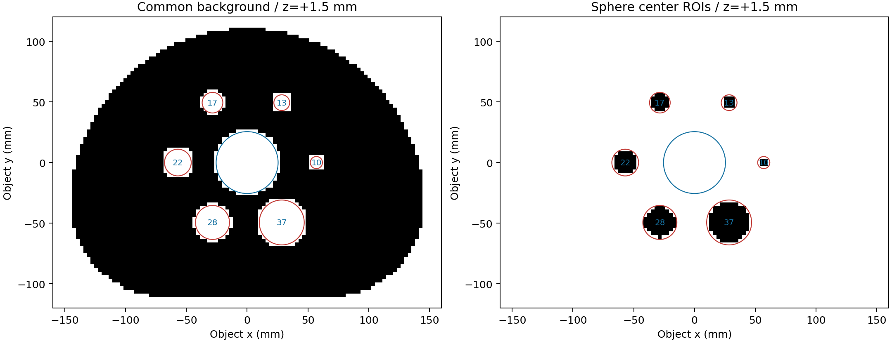

# 当前NEMA H60 ROI与独立能量结果

2026-10-10按用户最新确认重测：不生成218与440跨能量叠加图；保留EHE两路与JSCC四路，合计12条路线。原数据、矩阵、冻结发布及历史报告保留，未重新模拟或重建。

## 球与统一背景

各球ROI为所有满足 `||体素中心 − 球心|| ≤ 球半径 − 1.5 mm` 的3 mm体素，等权取均值，不再使用分数球体积权重。球心和直径来自原3D manifest，所有路线使用同一掩膜。10 mm球若要求整个立方体都在球内会无可用体素，用户因此明确选择对全部球采用中心1.5 mm避让规则；不能称为完全无部分容积效应。原子体素真值的8³采样占比在部分入选体素中最低约0.959，原真值和前投影输入均未改动，也未按这一占比重新拟合CRC。

| 球径(mm) | 10 | 13 | 17 | 22 | 28 | 37 |
|---|---:|---:|---:|---:|---:|---:|
| ROI体素数 | 8 | 20 | 60 | 136 | 312 | 772 |

统一背景为 **97,604个体素**：整个体素严格在Phantom活动腔体内部，与六个球及中央肺插入物均不相交、也不接触边界。没有额外侵蚀一层。活动腔体为原圆弧内腔，不包含壳壁；肺插入物是用户明确要求排除的零活度区域。背景使用所有合格位置和层；合格z中心为−25.5至+25.5 mm，间隔3 mm。±28.5 mm中心体素的外端面接触±30 mm体模边界，因此排除。

球内部用最远角判定并非此次最终规则；背景避让球/肺则用立方体到插入物的**最近距离**，不能仅凭体素中心或八角在外就认为没有相交。掩膜示意如下：黑色为该层入选区域，红圈为球的XY投影外轮廓，蓝圈为肺插入物；这里只用于解释ROI，指标仍计算完整3D掩膜。

## 计算方法

从完整78920活动单元历史恢复132040点网格，再沿用原XY重心线性插值采到原3 mm真值格点，40个z中心一一匹配。无平滑、无强度拟合，不按每图背景归一后计算指标。

同一幅图中，全部球共享同一个背景均值 `B` 与空间样本标准差 `s_B`（ddof=1）；球均值为 `H`。

- 热球：`CRC=(H/B−1)/9`，真实热球/自身能量背景比为10；`CNR=(H−B)/s_B`。
- 非本能量的冷球：CSV明确标记cold，`CRC=1−H/B`；CNR沿用有符号公式，因此可为负。图表展示热球曲线，不把负CNR取绝对值。
- 全1初值作为第0帧，CRC为0、背景CV为0；由于背景标准差为0，CNR为空而不是填0。

`s_B`衡量单幅图的空间波动，包含背景非均匀性、尖峰、泄漏等，不是均值标准误，也不是多次独立重建的不确定性。统一背景之后，CNR变化来自测量定义的改变，不代表重新求解后的算法改善。

## 当前图表与数据

EHE四组各0–200/每10保存，JSCC0–10000/每50保存；第0帧是已有初值，不是新计算的重建。共972个背景测量、5,832个球测量、72个球末帧记录。不同系统横轴独立，不能把同图列或相同迭代次数当成相同收敛。

- [全部球逐帧指标](sphere_iteration_metrics.csv)、[统一背景逐帧指标](common_background_iteration_metrics.csv)。
- [各球末帧](sphere_endpoint_metrics.csv)、[热球CNR峰值与末帧](hot_sphere_cnr_peak_and_final.csv)。
- EHE：[CNR](figures/ehe_hot_cnr.png) / [CRC](figures/ehe_hot_crc.png)；JSCC：[CNR](figures/jscc_hot_cnr.png) / [CRC](figures/jscc_hot_crc.png)。
- [统一背景CV曲线](figures/common_background_cv.png)。
- 分能量图集：[EHE Geant4 5e9](figures/gallery_0.png)、[EHE Poisson 5e9](figures/gallery_1.png)、[EHE Geant4 5e10](figures/gallery_2.png)、[EHE Poisson 5e10](figures/gallery_3.png)、[JSCC Geant4 5e9](figures/gallery_4.png)。图集是中央72 mm MIP，全XY域、gray_r、固定发射源密度尺度0–10，无平滑或单图亮度拟合。

218校正仍使用各实验最终440单光子图前投影的固定加性背景；这属于串扰校正，不是218+440图像叠加。EHE背景使用440200，JSCC使用44010000，原物理偏差和几何/材料/计数差异仍保留，模型加噪声不等于独立物理校准。

## 后续代码与验收

三个当前EHE生产源码已去掉叠加历史/末帧的计算，新增两路输出合同及对应验收。新执行遇到没有新输出约定的旧合同会在求解前拒绝；旧冻结发布仍按原身份只读保存。440→218背景构造、MLEM和保存循环的源码主体逐字相同。此次只有本地测试和源码回归，**没有执行新的GPU生产验证**；后续新任务仍需冻结匹配合同和完整输入validation10。

JSCC原六路10000是历史固定回归基准，113份代码SHA检查保持通过。后续新JSCC任务必须另行冻结四路生产合同及对应验证器，不能提交历史六路入口；本次没有开展新JSCC生产任务。持久规则见工程AGENTS.md。

来源、定义和复核见 [ROI定义](roi_definition.json)、[科学输入与图表SHA](scientific_acceptance.json)、[独立数值复核](independent_numeric_acceptance.json)、[生产主体回归](future_output_source_regression.json)、[本地规则测试](local_policy_acceptance.json)、[视觉检查](visual_acceptance.json)及[交付清单](delivery_manifest.json)。复现入口为仓库 `tools/research/analyze_nema_interior_roi.py`；独立稀疏插值核验入口为 `tools/research/verify_nema_interior_analysis.py`。

原18路PDF及其CSV反映旧分数球ROI/局部背景方法，作为历史记录保留，不与这里的指标直接混合。定时任务保持暂停。
